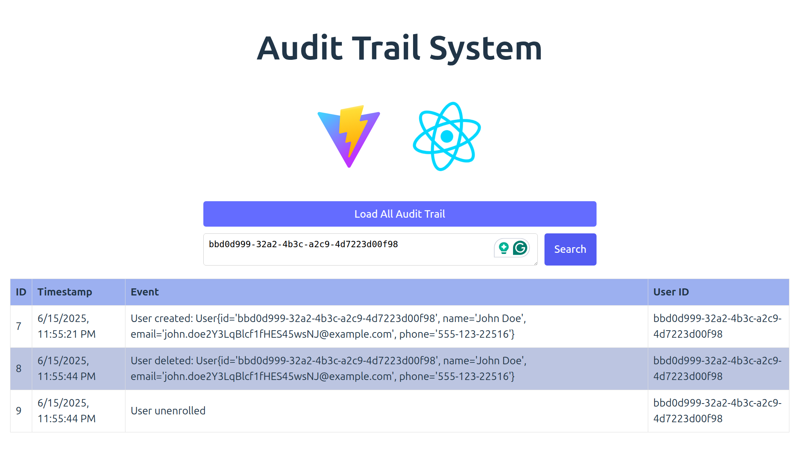

### Rationale

The idea of this POC is to show how to audit series of operations. Showing how to build an audit trail for the user.
Core ideas here:
* Everything is persisted in the audit-trail.
* Audit trail is immutable.
* Audit trail is stored in a separate table.
* New user just enrolled? Create a new audit entry.
* User unenrolled? Create a new audit entry.
* Operations happened behalf the user? Create a new audit entry.

### Build
```bash
./mvnw clean install
```
### Run

Start mysql 9 container
```bash
./run-mysql-9.docker.sh start
```

Create database and schema
```bash
./create-db-schema.sh
```

```bash
./run.sh
```

```
  .   ____          _            __ _ _
 /\\ / ___'_ __ _ _(_)_ __  __ _ \ \ \ \
( ( )\___ | '_ | '_| | '_ \/ _` | \ \ \ \
 \\/  ___)| |_)| | | | | || (_| |  ) ) ) )
  '  |____| .__|_| |_|_| |_\__, | / / / /
 =========|_|==============|___/=/_/_/_/

 :: Spring Boot ::                (v3.5.0)

2025-06-15T18:43:39.168-07:00  INFO 3595249 --- [           main] c.g.d.sandboxspring.Application          : Starting Application using Java 23.0.2 with PID 3595249 (/mnt/e35d88d4-42b9-49ea-bf29-c4c3b018d429/diego/git/diegopacheco/java-pocs/pocs/audit-trail-poc/target/classes started by diego in /mnt/e35d88d4-42b9-49ea-bf29-c4c3b018d429/diego/git/diegopacheco/java-pocs/pocs/audit-trail-poc)
2025-06-15T18:43:39.173-07:00  INFO 3595249 --- [           main] c.g.d.sandboxspring.Application          : No active profile set, falling back to 1 default profile: "default"
2025-06-15T18:43:40.400-07:00  INFO 3595249 --- [           main] .s.d.r.c.RepositoryConfigurationDelegate : Bootstrapping Spring Data JDBC repositories in DEFAULT mode.
2025-06-15T18:43:40.568-07:00  INFO 3595249 --- [           main] .s.d.r.c.RepositoryConfigurationDelegate : Finished Spring Data repository scanning in 159 ms. Found 2 JDBC repository interfaces.
2025-06-15T18:43:41.251-07:00  INFO 3595249 --- [           main] com.zaxxer.hikari.HikariDataSource       : HikariPool-1 - Starting...
2025-06-15T18:43:41.916-07:00  INFO 3595249 --- [           main] com.zaxxer.hikari.pool.HikariPool        : HikariPool-1 - Added connection com.mysql.cj.jdbc.ConnectionImpl@5d7f8467
2025-06-15T18:43:41.919-07:00  INFO 3595249 --- [           main] com.zaxxer.hikari.HikariDataSource       : HikariPool-1 - Start completed.
2025-06-15T18:43:42.736-07:00  INFO 3595249 --- [           main] o.s.b.a.e.web.EndpointLinksResolver      : Exposing 1 endpoint beneath base path '/actuator'
2025-06-15T18:43:43.158-07:00  INFO 3595249 --- [           main] o.s.b.web.embedded.netty.NettyWebServer  : Netty started on port 8080 (http)
2025-06-15T18:43:43.180-07:00  INFO 3595249 --- [           main] c.g.d.sandboxspring.Application          : Started Application in 4.581 seconds (process running for 5.401)
Spring Boot 3.5.x working! 
```


Enroll an user
```bash
./enroll-user.sh
```

```bash
❯ ./enroll-user.sh
Enrolling a new user...
>>> Request:
{
  "id": "0",
  "name": "John Doe",
  "email": "john.doeKGtfm0FEgUE9l42pw3pn@example.com",
  "phone": "555-123-71145"
}
<<< Response:
{
  "id": "7ad73dd2-b8eb-484e-8518-1f6352ec4347",
  "name": "John Doe",
  "email": "john.doeKGtfm0FEgUE9l42pw3pn@example.com",
  "phone": "555-123-71145"
}
```

### Endpoints 

`user`
- POST /api/users               - Enroll a new user
- GET  /api/users/{id}          - Get user by ID
- PUT  /api/users/unenroll/{id} - Update user by ID
- GET  /api/users/fetch         - Fetch a cat fact from an external API

`audit`
- GET /api/audits - Get all audits
- GET /api/search - Search for audits

### Running the UI

```bash
cd src/main/webapp
npm install
npm run dev
```
goto: http://localhost:5173/



### Future Ideas

* Add an Event_Type to make easy program around events (if needed)
* Feed the audit trail to ES for better full-text search
* Store in S3 as well

### Related POCs

* bookkeeping-auditability-records -> https://github.com/diegopacheco/java-pocs/tree/master/pocs/bookkeeping-auditability-records