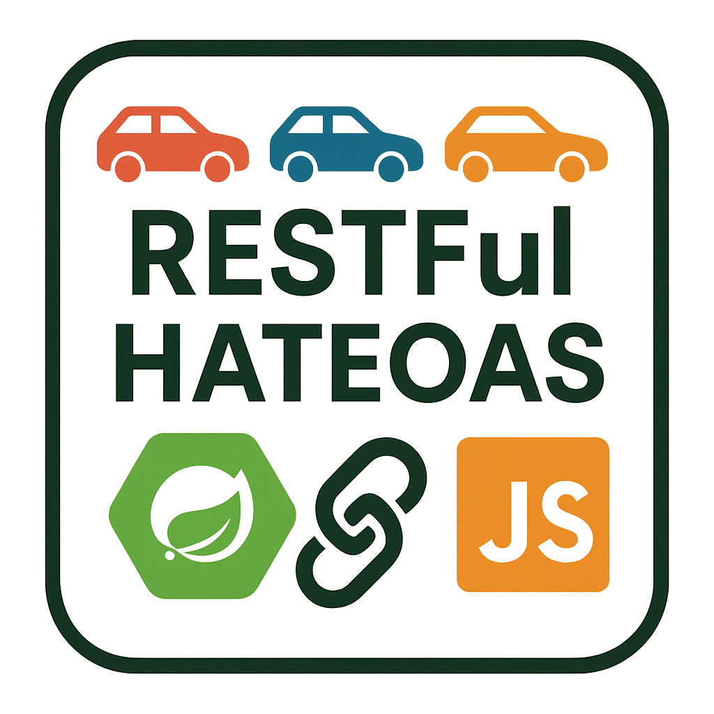
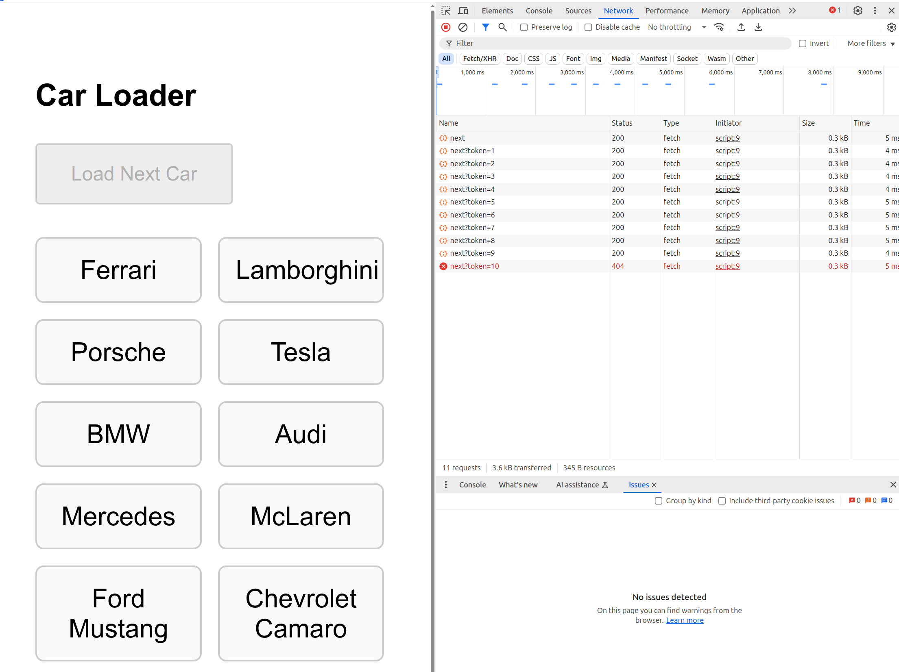

# Code on Demand - RESTful Boot/JS

Code on Demand RESTful architecture with HATEOAS(Hypermedia as the Engine of Application State).



1. Code on Demand:
* The server delivers executable JavaScript (/cars/script) to the client
* Frontend loads this behavior dynamically at runtime
* Actual car data is fetched separately after the script loads
* Server returns executable code(JS) so the client continues code execution.

2. State management:
* The client maintains state but in a hidden way (property inside a js object)
* The token is passed between client/server without exposing implementation details

### Build

```bash
./mvnw clean install
```

### Run

server
```bash
./run.sh
```

```
[INFO] Attaching agents: []

  .   ____          _            __ _ _
 /\\ / ___'_ __ _ _(_)_ __  __ _ \ \ \ \
( ( )\___ | '_ | '_| | '_ \/ _` | \ \ \ \
 \\/  ___)| |_)| | | | | || (_| |  ) ) ) )
  '  |____| .__|_| |_|_| |_\__, | / / / /
 =========|_|==============|___/=/_/_/_/

 :: Spring Boot ::                (v3.4.4)

2025-05-31T20:51:18.510-07:00  INFO 321695 --- [           main] c.g.d.sandboxspring.Application          : Starting Application using Java 23.0.2 with PID 321695 (/mnt/e35d88d4-42b9-49ea-bf29-c4c3b018d429/diego/git/diegopacheco/java-pocs/pocs/code-on-demand-restful-boot-js/target/classes started by diego in /mnt/e35d88d4-42b9-49ea-bf29-c4c3b018d429/diego/git/diegopacheco/java-pocs/pocs/code-on-demand-restful-boot-js)
2025-05-31T20:51:18.513-07:00  INFO 321695 --- [           main] c.g.d.sandboxspring.Application          : No active profile set, falling back to 1 default profile: "default"
2025-05-31T20:51:19.477-07:00  INFO 321695 --- [           main] o.s.b.w.embedded.tomcat.TomcatWebServer  : Tomcat initialized with port 8080 (http)
2025-05-31T20:51:19.492-07:00  INFO 321695 --- [           main] o.apache.catalina.core.StandardService   : Starting service [Tomcat]
2025-05-31T20:51:19.493-07:00  INFO 321695 --- [           main] o.apache.catalina.core.StandardEngine    : Starting Servlet engine: [Apache Tomcat/10.1.39]
2025-05-31T20:51:19.534-07:00  INFO 321695 --- [           main] o.a.c.c.C.[Tomcat].[localhost].[/]       : Initializing Spring embedded WebApplicationContext
2025-05-31T20:51:19.536-07:00  INFO 321695 --- [           main] w.s.c.ServletWebServerApplicationContext : Root WebApplicationContext: initialization completed in 937 ms
2025-05-31T20:51:20.066-07:00  INFO 321695 --- [           main] o.s.b.a.e.web.EndpointLinksResolver      : Exposing 1 endpoint beneath base path '/actuator'
2025-05-31T20:51:20.132-07:00  INFO 321695 --- [           main] o.s.b.w.embedded.tomcat.TomcatWebServer  : Tomcat started on port 8080 (http) with context path '/'
2025-05-31T20:51:20.149-07:00  INFO 321695 --- [           main] c.g.d.sandboxspring.Application          : Started Application in 1.99 seconds (process running for 2.26)
Spring Boot 3.4.x working! 
2025-05-31T20:51:36.316-07:00  INFO 321695 --- [nio-8080-exec-1] o.a.c.c.C.[Tomcat].[localhost].[/]       : Initializing Spring DispatcherServlet 'dispatcherServlet'
2025-05-31T20:51:36.316-07:00  INFO 321695 --- [nio-8080-exec-1] o.s.web.servlet.DispatcherServlet        : Initializing Servlet 'dispatcherServlet'
2025-05-31T20:51:36.319-07:00  INFO 321695 --- [nio-8080-exec-1] o.s.web.servlet.DispatcherServlet        : Completed initialization in 3 ms
```

client
```bash
./run-client.sh
```

```bash
❯ ./run-client.sh

   ┌────────────────────────────────────────┐
   │                                        │
   │   Serving!                             │
   │                                        │
   │   - Local:    http://localhost:3000    │
   │   - Network:  http://10.0.0.63:3000    │
   │                                        │
   │   Copied local address to clipboard!   │
   │                                        │
   └────────────────────────────────────────┘

 HTTP  5/31/2025 8:51:36 PM ::1 GET /
 HTTP  5/31/2025 8:51:36 PM ::1 Returned 304 in 26 ms
 HTTP  5/31/2025 8:51:38 PM ::1 GET /
 HTTP  5/31/2025 8:51:38 PM ::1 Returned 304 in 1 ms
 HTTP  5/31/2025 8:51:42 PM ::1 GET /.well-known/appspecific/com.chrome.devtools.json
 HTTP  5/31/2025 8:51:42 PM ::1 Returned 404 in 4 ms
 HTTP  5/31/2025 8:52:06 PM ::1 GET /
 HTTP  5/31/2025 8:52:06 PM ::1 Returned 304 in 4 ms
```

### Result

