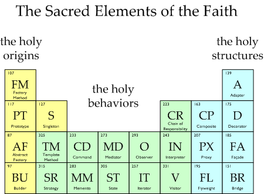

### Patterns

Classical GOF Design Patterns in Java



### Creational

* Abstract Factory
* Builder
* Factory Method
* Prototype
* Singleton

### Structural

* Adapter
* Bridge
* Composite
* Decorator
* Facade
* Flyweight
* Proxy

### Behavioral

* Chain of responsibility
* Command
* Interpreter
* Iterator
* Mediator
* Memento
* Observer
* State
* Strategy
* Template method
* Visitor

### Build 
```bash
./mvnw clean install 
```
