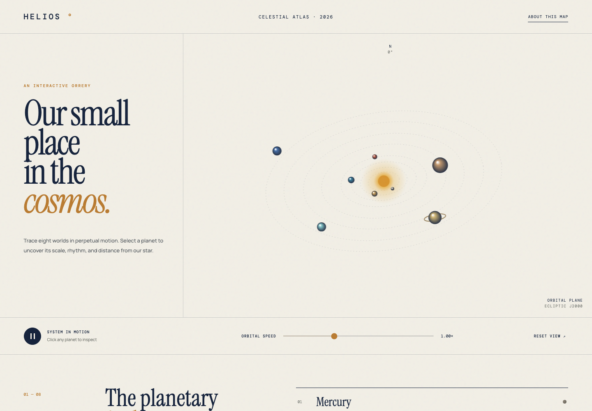

# Helios

An interactive, light-themed solar system visualizer with animated orbital motion, selectable planets, speed controls, and responsive layouts.

## Run

```bash
./start.sh
```

Open `http://127.0.0.1:8080`.

## Stop

```bash
./stop.sh
```

## Features

- Animated canvas-based orbits
- Eight selectable planets
- Play, pause, speed, and reset controls
- Planetary facts panel
- Responsive desktop and mobile layouts
- Reduced-motion support
- No runtime dependencies

## Screenshots


