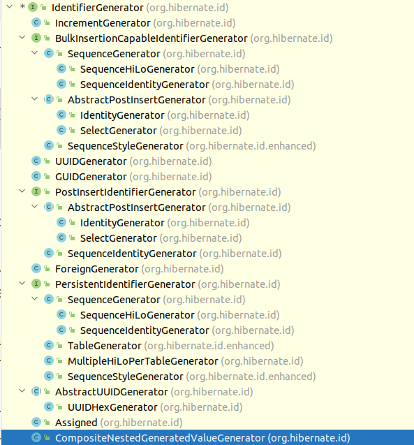
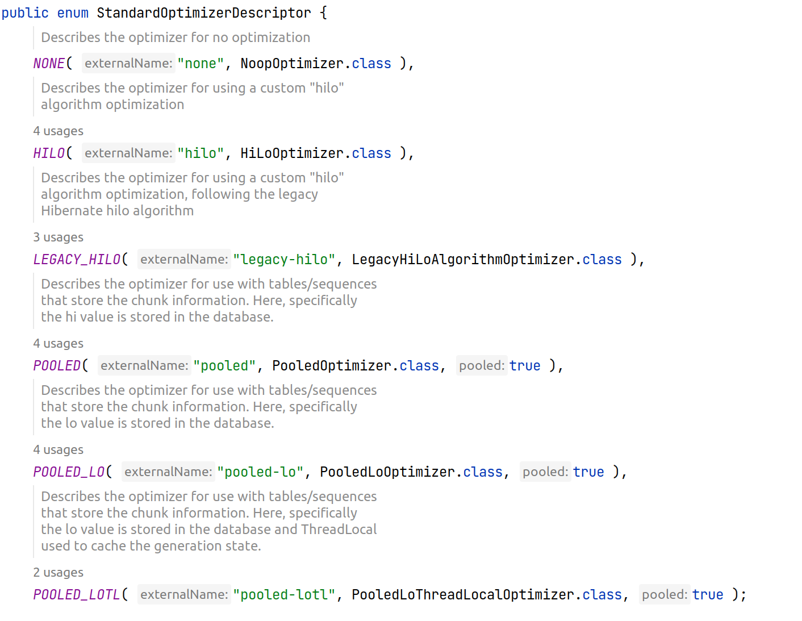

### Build 
```bash
./mvnw clean install 
```

### About

This is a project to Debug and test Hibernate on Generators and Optimizers.
The test is failling by default and by design.

### Findings

Hibernate has Generators and Optimizers. Generators Generate id by:
* UUID
* Sequence
* Table
* Custom
* etc...

Hibernate has all this Generators:


Optimizers reduce the amount of DB calls, like:
* Hilo
* LegacyHilo
* Polled
* Noop
* etc...

Hibernate has all this Optimizers:

https://github.com/hibernate/hibernate-orm/blob/5.6/hibernate-core/src/main/java/org/hibernate/id/enhanced/StandardOptimizerDescriptor.java

* When you use *org.hibernate.id.SequenceHiLoGenerator* it will ALWAYS use *org.hibernate.id.enhanced.LegacyHiLoAlgorithmOptimizer* 
as default optimizer.
* *org.hibernate.id.enhanced.SequenceStyleGenerator* generators using the optimizer *org.hibernate.id.enhanced.PooledLoOptimizer* is not
compatible with SequenceHiLoGenerator/LegacyHiLoAlgorithmOptimizer. 
*  PooledLoOptimizer does +1 and LegacyHiLoAlgorithmOptimizer does not.

### The Diff

The diff will output something like this:
```

***** DIFF ***** 
>>> LEFT: generator[org.hibernate.id.SequenceHiLoGenerator] optimizer[org.hibernate.id.enhanced.LegacyHiLoAlgorithmOptimizer]
Next Value[4] DB Sequence Val[1]
Next Value[5] DB Sequence Val[1]
Next Value[6] DB Sequence Val[1]
Next Value[7] DB Sequence Val[1]
Next Value[8] DB Sequence Val[2]
Next Value[9] DB Sequence Val[2]
Next Value[10] DB Sequence Val[2]
Next Value[11] DB Sequence Val[2]
Next Value[12] DB Sequence Val[3]
Next Value[13] DB Sequence Val[3]
Next Value[14] DB Sequence Val[3]
Next Value[15] DB Sequence Val[3]
Next Value[16] DB Sequence Val[4]
Next Value[17] DB Sequence Val[4]
Next Value[18] DB Sequence Val[4]
Next Value[19] DB Sequence Val[4]
Next Value[20] DB Sequence Val[5]
Next Value[21] DB Sequence Val[5]
Next Value[22] DB Sequence Val[5]
Next Value[23] DB Sequence Val[5]
Next Value[24] DB Sequence Val[6]
Next Value[25] DB Sequence Val[6]
Next Value[26] DB Sequence Val[6]
Next Value[27] DB Sequence Val[6]
Next Value[28] DB Sequence Val[7]
Next Value[29] DB Sequence Val[7]
Next Value[30] DB Sequence Val[7]
Next Value[31] DB Sequence Val[7]
Next Value[32] DB Sequence Val[8]
Next Value[33] DB Sequence Val[8]
Next Value[34] DB Sequence Val[8]
Next Value[35] DB Sequence Val[8]
Next Value[36] DB Sequence Val[9]
Next Value[37] DB Sequence Val[9]
Next Value[38] DB Sequence Val[9]
Next Value[39] DB Sequence Val[9]
Next Value[40] DB Sequence Val[10]
Next Value[41] DB Sequence Val[10]
Next Value[42] DB Sequence Val[10]
Next Value[43] DB Sequence Val[10]
Next Value[44] DB Sequence Val[11]
Next Value[45] DB Sequence Val[11]
Next Value[46] DB Sequence Val[11]
Next Value[47] DB Sequence Val[11]
Next Value[48] DB Sequence Val[12]
Next Value[49] DB Sequence Val[12]
Next Value[50] DB Sequence Val[12]
Next Value[51] DB Sequence Val[12]
Next Value[52] DB Sequence Val[13]
Next Value[53] DB Sequence Val[13]

<<< RIGHT: generator[org.hibernate.id.enhanced.SequenceStyleGenerator] optimizer[org.hibernate.id.enhanced.PooledLoOptimizer]
Next Value[1] DB Sequence Val[1]
Next Value[2] DB Sequence Val[1]
Next Value[3] DB Sequence Val[1]
Next Value[4] DB Sequence Val[1]
Next Value[5] DB Sequence Val[5]
Next Value[6] DB Sequence Val[5]
Next Value[7] DB Sequence Val[5]
Next Value[8] DB Sequence Val[5]
Next Value[9] DB Sequence Val[9]
Next Value[10] DB Sequence Val[9]
Next Value[11] DB Sequence Val[9]
Next Value[12] DB Sequence Val[9]
Next Value[13] DB Sequence Val[13]
Next Value[14] DB Sequence Val[13]
Next Value[15] DB Sequence Val[13]
Next Value[16] DB Sequence Val[13]
Next Value[17] DB Sequence Val[17]
Next Value[18] DB Sequence Val[17]
Next Value[19] DB Sequence Val[17]
Next Value[20] DB Sequence Val[17]
Next Value[21] DB Sequence Val[21]
Next Value[22] DB Sequence Val[21]
Next Value[23] DB Sequence Val[21]
Next Value[24] DB Sequence Val[21]
Next Value[25] DB Sequence Val[25]
Next Value[26] DB Sequence Val[25]
Next Value[27] DB Sequence Val[25]
Next Value[28] DB Sequence Val[25]
Next Value[29] DB Sequence Val[29]
Next Value[30] DB Sequence Val[29]
Next Value[31] DB Sequence Val[29]
Next Value[32] DB Sequence Val[29]
Next Value[33] DB Sequence Val[33]
Next Value[34] DB Sequence Val[33]
Next Value[35] DB Sequence Val[33]
Next Value[36] DB Sequence Val[33]
Next Value[37] DB Sequence Val[37]
Next Value[38] DB Sequence Val[37]
Next Value[39] DB Sequence Val[37]
Next Value[40] DB Sequence Val[37]
Next Value[41] DB Sequence Val[41]
Next Value[42] DB Sequence Val[41]
Next Value[43] DB Sequence Val[41]
Next Value[44] DB Sequence Val[41]
Next Value[45] DB Sequence Val[45]
Next Value[46] DB Sequence Val[45]
Next Value[47] DB Sequence Val[45]
Next Value[48] DB Sequence Val[45]
Next Value[49] DB Sequence Val[49]
Next Value[50] DB Sequence Val[49]

***** DIFF ***** 
```
