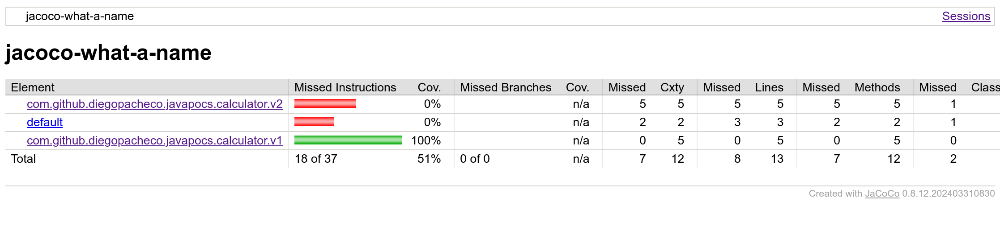
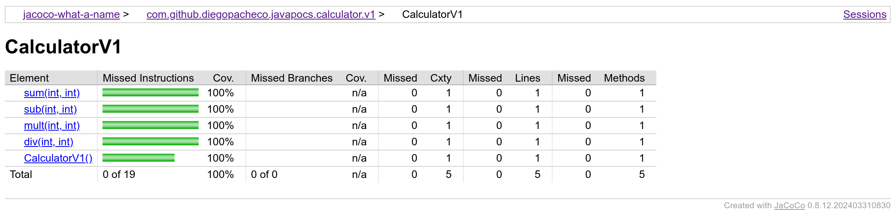
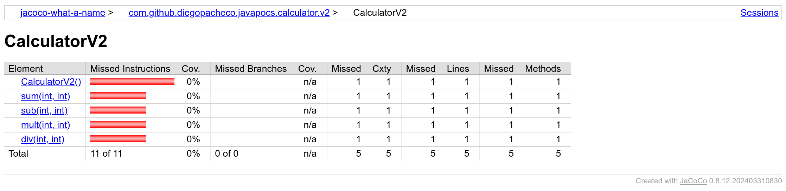

### Build 
```bash
./mvnw clean install 
```
### Versions
Maven wrapper / Maven
```
❯ ./mvnw --version
Apache Maven 3.9.4 (dfbb324ad4a7c8fb0bf182e6d91b0ae20e3d2dd9)
Maven home: /home/diego/.m2/wrapper/dists/apache-maven-3.9.4-bin/2vqnav6ufo1qvo5j2um40861m/apache-maven-3.9.4
Java version: 21.0.2, vendor: Amazon.com Inc., runtime: /home/diego/.sdkman/candidates/java/21.0.2-amzn
Default locale: en_US, platform encoding: UTF-8
OS name: "linux", version: "6.2.0-1009-lowlatency", arch: "amd64", family: "unix"
```
Maven plugins
```
maven-compiler-plugin: 3.13.0
exec-maven-plugin: 3.3.0
```

### Aggregated Report

<a href="https://htmlpreview.github.io/?https://github.com/diegopacheco/java-pocs/blob/master/pocs/jacoco-what-a-name/site/jacoco/index.html">All Report</a>



### V1 packages - Report

<a href="https://htmlpreview.github.io/?https://github.com/diegopacheco/java-pocs/blob/master/pocs/jacoco-what-a-name/site/jacoco/com.github.diegopacheco.javapocs.calculator.v1/CalculatorV1.html">V1 Coverage Report</a>



### V2 packages - Report

<a href="https://htmlpreview.github.io/?https://github.com/diegopacheco/java-pocs/blob/master/pocs/jacoco-what-a-name/site/jacoco/com.github.diegopacheco.javapocs.calculator.v2/CalculatorV2.html">V2 Coverage Report</a>

