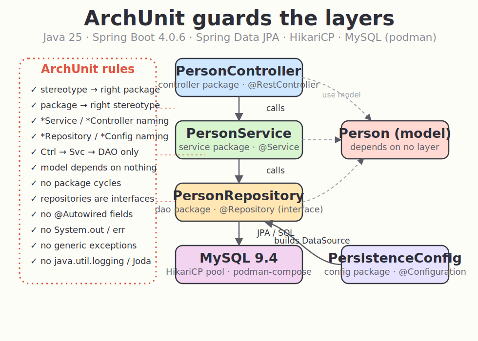

# java-25-archunit-testing

Architecture tests with [ArchUnit](https://www.archunit.org/getting-started) on a small Spring Boot app.
The production code is a trivial `Person` CRUD; the interesting part is the **JUnit 5 + ArchUnit suite**
that fails the build if anyone breaks the layering or coding conventions.

## Stack

- Java 25
- Spring Boot 4.0.6
- Spring Data JPA + MySQL (`mysql-connector-j`)
- HikariCP connection pool (explicit `@Configuration` bean)
- MySQL 9.4 via podman / podman-compose
- ArchUnit 1.4.1 (`archunit-junit5`)
- Gradle 9

## Architecture



The app is a classic layered design. Each layer lives in its own package and is only allowed to
talk to the one below it. ArchUnit enforces every arrow and every package boundary in the picture.

```
com.github.diegopacheco.archunit
├── Application.java          @SpringBootApplication
├── controller/  PersonController   @RestController   -> calls service
├── service/     PersonService      @Service          -> calls dao
├── dao/         PersonRepository   @Repository        (Spring Data JPA interface)
├── config/      PersistenceConfig  @Configuration     (HikariCP DataSource bean)
└── model/       Person             @Entity            (depends on no layer)
```

## What is tested and why

The suite has **22 rules** across 5 test classes. All of them run with plain `./gradlew test` —
no database needed, ArchUnit only reads the compiled bytecode.

### 1. Package conventions — `PackageConventionTest` (the 4 rules you asked for, both directions)

| Rule | Why |
|------|-----|
| `@Service` classes must live in `..service..` | A stereotype out of place is the first sign of layering rot. |
| `@Repository` classes must live in `..dao..` | Persistence access stays in one place, easy to audit. |
| `@RestController` / `@Controller` must live in `..controller..` | HTTP surface is contained and discoverable. |
| `@Configuration` classes must live in `..config..` | Wiring lives in one folder, not scattered across the app. |
| Everything in `..service..` must be a `@Service` | Reverse check: the package can't quietly accumulate non-service classes. |
| Everything in `..config..` must be a `@Configuration` | Same reverse check for the config folder. |

### 2. Layered architecture — `LayeredArchitectureTest`

One rule using ArchUnit's `layeredArchitecture()` DSL: **Controller → Service → Persistence** is the
only allowed direction.

- Controller may not be accessed by anyone (it is the top).
- Service may only be accessed by Controller.
- Persistence may only be accessed by Service.

**Why:** this is the single most valuable architecture test — it stops a controller from reaching
straight into the repository, or the repository from calling back up into a service.

### 3. Naming conventions — `NamingConventionTest`

`*Service`, `*Controller`, `*Repository`, `*Config`/`*Configuration`.

**Why:** consistent names make the codebase navigable and let other tools (and these very rules)
reason about classes by name.

### 4. Dependency rules — `DependencyRulesTest`

| Rule | Why |
|------|-----|
| The domain model depends on no other layer | Keeps `Person` a pure domain type, reusable and framework-light. |
| Services never depend on controllers | Business logic must not know about the web layer. |
| Persistence never depends on service/controller | The bottom layer stays a leaf. |
| No package cycles (`slices().beFreeOfCycles()`) | Cycles are the root of "change one thing, rebuild everything". |

### 5. Coding rules — `CodingRulesTest`

| Rule | Why |
|------|-----|
| No `@Autowired` on fields | Forces constructor injection — testable, immutable, no hidden nulls. |
| Spring Data repositories must be interfaces | A `@Repository` that is a concrete class is almost always a mistake. |
| Everything in `controller` must be `@RestController` | No stray helper classes leaking into the web layer. |
| No `System.out` / `System.err` | Use a logger; stdout has no levels and no structure. |
| No generic exceptions thrown (`Exception`, `RuntimeException`, `Throwable`) | Specific exceptions are catchable and meaningful. |
| No `java.util.logging` | Standardize on SLF4J. |
| No Joda-Time | Use `java.time`. |

## Running it

### Architecture tests (no database required)

```bash
./gradlew clean test
# or
./test.sh
```

### Run the app against MySQL

```bash
./start.sh      # podman-compose up + wait for MySQL to accept connections
./run.sh        # starts MySQL (if not up) and runs the Spring Boot app on :8080
./stop.sh       # podman-compose down
```

Smoke the HTTP API:

```bash
curl -X POST http://localhost:8080/api/people -H "Content-Type: application/json" \
  -d '{"firstName":"Diego","lastName":"Pacheco"}'
curl http://localhost:8080/api/people
curl "http://localhost:8080/api/people/search?firstName=Diego"
```

## Test output

```
PackageConventionTest    > 6 tests  PASSED
NamingConventionTest     > 4 tests  PASSED
LayeredArchitectureTest  > 1 test   PASSED
DependencyRulesTest      > 4 tests  PASSED
CodingRulesTest          > 7 tests  PASSED

BUILD SUCCESSFUL
22 architecture rules, 0 violations
```

## Other cool things you can test with ArchUnit

Ideas this suite does not include but are easy wins on real projects:

- **Hexagonal / Onion architecture** — `Architectures.onionArchitecture()` to pin domain at the
  center with adapters on the outside.
- **`@Transactional` only on services** — keep transaction boundaries out of controllers and DAOs.
- **DTOs never leak** — controllers may return DTOs, never JPA entities (`Person` must not appear in
  a controller's public method signatures).
- **Repositories returning `Optional`, not `null`** — enforce method return-type conventions.
- **No `@Autowired`/`@Value` field injection anywhere** (extended to constructors-only everywhere).
- **Test classes location & naming** — every `*Test` sits next to the class it tests, lives under
  `src/test`, and ends with `Test`.
- **Forbidden dependencies** — no use of `java.util.Date`/`Calendar`, no `printStackTrace()`, no
  `@Deprecated` usage, no access to `..internal..` packages of libraries.
- **Annotation hygiene** — every `@Service`/`@Component` is package-private or final, every controller
  method is annotated with an HTTP mapping.
- **Module/feature isolation** — feature package `..orders..` may not depend on `..billing..` except
  through a published `api` sub-package.
- **Freeze existing violations** — `FreezingArchRule` records current violations as a baseline so the
  rule fails only on *new* ones, perfect for legacy codebases.
- **Custom `ArchCondition`** — write your own predicate (e.g. "every public method on a `@Service`
  logs before it returns") when the built-in DSL isn't enough.
