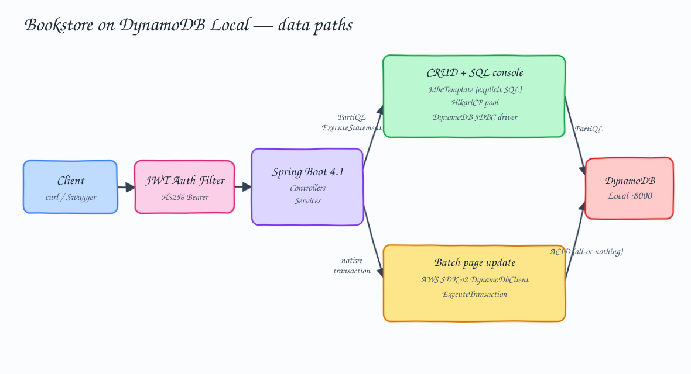
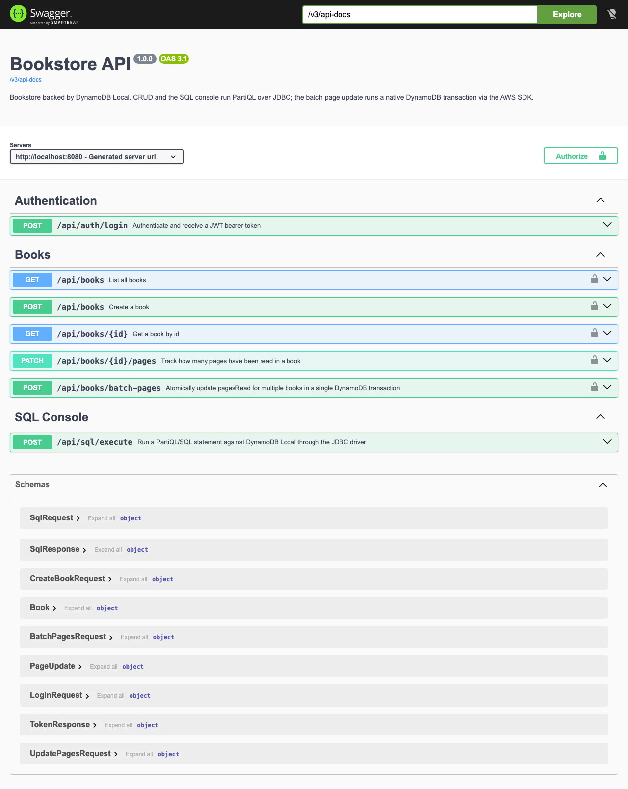
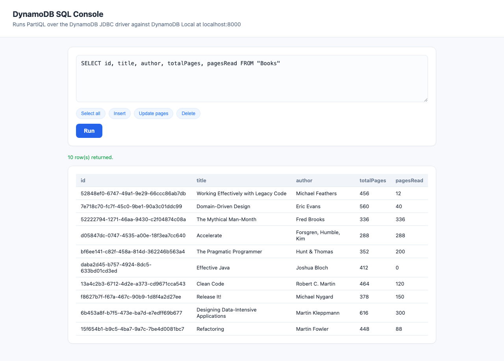
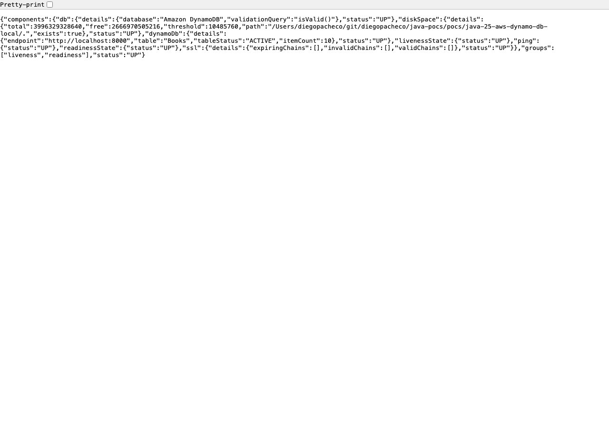

# java-25-aws-dynamo-db-local

A bookstore backed by **DynamoDB Local**. You can create books, list them, fetch one by id, track how many pages you have read, and atomically update the pages of several books at once inside a **real DynamoDB transaction**. CRUD and a `/sql-console` run **PartiQL over JDBC + HikariCP** with explicit SQL; the batch update runs a native DynamoDB transaction through the AWS SDK. Auth is JWT, docs are OpenAPI/Swagger, logging is Log4j2, and there is a health check.



## Stack

| Concern | Choice |
| --- | --- |
| Language | Java 25 |
| Framework | Spring Boot 4.1.0 (Spring Framework 7) |
| Data access | Spring `JdbcTemplate` with explicit SQL |
| Connection pool | HikariCP |
| JDBC driver | `com.dbvis:dynamodb-jdbc:1.5` (PartiQL over JDBC) |
| Transactions | AWS SDK v2 `DynamoDbClient.executeTransaction` (bundled in the driver jar) |
| Datastore | `amazon/dynamodb-local` on `podman`, port 8000 |
| API docs | springdoc-openapi 3.0.3 (`/swagger`, `/swagger-ui`) |
| Auth | Hand-rolled HS256 JWT (no extra library), servlet filter |
| Logging | Log4j2 (`log4j2.xml`, console + rolling file) |
| Health | Spring Boot Actuator + custom DynamoDB indicator |
| Build | Maven (wrapper, Maven 3.9.16) |
| Tests | JUnit 5 (unit + integration) |

## Important: DynamoDB has no real JDBC, and what that costs us

DynamoDB is a NoSQL, HTTP/JSON service. It is **not** a relational database and there is **no official JDBC driver**. The request asked for Spring Data JDBC + explicit SQL + HikariCP + a SQL console **and** DynamoDB Local, so this is a genuine mismatch that had to be resolved. The options and their tradeoffs:

| Option | What you get | What it costs |
| --- | --- | --- |
| **A. PartiQL-native (AWS SDK only)** | Real DynamoDB semantics, real transactions, PartiQL for "SQL". | No JDBC, no HikariCP — those libraries are simply not used. |
| **B. Third-party DynamoDB JDBC driver** *(chosen)* | HikariCP pools connections; SQL/PartiQL runs over `java.sql`; a browser SQL console works. | The driver translates each statement to a single PartiQL `ExecuteStatement`; **JDBC `commit()` is not a real DynamoDB transaction**; Spring Data JDBC's entity/repository mapping does not work (no relational dialect). |
| **C. Hybrid (relational DB + DynamoDB)** | Every library used literally. | Two datastores, more moving parts, and the relational half is not DynamoDB at all. |

This project takes **Option B** and is honest about its one real limitation:

- **CRUD and the `/sql-console`** go through HikariCP → the DynamoDB JDBC driver → **explicit SQL** (`INSERT/SELECT/UPDATE`). The driver parses the SQL and issues a PartiQL `ExecuteStatement` per call.
- **Spring Data JDBC** cannot map entities to DynamoDB because there is no relational `Dialect` for it. We therefore use **`JdbcTemplate`** (the JDBC foundation Spring Data JDBC is built on) with explicit SQL. This is the accurate, working subset of the requirement.
- **Transactions** cannot come from the JDBC driver — it only ever calls `ExecuteStatement` and its `commit()`/`rollback()` do nothing transactional. To get a *true* ACID transaction, the batch endpoint uses the AWS SDK's `ExecuteTransaction` directly. The SDK is already bundled inside the driver jar, so this adds no dependency.

## How DynamoDB works (the short version)

- Data lives in **tables** of **items** (rows). Each item is a bag of typed **attributes** (`S` string, `N` number, `B` binary, `BOOL`, `L`, `M`, ...).
- Every table has a **primary key**. Here the `Books` table uses a single **partition key** `id` (String). The partition key decides which physical partition stores the item; a lookup by key is an O(1) `GetItem`.
- There is no schema beyond the key. Two items in the same table can have different attributes.
- You read/write with the low-level API (`GetItem`, `PutItem`, `Query`, `Scan`) **or** with **PartiQL**, a SQL-compatible query language. `SELECT ... WHERE id = ?` on the key is a point read; `SELECT * FROM "Books"` with no key predicate is a full-table **Scan**.
- Numbers are stored as a single `N` type, so the JDBC driver returns them as decimals (`464.0`); the code reads them back as `int`.

## How transactions work in DynamoDB

DynamoDB transactions are **not** long-lived `begin/commit` sessions like SQL. A transaction is **one API call** that carries up to 100 writes, applied **all-or-nothing**:

- `TransactWriteItems` (low-level) or `ExecuteTransaction` (PartiQL) submit the whole batch in a single request.
- Every statement may carry a **condition**. If **any** condition fails, the **entire** transaction is cancelled and **nothing** is written — the server returns `TransactionCanceledException` with per-item `CancellationReasons` (e.g. `ConditionalCheckFailed`).
- There is no partial success and no dirty read of an in-flight transaction.

This project's batch endpoint issues one `ExecuteTransaction` with a PartiQL `UPDATE ... WHERE id = ? AND totalPages >= ?` per book. The `totalPages >= newPagesRead` guard means "you cannot have read more pages than the book has". If one book in the batch violates it, **the whole batch rolls back** and every book keeps its previous value. This is exercised by an integration test and returns **HTTP 409**.

## DynamoDB Local limitations

`amazon/dynamodb-local` is a Java reimplementation for development. Versus real DynamoDB:

- It runs in one process against SQLite (or `-inMemory`); **not** durable or highly available.
- **No real throughput/capacity** — `ProvisionedThroughputExceededException`, autoscaling and billing modes are accepted but not enforced.
- Read-consistency, TTL expiry, streams, PITR, global tables, encryption and IAM are **stubbed, approximate, or absent**.
- Item/partition size limits and some validation differ from the cloud; performance is not representative.
- Credentials are **not verified** — any access key/secret is accepted (we pass `dummy`/`dummy`).
- Data is lost when the container is removed. Great for tests and local dev, not for anything real.

## Data model

Table `Books`, partition key `id` (String):

| Attribute | Type | Notes |
| --- | --- | --- |
| `id` | S | UUID, partition key |
| `title` | S | |
| `author` | S | |
| `totalPages` | N | book length |
| `pagesRead` | N | reading progress, starts at 0 |

## APIs

Base URL `http://localhost:8080`. **Every `/api/**` endpoint enforces `Authorization: Bearer <jwt>`** except `/api/auth/login` (you need it to get a token) and the `/api/sql/**` console. Health and Swagger are also open.

| Method | Path | Auth | Purpose |
| --- | --- | --- | --- |
| POST | `/api/auth/login` | no | Get a JWT (`admin` / `admin`) |
| POST | `/api/books` | yes | Create a book |
| GET | `/api/books?page=0&size=2` | yes | List books, paginated (defaults `page=0`, `size=2`) |
| GET | `/api/books/{id}` | yes | Get one book |
| PATCH | `/api/books/{id}/pages` | yes | Track pages read |
| POST | `/api/books/batch-pages` | yes | Atomic multi-book page update (transaction) |
| POST | `/api/sql/execute` | no | Run PartiQL/SQL against DynamoDB Local |
| GET | `/actuator/health` | no | Health of app + DynamoDB |
| GET | `/swagger` · `/swagger-ui` | no | OpenAPI UI |
| GET | `/sql-console` | no | Light-themed SQL console page |

### Calling each API (real responses)

**POST `/api/auth/login`**
```json
{ "username": "admin", "password": "admin" }
```
```json
{ "token": "eyJhbGciOiJIUzI1NiIsInR5cCI6IkpXVCJ9.eyJzdWIiOiJhZG1pbi...", "expiresInSeconds": 3600 }
```

**GET `/api/books` without a token → 401**
```json
{ "status": 401, "error": "Unauthorized", "message": "missing bearer token" }
```

**POST `/api/books` → 201**
```json
{ "title": "Effective Java", "author": "Joshua Bloch", "totalPages": 412 }
```
```json
{ "id": "9c6f69b7-d0d5-47a8-afcf-02bd4a1a2021", "title": "Effective Java", "author": "Joshua Bloch", "totalPages": 412, "pagesRead": 0 }
```

**GET `/api/books/{id}`**
```json
{ "id": "9c6f69b7-d0d5-47a8-afcf-02bd4a1a2021", "title": "Effective Java", "author": "Joshua Bloch", "totalPages": 412, "pagesRead": 0 }
```

**PATCH `/api/books/{id}/pages`**
```json
{ "pagesRead": 75 }
```
```json
{ "id": "9c6f69b7-d0d5-47a8-afcf-02bd4a1a2021", "title": "Effective Java", "author": "Joshua Bloch", "totalPages": 412, "pagesRead": 75 }
```

**GET `/api/books?page=0&size=2`** — paginated. `page` defaults to `0`, `size` defaults to `2`. Because DynamoDB has no SQL `OFFSET`, the Scan result is sorted by title and paged in the service layer; `total`/`totalPages` describe the whole catalog.
```json
{
  "page": 0,
  "size": 2,
  "total": 10,
  "totalPages": 5,
  "content": [
    { "id": "d05847dc-...", "title": "Accelerate", "author": "Forsgren, Humble, Kim", "totalPages": 288, "pagesRead": 288 },
    { "id": "13a4c2b3-...", "title": "Clean Code", "author": "Robert C. Martin", "totalPages": 464, "pagesRead": 120 }
  ]
}
```

**POST `/api/books/batch-pages` (success)** — one atomic transaction
```json
{ "updates": [ { "id": "9c6f69b7-...", "pagesRead": 150 } ] }
```
```json
[ { "id": "9c6f69b7-...", "title": "Effective Java", "author": "Joshua Bloch", "totalPages": 412, "pagesRead": 150 } ]
```

**POST `/api/books/batch-pages` (rollback) → 409** — `pagesRead` above `totalPages` cancels the whole transaction
```json
{ "updates": [ { "id": "9c6f69b7-...", "pagesRead": 999999 } ] }
```
```json
{ "status": 409, "error": "Conflict", "message": "transaction rolled back: Transaction cancelled ... [ConditionalCheckFailed] ..." }
```

**POST `/api/sql/execute`**
```json
{ "sql": "SELECT id, title FROM \"Books\"" }
```
```json
{ "columns": ["id","title"], "rows": [ { "id": "8f3f8c5f-...", "title": "Clean Code" } ], "rowCount": 4, "updateCount": null }
```

**GET `/actuator/health`**
```json
{ "status": "UP", "components": { "dynamoDb": { "status": "UP", "details": { "endpoint": "http://localhost:8000", "table": "Books", "tableStatus": "ACTIVE" } } } }
```

## Screenshots

**Swagger UI** — every endpoint, grouped, with JWT lock icons (`/swagger`)



**SQL console** — light theme, PartiQL over JDBC, live results (`/sql-console`)



**Health** — app + DynamoDB indicator (`/actuator/health`)



## Run it

Prerequisites: Java 25, `podman` (machine started), and the port `8000`/`8080` free.

```bash
./start.sh   # starts dynamodb-local on podman, builds, runs the app, waits for health
./demo.sh    # calls every functional endpoint end-to-end against the running app
./test.sh    # starts dynamodb-local if needed and runs the JUnit 5 suite
./stop.sh    # stops the app and removes the dynamodb-local container
```

`start.sh` uses the exact container the task asked for, via podman:

```bash
podman run -d --name ddb-local -p 8000:8000 amazon/dynamodb-local
```

Then open:

- Swagger: http://localhost:8080/swagger
- SQL console: http://localhost:8080/sql-console
- Health: http://localhost:8080/actuator/health

## Tests

`./test.sh` runs 14 JUnit 5 tests:

- **Unit** — `JwtServiceTest` (sign/verify round-trip, tampered signature, wrong key, expiry, malformed) and `BookServiceTest` (creation defaults, validation, not-found, page bounds) with Mockito.
- **Integration** — `BookApiIntegrationTest` boots the full app on a random port against DynamoDB Local and drives the real HTTP API: 401 without a token, the full book lifecycle, the atomic batch transaction, and the **rollback** case asserting the book keeps its pre-transaction value. It is guarded by `@EnabledIf("dynamoAvailable")`, so it **skips loudly** if nothing is listening on `localhost:8000` instead of failing spuriously.

```
Tests run: 14, Failures: 0, Errors: 0, Skipped: 0
BUILD SUCCESS
```

## Notes

- **JWT**: HS256 signed with `jwt.secret`; the filter guards every `/api/**` route except `/api/auth/login` and `/api/sql/**`. `admin`/`admin` and the secret live in `application.yml` — change them for anything real.
- **Logging**: `src/main/resources/log4j2.xml` logs to console and `logs/bookstore.log` (rolling). The default Spring/Logback binding is excluded from every starter so Log4j2 is the only logging backend.
- **Connection pool**: HikariCP (`dynamodb-hikari`, max 5) wraps the DynamoDB JDBC driver; AWS creds for the driver are passed as Hikari `data-source-properties`.
- **Table bootstrap**: `TableInitializer` creates the `Books` table (`PAY_PER_REQUEST`) on startup if it is missing.
