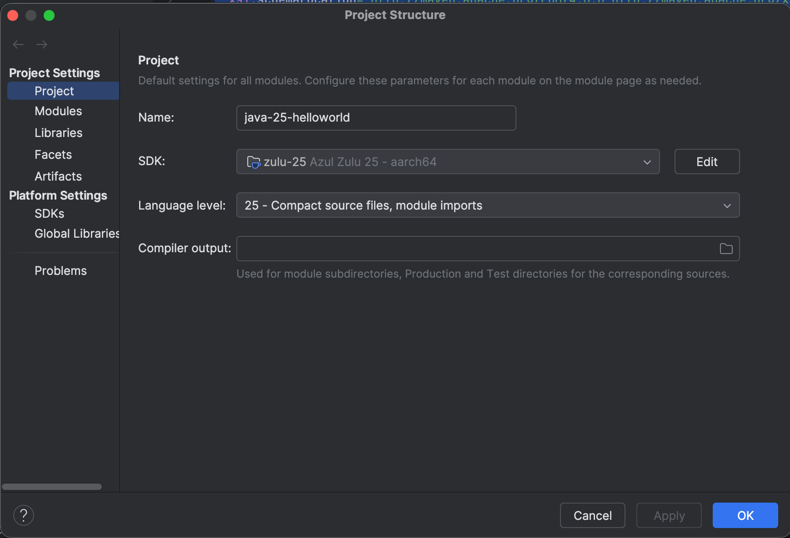

### Build 

```bash
./mvnw clean install 
```

### Result

java -version
```
❯ java -version
openjdk version "25" 2025-09-16 LTS
OpenJDK Runtime Environment Zulu25.28+85-CA (build 25+36-LTS)
OpenJDK 64-Bit Server VM Zulu25.28+85-CA (build 25+36-LTS, mixed mode, sharing)
```

./run.sh
```

```

### Java 25 on IntelliJ

