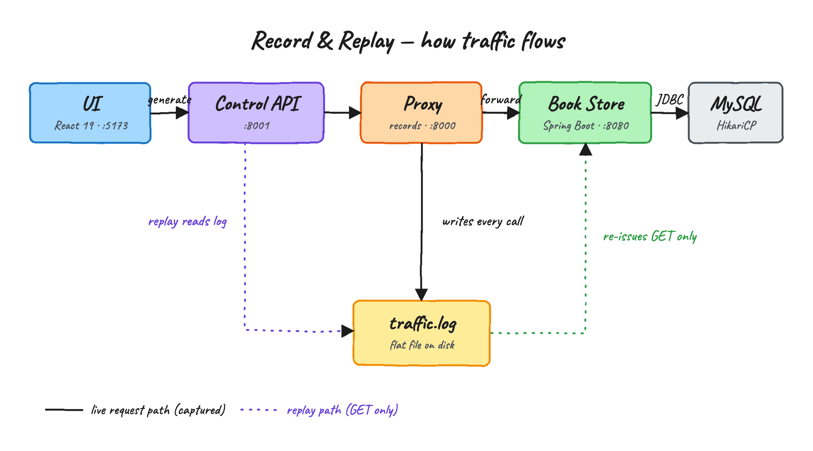
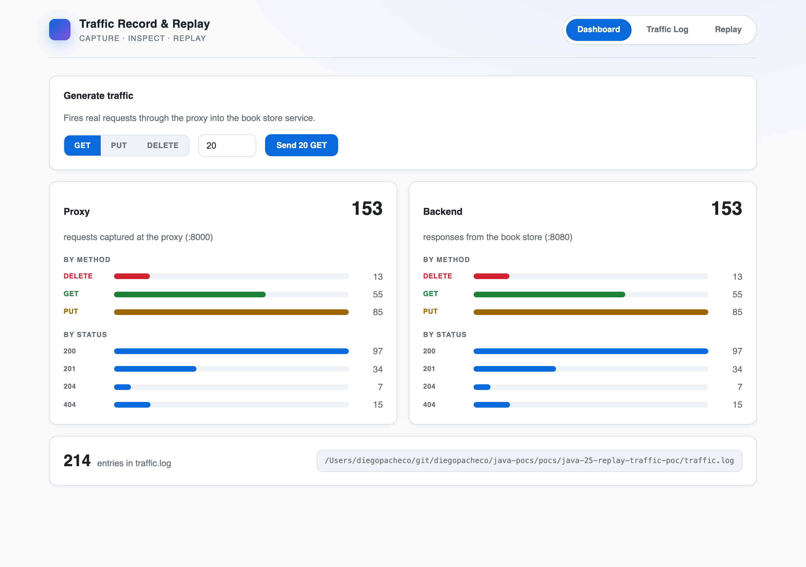
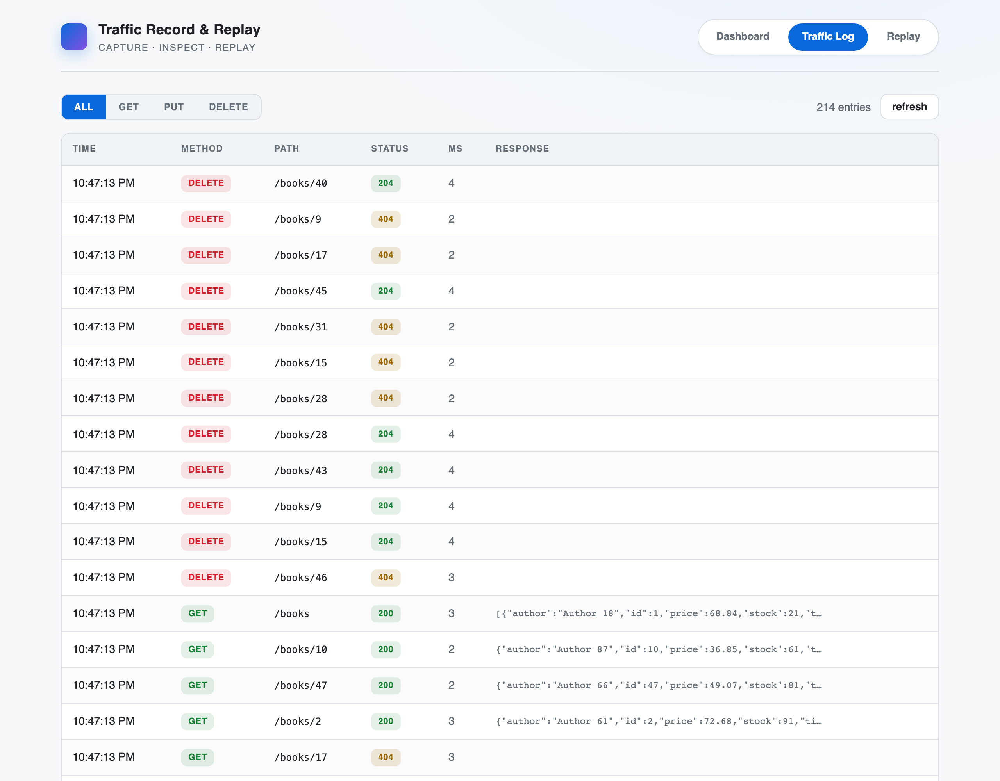
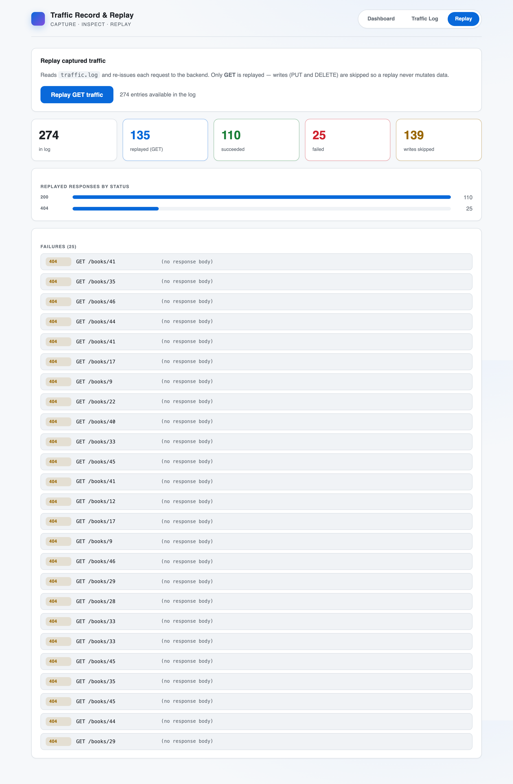

# Traffic Record & Replay

Capture real HTTP traffic at a proxy, write it to a flat log, then replay the
read-only part of it against the service. A small book store API stands in for
"production", a Java proxy records everything that passes through, and a React
UI drives and visualizes it.

## Components

- **traffic-proxy** — plain Java 25, no frameworks. Sits in front of the book
  store on `:8000`, forwards every request, and appends each request/response
  pair to `traffic.log`. A second port `:8001` serves a small control API
  (stats, log, generate, replay) for the UI.
- **bookstore-service** — Spring Boot 4.0.6 on Java 25. REST over `GET`, `PUT`,
  `DELETE`. Persistence is Spring Data JDBC (no Hibernate) on MySQL through a
  HikariCP pool. `PUT /books/{id}` is an upsert: it inserts when the id is new,
  updates when it already exists.
- **ui** — Bun + Vite + React 19, wired with TanStack Router, Query and Table.

## How it flows



The proxy sits in the request path and records both directions; the backend
never knows it is there. Replay reads the same file back and only re-issues the
safe verb (`GET`), so it can never mutate data.

## The three tabs

### Dashboard



- Pick a method (`GET` / `PUT` / `DELETE`) and a count, then **Generate traffic**
  fires that many real requests through the proxy into the book store.
- The **Proxy** and **Backend** panels are live counters (refreshed about every
  1.5s), broken down by method and by status code.
- The two totals track each other because every proxied call reaches the
  backend; the split is what lets you spot forwarding failures.
- The footer shows how many lines are in `traffic.log` and where it lives.

### Traffic Log



- The actual contents of `traffic.log`, newest first.
- Filter by `ALL` / `GET` / `PUT` / `DELETE`.
- Each row carries time, method, path, status, latency in ms, and a preview of
  the response body — the same data the replay reads back.

### Replay



- **Replay GET traffic** reads `traffic.log` and re-issues each request to the
  backend. `PUT` and `DELETE` are skipped, so a replay never mutates data.
- Counters show how much was in the log, how many GETs were replayed, and how
  many succeeded, failed, or were skipped as writes.
- Anything that did not return 2xx is listed at the bottom with its path,
  status, and response detail — a replayed `GET /books/41` returning `404`
  means that id was deleted (or never created) since it was captured.

## Requirements

- Java 25, Bun, podman + podman-compose (MySQL runs in a container).
- The Maven wrapper (`mvnw`) is bundled, so no system Maven is needed.

## Run

```
./start.sh    # MySQL, both Java services, and the UI dev server
./test.sh     # generates traffic, prints stats, then replays
./stop.sh     # stops everything and tears down MySQL
```

Then open http://localhost:5173.

## Ports

| What            | Port |
|-----------------|------|
| UI (Vite)       | 5173 |
| Proxy           | 8000 |
| Control API     | 8001 |
| Book store      | 8080 |
| MySQL           | 3309 |

## Config

Everything is read from the environment with working defaults — nothing is
hard-coded into the binaries:

- proxy: `PROXY_PORT`, `CONTROL_PORT`, `BACKEND_URL`, `TRAFFIC_LOG`, `MAX_BODY`
- book store: `SERVER_PORT`, `DB_URL`, `DB_USER`, `DB_PASS`
- ui: `VITE_API_URL` (defaults to `http://localhost:8001`)

## Layout

```
bookstore-service/   Spring Boot 4 + Spring Data JDBC + MySQL
traffic-proxy/       JDK-only recording proxy + control API
ui/                  React 19 + TanStack dashboard
infra/compose.yaml   MySQL 9
docs/                diagram and screenshots used in this README
start.sh stop.sh test.sh
```
