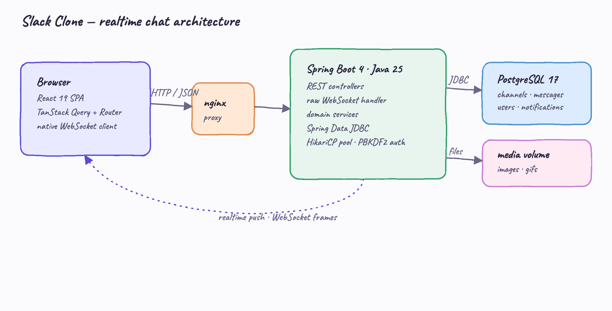
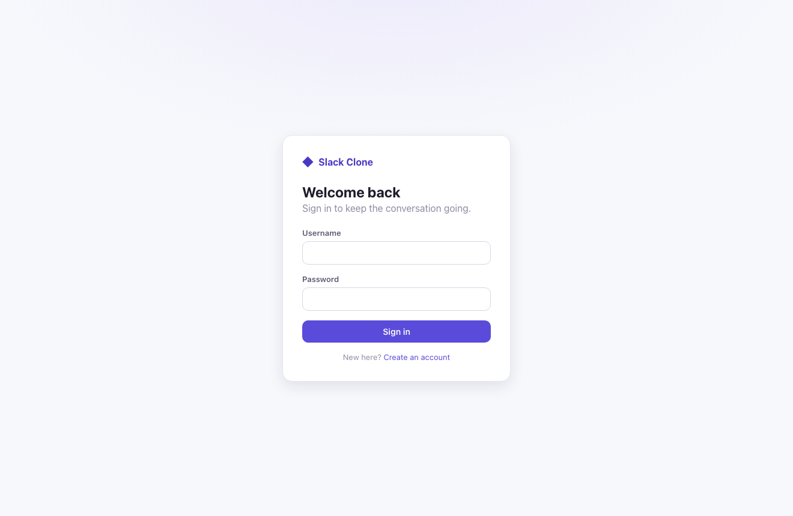
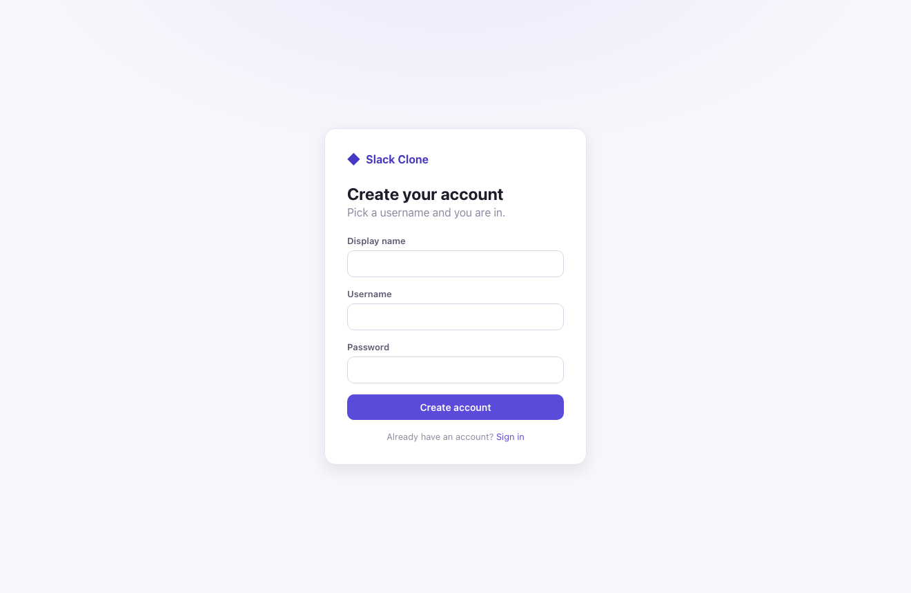
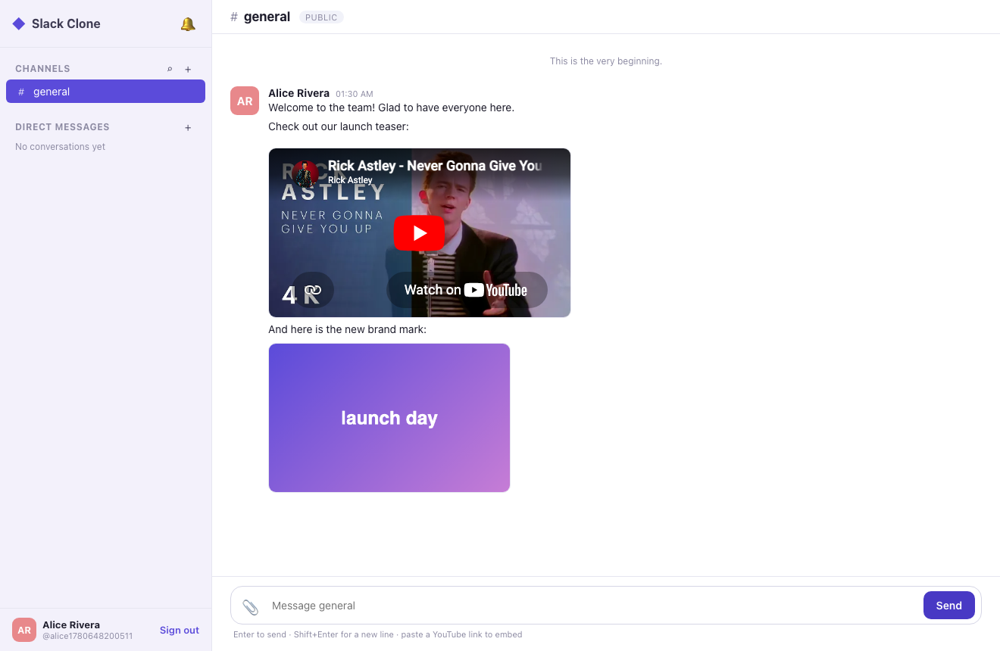
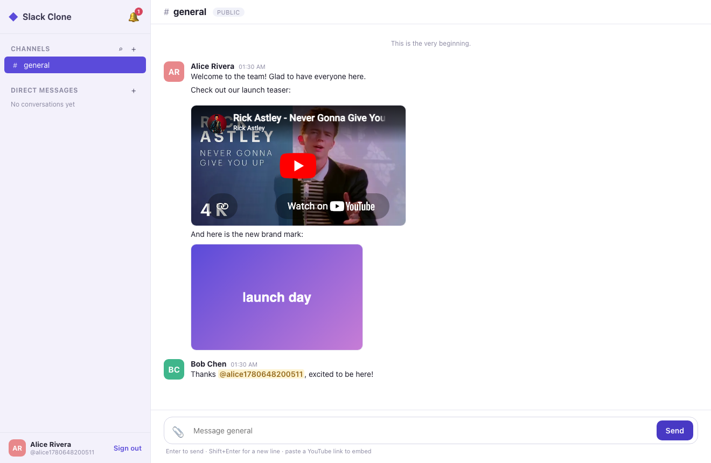
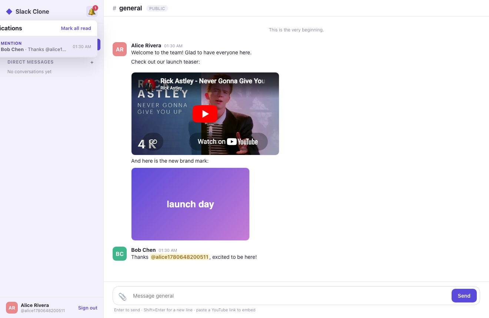
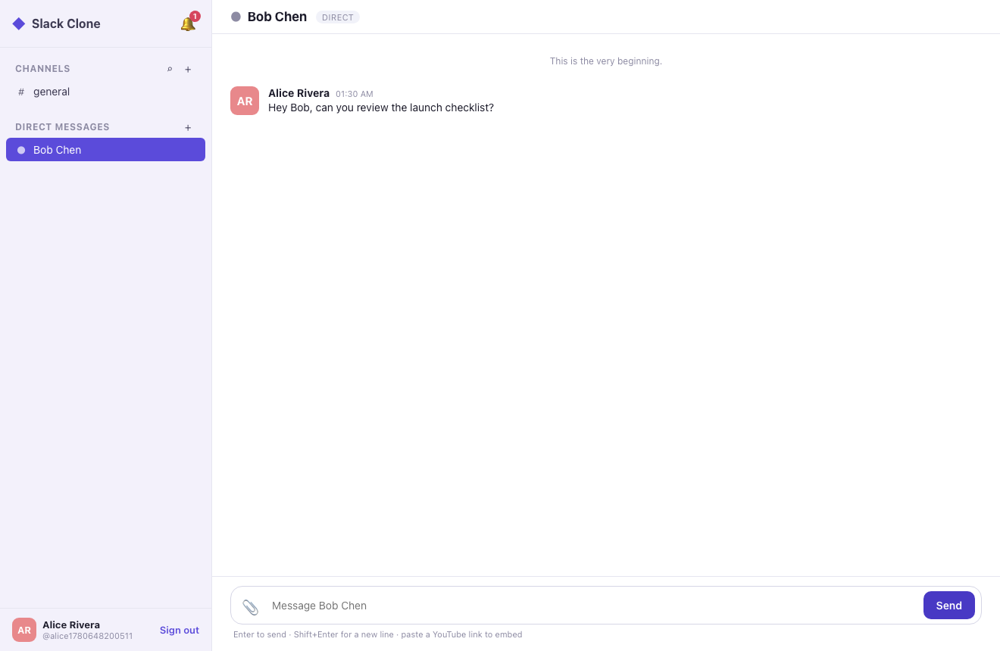

# Slack Clone

A self-hosted, Slack-style team chat. Public and private channels, direct messages,
in-app notifications, realtime delivery over raw WebSocket, inline media (images, GIFs,
YouTube), and full persisted history. Java 25 + Spring Boot 4 backend, React 19 + Vite
frontend, PostgreSQL, all run locally with Podman.

## Architecture



One write path: the browser sends messages over REST; the backend persists them and then
pushes WebSocket frames to every subscribed client. The WebSocket carries reads (pushes)
only — it is never trusted to write. nginx serves the built SPA and proxies `/api`,
`/media`, and `/ws` to the backend, so everything is same-origin in the running stack.

See [design-doc.md](design-doc.md) for the full design.

## Features

- **Public & private channels** — public channels are browsable and self-join; private
  channels are invite-only and invisible to non-members.
- **Direct messages** — modeled as channels of type `DIRECT` with exactly two members, so
  one message model serves channels and DMs alike.
- **Realtime** — raw Spring WebSocket with a hand-rolled subscription registry; messages
  appear in other browsers with no refresh.
- **Notifications** — `@mention` and direct-message notifications, persisted and pushed
  live, with an unread badge and a dropdown panel.
- **Media** — upload images and GIFs (served from a mounted volume) and paste a YouTube
  link to embed it via a privacy-friendly `youtube-nocookie` player.
- **History** — cursor-paged, persisted message history that reloads on refresh.

## Tech stack

| Layer | Choice |
|---|---|
| Backend | Java 25, Spring Boot 4.0.6 |
| Persistence | Spring Data JDBC, HikariCP, PostgreSQL 17 |
| Realtime | Spring WebSocket (raw `TextWebSocketHandler`) |
| Auth | username + password, PBKDF2 hashing (JDK), bearer-token sessions |
| Frontend | React 19, TypeScript 6, Vite 8 |
| State / routing | TanStack Query + TanStack Router |
| Serving | nginx (static SPA + reverse proxy) |
| Runtime | Podman + podman-compose |

## Quick start

Requires Podman, Java 25, and Node. From this directory:

```bash
./start.sh
```

`start.sh` builds the backend jar, builds the frontend bundle, brings up Postgres,
backend, and frontend with podman-compose, and waits until both are healthy. Then open:

```
http://localhost:3000
```

Register two users in two browser windows to see realtime delivery and notifications.

```bash
./stop.sh    # tear the stack down
./test.sh    # exercise the full path against the running stack
```

`test.sh` registers two users, creates a public channel, joins it, sends a message,
reads history, asserts the mention notification, opens a DM, and asserts the DM
notification:

```
PASS: register, channel create, join, send, history, mention, dm open, dm notification
```

## Screens

### Sign in / register
A light, focused entry. Passwords are hashed with PBKDF2 server-side; a successful login
returns a bearer token used for REST and the WebSocket handshake.




### Channel with media
A channel showing a text message, an embedded YouTube video (pasted as a link and turned
into an inline player), and an uploaded image. The three-pane light layout keeps channels
and DMs on the left and the active conversation in the center.



### Realtime across users
A second user, Bob, joins the public channel and replies with an `@mention`. Alice's
window updates live over WebSocket — Bob's message arrives with no refresh, the mention is
highlighted, and the bell shows an unread badge.




### Notifications
The notification panel lists the mention pushed to Alice, with the actor and a snippet.
Clicking a notification jumps to the channel and marks it read.



### Direct messages
A direct message between Alice and Bob, listed under Direct Messages in the sidebar.



## Project layout

```
java-25-slack-clone/
  design-doc.md
  podman-compose.yml
  start.sh  stop.sh  test.sh
  backend/                  Spring Boot 4 · Java 25
    src/main/java/com/slackclone/
      auth/  channel/  message/  notification/  media/  realtime/  user/  config/
    src/main/resources/{application.yml, schema.sql}
    Containerfile
  frontend/                 React 19 · Vite · TypeScript
    src/
      app/  features/  components/  lib/  types/  styles/
    nginx.conf
    Containerfile
  printscreens/
```

## How realtime works

1. The browser opens `ws://<host>/ws?token=<bearer>`. A handshake interceptor resolves the
   token to a user and rejects unauthenticated connections.
2. The client sends `{"type":"subscribe","channelId":N}`; the server verifies membership
   before registering the session under that channel.
3. On a new message the backend persists it, then pushes a `message` frame to every session
   subscribed to that channel and a `notification` frame to each mentioned or DM'd user.
4. The frontend merges incoming frames into the TanStack Query cache, so realtime pushes
   and cached history share one source of truth.

## Notes & limitations

- Auth is username + password with PBKDF2 hashing and constant-time comparison, but tokens
  do not expire and there is no rate limiting — fine for a single-node clone, not the open
  internet.
- Single node: media is stored on a local volume and the WebSocket registry is in-memory.
- Out of scope for this version: threads, reactions, search, presence, voice/video.
