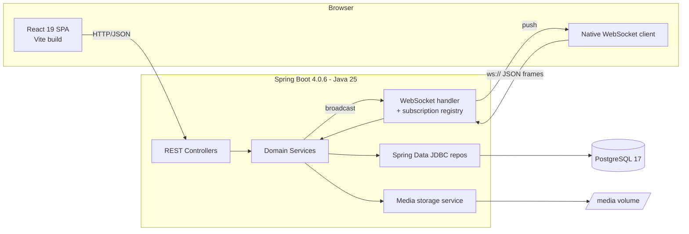
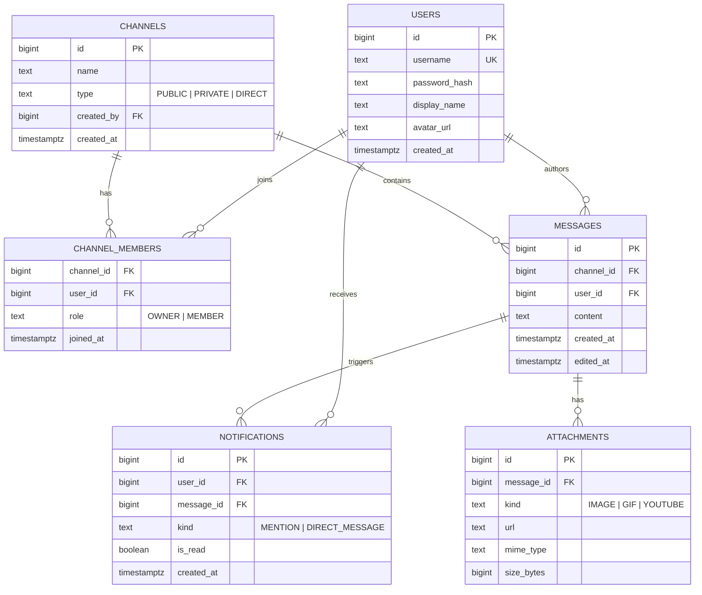
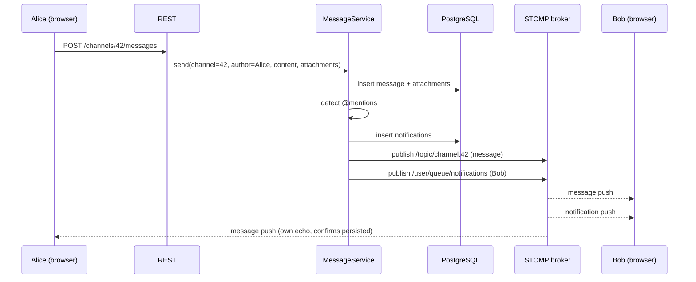
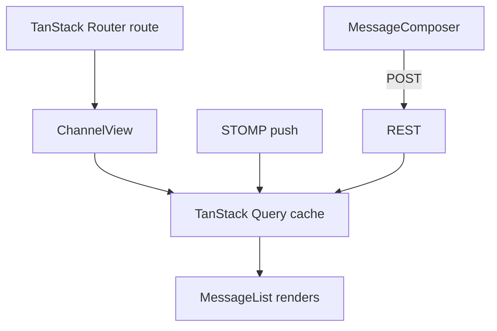

# Slack Clone — Design Document

## 1. Overview

A self-hosted Slack-style team chat. Public and private channels, direct messages,
in-app notifications, realtime delivery over WebSocket, inline media (images, GIFs,
YouTube), and full persisted message history.

Single repository, two deployables: a Java backend and a React frontend, both run
locally through Podman with `start.sh` / `stop.sh`.

## 2. Goals

- Public channels (anyone can join) and private channels (invite-only).
- Direct messages between two users.
- Realtime message delivery (no polling for the happy path).
- In-app notifications for mentions and direct messages.
- Upload and render images and GIFs; embed YouTube videos by URL.
- Persist and re-load full channel and DM history.
- Light, modular, component-driven UI.
- One-command local startup.

## 3. Non-Goals

- Production-grade authentication (OAuth/SSO/MFA). A lightweight token identity is used.
- Horizontal scaling, message brokering across nodes, or HA. Single-node only.
- Voice/video calls, screen share, threads, reactions, search. Out of scope for v1.
- Mobile native apps. Web only, responsive.
- E2E encryption.

## 4. Tech Stack

| Layer | Choice | Version |
|---|---|---|
| Language (backend) | Java | 25 |
| Framework | Spring Boot | 4.0.6 |
| Persistence | Spring Data JDBC | (Spring Boot managed) |
| Realtime | Spring WebSocket (raw, `TextWebSocketHandler`) | (Spring Boot managed) |
| Database | PostgreSQL | 17 |
| Build | Gradle (Kotlin DSL) | wrapper |
| Language (frontend) | TypeScript | 6.x |
| UI | React | 19 |
| Bundler/dev | Vite | latest |
| Routing | TanStack Router | latest |
| Server state | TanStack Query | latest |
| WS client | Native `WebSocket` (thin wrapper) | — |
| Password hashing | JDK `PBKDF2WithHmacSHA256` | (built-in) |
| Containers | Podman + podman-compose | 5.x |

Library budget is deliberately small: no ORM beyond Spring Data JDBC, no Redis, no
message broker, no STOMP, no object store, no auth provider, no password-hashing
library (JDK PBKDF2), no CSS framework (hand-rolled CSS modules / design tokens). The
realtime layer is a raw WebSocket handler with a hand-rolled subscription registry.

## 5. High-Level Architecture



Write path: client `POST`s a message (or uploads a file) over REST. The service
persists it, then publishes to the relevant STOMP destination. Every subscribed
client receives the push. There is exactly one write path; WebSocket carries reads
(pushes) only.

## 6. Data Model

DMs are modeled as channels of type `DIRECT` with exactly two members, so a single
`message` table serves channels and DMs alike.



### Spring Data JDBC aggregates

Aggregates are kept small to fit the JDBC model (no lazy loading, explicit loads):

- **Message** (root) → owns its `Attachment` collection. Saving a message persists
  its attachments in the same write.
- **Channel** (root) → owns its `ChannelMember` collection.
- **User** (root), **Notification** (root) stand alone.

Cross-aggregate links are by id only (e.g. `Message.userId`, not a `User` reference).
Read models that need joins (message + author display name) use a dedicated query in
the repository rather than object graph traversal.

## 7. Backend Design

### Package layout (feature-sliced)

```
com.slackclone
  config/        WebSocketConfig, CorsConfig, AuthFilter
  user/          UserController, UserService, UserRepository, User
  channel/       ChannelController, ChannelService, ChannelRepository, Channel, ChannelMember
  message/       MessageController, MessageService, MessageRepository, Message, Attachment
  notification/  NotificationController, NotificationService, NotificationRepository, Notification
  media/         MediaController, MediaStorageService
  realtime/      ChatWebSocketHandler, RealtimeRegistry, HandshakeAuthInterceptor, frame DTOs
```

### REST API

| Method | Path | Purpose |
|---|---|---|
| POST | `/api/auth/login` | Resolve/create user by username, return token |
| GET | `/api/users/me` | Current user |
| GET | `/api/users` | Directory (for starting DMs) |
| GET | `/api/channels` | Channels visible to current user |
| POST | `/api/channels` | Create public/private channel |
| POST | `/api/channels/{id}/join` | Join a public channel |
| POST | `/api/channels/{id}/members` | Invite to private channel |
| GET | `/api/channels/{id}/messages?before=&limit=` | Paged history (cursor) |
| POST | `/api/channels/{id}/messages` | Send a message (+ attachment refs) |
| POST | `/api/dms/{userId}` | Open/get a DIRECT channel with a user |
| POST | `/api/media` | Upload image/GIF (multipart) → returns URL |
| GET | `/media/{file}` | Serve stored media |
| GET | `/api/notifications` | List notifications |
| POST | `/api/notifications/{id}/read` | Mark read |

History pagination is cursor-based (`before=<message_id>`), newest-first, so loading
older history is O(limit) and stable under concurrent writes.

### Realtime (STOMP)

- Endpoint: `/ws` (SockJS fallback optional).
- Destinations:
  - `/topic/channel.{channelId}` — new/edited messages for a channel or DM.
  - `/user/queue/notifications` — per-user notification push (Spring user destination).
- Subscription is authorized: a client may only subscribe to channel topics it is a
  member of (checked in a `ChannelInterceptor`).
- The server never trusts the client to broadcast. Clients send via REST; only the
  backend publishes to topics through `SimpMessagingTemplate`.



### Notifications

Generated server-side at send time:
- **MENTION** — message content contains `@username` of a channel member.
- **DIRECT_MESSAGE** — any message in a `DIRECT` channel, for the other member.

Each is persisted and pushed to `/user/queue/notifications`. Unread count is derived
from `is_read = false`. No email/push; in-app only.

### Media

- Upload (`POST /api/media`, multipart) validates content type against an allowlist
  (`image/png`, `image/jpeg`, `image/gif`, `image/webp`) and a max size, writes to the
  mounted media volume under a UUID filename, returns a public URL.
- Stored files are served by `GET /media/{file}` with caching headers.
- YouTube needs no upload: the client (or server) extracts the video id from a pasted
  URL and stores an `ATTACHMENT(kind=YOUTUBE, url=videoId)`; the frontend renders a
  privacy-friendly `youtube-nocookie.com` iframe.

### Auth (lightweight, explicitly not production)

`POST /api/auth/login {username}` upserts a user and returns an opaque bearer token
(random, stored in a `sessions` table or signed). An `AuthFilter` resolves the token
to the current user for REST and for the STOMP `CONNECT` frame. No passwords, no
refresh, no roles beyond channel ownership. This is a known simplification, called out
so it is not mistaken for real security.

### Database lifecycle

Schema created from `src/main/resources/schema.sql` on startup (Spring Boot runs it
against Postgres). No Flyway/Liquibase to stay within the library budget; if the
schema later needs versioned migrations, Flyway is the drop-in upgrade.

## 8. Frontend Design

### Folder layout (feature-modular)

```
frontend/src
  app/            router.tsx, providers.tsx, AppShell
  features/
    auth/         LoginView, useAuth
    channels/     ChannelList, ChannelView, CreateChannelDialog, useChannels
    messages/     MessageList, MessageItem, MessageComposer, useMessages
    dms/          DmList, StartDmDialog, useDms
    notifications/NotificationBell, NotificationPanel, useNotifications
    media/        ImageAttachment, GifAttachment, YouTubeEmbed, FileUploader
  components/      Avatar, Button, Dialog, Icon, Spinner, EmptyState (shared, dumb)
  lib/            apiClient.ts, stompClient.ts, queryClient.ts, mentions.ts
  hooks/          usePresence, useInfiniteHistory
  types/          api.ts (shared DTO types)
  styles/         tokens.css, globals.css
```

### State & data

- **TanStack Query** owns all server state: channels, messages (infinite query for
  history), notifications. Cache keys: `['messages', channelId]`, `['channels']`,
  `['notifications']`.
- **TanStack Router** owns navigation: `/`, `/c/$channelId`, `/dm/$userId`. The active
  channel id comes from the route, not component state.
- **STOMP client** (`lib/stompClient.ts`) is a singleton. On a channel message push it
  updates the matching Query cache (optimistic merge), so realtime and cache stay in
  one source of truth. Notification pushes bump the `['notifications']` cache.



### Component approach

Many small, single-purpose components; shared primitives in `components/` are
presentational and stateless, feature components in `features/` own their data hooks.
Composer, message item, attachment renderers, and notification items are all isolated
and independently testable.

### Light UI

Light theme only, driven by CSS custom properties in `styles/tokens.css` (color,
spacing, radius, typography scale). Three-pane layout: left sidebar (channels + DMs),
center (active conversation), right (notifications panel / member list). Responsive
collapse to a single pane on narrow viewports.

## 9. Local Development & Deployment

```
podman-compose.yml
  postgres   -> Postgres 17, named volume for data
  backend    -> Containerfile (Gradle build -> JRE 25), depends_on postgres
  frontend   -> Containerfile (Vite build -> static served), depends_on backend
  media volume mounted into backend
```

- `start.sh` — builds and brings up the full stack with podman-compose, waits (loop,
  max 1s sleep) for Postgres and backend health before declaring ready.
- `stop.sh` — tears the stack down.
- `test.sh` — exercises login → create channel → send message → fetch history to prove
  the path works.

Backend health endpoint and a readiness loop gate the frontend so the UI never starts
against a cold database.

## 10. Repository Layout

```
java-25-slack-clone/
  design-doc.md
  README.md
  podman-compose.yml
  start.sh  stop.sh  test.sh
  backend/
    Containerfile
    build.gradle.kts  settings.gradle.kts
    src/main/java/com/slackclone/...
    src/main/resources/{application.yml, schema.sql}
    src/test/java/...
  frontend/
    Containerfile
    package.json  vite.config.ts  tsconfig.json
    src/...
  printscreens/
```

## 11. Build Phases

1. **Scaffold** — repo, podman-compose, Postgres up, backend + frontend hello path.
2. **Identity & channels** — login, create/join public & private channels, membership.
3. **Messaging + history** — send/persist messages, cursor-paged history, REST only.
4. **Realtime** — STOMP wiring, channel topics, live delivery, own-echo.
5. **DMs** — DIRECT channels, user directory, start-DM flow.
6. **Notifications** — mention/DM detection, persistence, user-queue push, bell + panel.
7. **Media** — image/GIF upload + render, YouTube embed.
8. **Polish** — light theme, responsive layout, empty/loading states.
9. **Docs** — README with hand-drawn-style diagram and Playwright screenshots.

Each phase ends with a runnable stack and a `test.sh` assertion for the new path.

## 12. Risks & Open Questions

- **Spring Boot 4.0.6 + Java 25** are recent; pin exact dependency versions and verify
  the WebSocket/STOMP and Data JDBC starters resolve before building features on them.
- **TypeScript 6.x** is recent; confirm Vite/React 19 type compatibility early.
- **Auth simplification** — confirm a username-only identity is acceptable for v1.
- **Media storage on a volume** is single-node; fine for this scope, not for scale-out.
- **Presence/online indicators** are not in scope unless requested (cheap to add later
  via STOMP connect/disconnect events).

## 13. Success Criteria

- Two browsers, two users: a message sent in a shared channel appears in the other
  browser in realtime without refresh.
- A private channel is invisible to non-members.
- A DM and an `@mention` each produce a notification for the recipient.
- An uploaded image/GIF and a pasted YouTube link render inline.
- Reloading the page restores full history.
- `./start.sh` brings the whole stack up from clean; `./stop.sh` tears it down.
