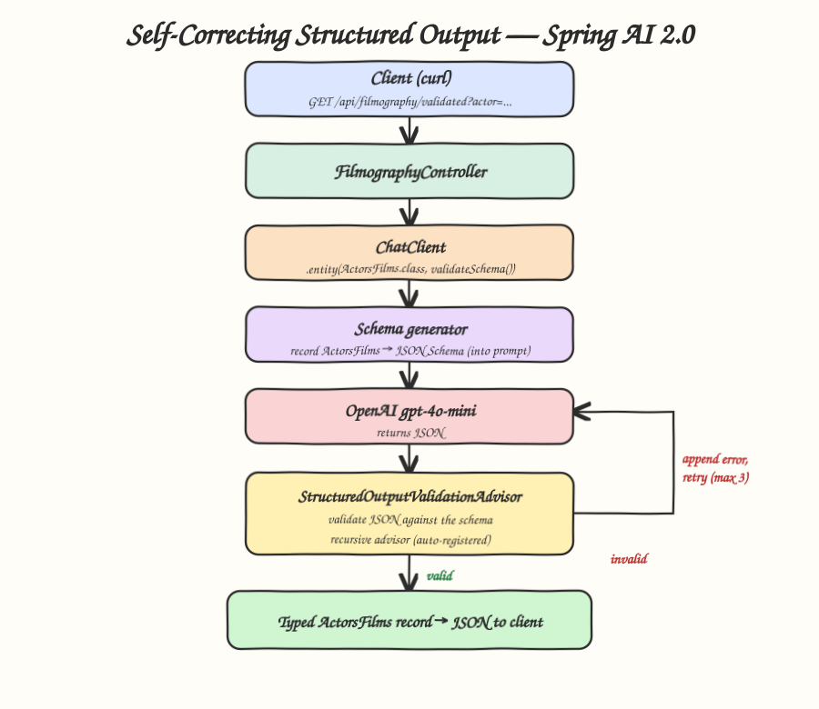

# java-25-spring-ai-2-structured-outputs

POC of **self-correcting structured output** in Spring AI 2.0, based on the Spring blog post:
https://spring.io/blog/2026/06/23/spring-ai-self-correcting-structured-output

An LLM is text-in / text-out. Structured output steers the model to produce text that matches a
schema and parses it back into a typed Java object. Spring AI 2.0 adds two new dials on top of the
classic `ChatClient.call().entity(...)`:

- `validateSchema()` — a self-correcting retry loop. The response is validated against the schema;
  on failure the validation error is appended to the prompt and the call is re-issued (up to 3
  attempts by default). The model sees what was wrong and corrects it. Powered by the
  auto-registered recursive `StructuredOutputValidationAdvisor`.
- `useProviderStructuredOutput()` — pushes the schema to the provider's API (OpenAI Structured
  Outputs) so invalid responses can't be emitted at all.

## Stack

- Java 25
- Spring Boot 4.0.6
- Spring AI 2.0.0 (`spring-ai-starter-model-openai`)
- OpenAI `gpt-4o-mini`

## Architecture



## The target type

```java
public record ActorsFilms(String actor, List<String> movies) {}
```

## The feature

```java
ActorsFilms films = chatClient.prompt()
        .user("Generate the filmography of 5 movies for the actor " + actor + ".")
        .call()
        .entity(ActorsFilms.class, spec -> spec.validateSchema());
```

See `src/main/java/.../structuredoutput/FilmographyService.java` for the three variants
(`basic`, `validated`, `providerNative`).

## Endpoints

| Method | Path | Dial |
|--------|------|------|
| GET | `/api/filmography/basic?actor=...` | none — plain `.entity(...)` |
| GET | `/api/filmography/validated?actor=...` | `validateSchema()` (self-correcting) |
| GET | `/api/filmography/provider?actor=...` | `useProviderStructuredOutput()` |

## Run it

Export your key (the app reads `OPENAI_API_KEY`):

```bash
export OPENAI_API_KEY=sk-...
```

```bash
./start.sh   # builds, runs on http://localhost:8081, waits for health UP
./test.sh    # triggers all three endpoints and prints the JSON
./stop.sh    # stops the app
```

## Example output

`./test.sh` against the `validated` endpoint returns typed JSON:

```json
{
  "actor": "Meryl Streep",
  "movies": ["The Devil Wears Prada", "Sophie's Choice", "Kramer vs. Kramer", "The Iron Lady", "Doubt"]
}
```

## Customizing the self-correcting advisor

`validateSchema()` auto-registers a `StructuredOutputValidationAdvisor` with 3 attempts. To change
it, build your own and register it on the `ChatClient` (it replaces the auto-registered one):

```java
var validationAdvisor = StructuredOutputValidationAdvisor.builder()
        .outputType(ActorsFilms.class)
        .maxRepeatAttempts(5)
        .build();

ChatClient chatClient = ChatClient.builder(chatModel)
        .defaultAdvisors(validationAdvisor)
        .build();
```

## Build / tests

```bash
./mvnw clean package
```

```
Tests run: 1, Failures: 0, Errors: 0, Skipped: 0
BUILD SUCCESS
```

The test (`ApplicationTests`) loads the full context to verify the Spring AI / OpenAI wiring boots.
