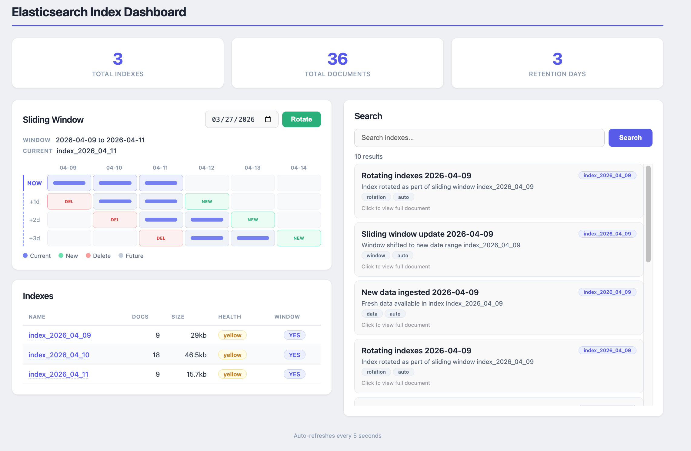
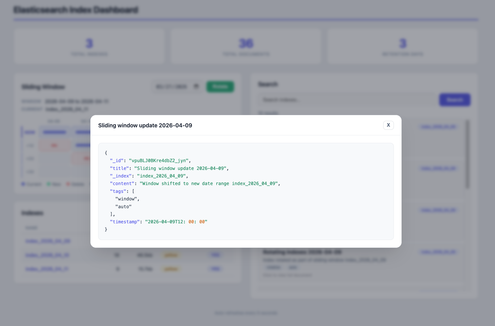
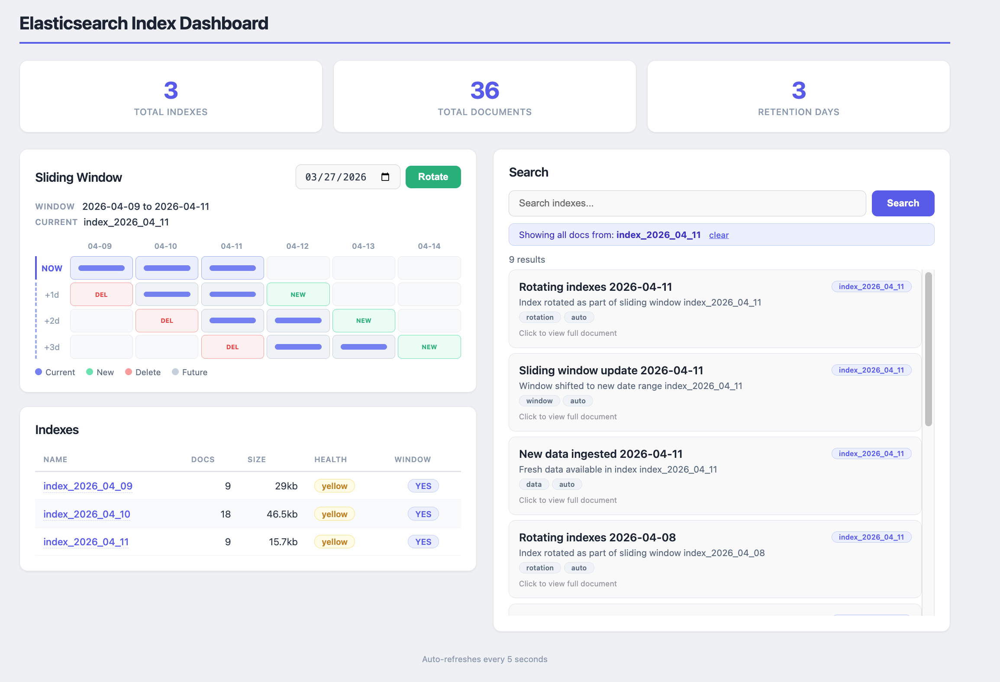

# Java 25 + Spring Boot 4 + Elasticsearch 9 - Sliding Window Indexes

Manages Elasticsearch indexes using a **sliding window algorithm**. One index per day (`index_YYYY_MM_DD`), with configurable retention (default: 3 days). Expired indexes have their data **migrated** into the new index before deletion.

Includes a **two-column React dashboard** with a Gantt-style sliding window visualization, wildcard search, and manual rotation with data migration.

## Design Doc

Full architecture, component details, rotation rules, and dashboard specs: [design-doc.md](design-doc.md)

## Tech Stack

| Component | Version |
|-----------|---------|
| Java | 25 |
| Spring Boot | 4.0.4 |
| Elasticsearch | 9.0.2 |
| Gradle | 9.0 |
| React | 19 |
| TanStack Query | 5 |
| Vite | 8 |
| Bun | 1.x |
| Podman | latest |
| Testcontainers | 1.20.4 |

## Dashboard

Open http://localhost:5173 after `./run.sh`.

### Dashboard after rotation with search results



Full dashboard view after a rotation. Left column shows the Gantt-style sliding window (NOW + 3 projected days with DEL/NEW markers), the current window range, and the indexes table with doc counts, sizes, and health. Right column shows wildcard search results across all window indexes, each result displaying title, content, tags, and the source index badge.

### JSON document modal with syntax coloring



Clicking any search result opens a modal with the full Elasticsearch document rendered as syntax-colored JSON. Keys in blue, string values in green, numbers in yellow, timestamps highlighted. The modal can be closed with ESC or clicking outside.

### Clickable index name loading docs into search



Clicking an index name on the left table loads all documents from that specific index into the search area on the right. A blue banner shows which index is being filtered, with a "clear" link to reset. The search results show documents only from the selected index.

## Architecture

```
┌──────────────────────────────────────────────┐
│            React Dashboard (:5173)            │
│                                               │
│  ┌───────────────┐  ┌─────────────────────┐  │
│  │ Sliding Window │  │ Search + Results    │  │
│  │ Gantt Chart    │  │ (wildcard, scroll)  │  │
│  │ Rotate + Date  │  │ Click -> JSON Modal │  │
│  │ Indexes Table  │  │ (colored, ESC close)│  │
│  └───────────────┘  └─────────────────────┘  │
└──────────────────┬───────────────────────────┘
                   │
┌──────────────────▼───────────────────────────┐
│          Spring Boot 4 App (:8080)            │
│                                               │
│  IndexService    SearchService                │
│  DashboardService  RotateController           │
└──────────────────┬───────────────────────────┘
                   │
┌──────────────────▼───────────────────────────┐
│          Elasticsearch 9 (:9200)              │
│                                               │
│  index_2026_03_24  index_2026_03_25           │
│  index_2026_03_26                             │
└──────────────────────────────────────────────┘
```

## Sliding Window

```
         03-24   03-25   03-26   03-27   03-28   03-29
 NOW   [ ████ ] [ ████ ] [ ████ ]
 +1d   [  DEL ]  [ ████ ] [ ████ ] [ NEW  ]
 +2d             [  DEL ]  [ ████ ] [ ████ ] [ NEW  ]
 +3d                       [  DEL ]  [ ████ ] [ ████ ] [ NEW  ]
```

- Blue = active window
- Green NEW = index created, sample data fed
- Red DEL = data migrated to new index, then deleted

### Rotation Rules

1. Create new index for the target date (idempotent)
2. Feed 3 sample documents into the new index
3. Identify expired indexes (older than retention window)
4. Migrate all documents from expired indexes into new index (`_reindex`)
5. Delete expired indexes
6. Refresh and return summary

## Quick Start

### Prerequisites
- Java 25
- Podman + podman-compose
- Bun

### Run Everything
```bash
./run.sh
```
Starts Elasticsearch (podman), Spring Boot app (:8080), and React dashboard (:5173).

### Feed Data
```bash
./feed.sh
```
Creates 3 indexes (today, yesterday, day before) and feeds 9 sample documents.

### Test All Features
```bash
./test.sh
```
Calls every API endpoint: create, search, delete, dashboard, retention, rotate.

### Stop Everything
```bash
./stop.sh
```

### Run Integration Tests
```bash
./gradlew test
```

## API Endpoints

### Index Management

| Endpoint | Method | Description |
|----------|--------|-------------|
| `/api/index/current` | GET | Get today's index name |
| `/api/index/{date}` | POST | Create index for date (YYYY-MM-DD) |
| `/api/index/{date}` | DELETE | Delete index for date |
| `/api/index/range?from=&to=` | GET | List index names in date range |
| `/api/index/retention` | POST | Apply retention policy |

### Search

| Endpoint | Method | Description |
|----------|--------|-------------|
| `/api/search?q=&from=&to=` | GET | Wildcard search across date range |
| `/api/search/today?q=` | GET | Wildcard search today's index |

### Dashboard

| Endpoint | Method | Description |
|----------|--------|-------------|
| `/api/dashboard` | GET | Full dashboard data |

### Rotation

| Endpoint | Method | Description |
|----------|--------|-------------|
| `/api/rotate/{date}` | POST | Create index, feed data, migrate + delete expired indexes |

### Two-Column Layout

| Left Column | Right Column |
|-------------|--------------|
| Gantt-style sliding window (current + 3 days projected) | Search textbox (wildcard, supports single chars) |
| Rotate button with date picker | Scrollable search results |
| Indexes table (name, docs, size, health, in-window) | Click result -> JSON modal with syntax colors |

### Features

- **Gantt Chart**: Stacked rows showing the window sliding forward, with NEW/DEL markers
- **Rotate**: Pick a date, click Rotate -> creates index, migrates data from expired indexes, deletes old, refreshes dashboard
- **Search**: Wildcard search (`*query*`) across all window indexes, even single characters like "a"
- **JSON Modal**: Click any search result to view full document with colored JSON (blue keys, green strings, yellow numbers). Close with ESC or click outside.
- **Auto-refresh**: Every 5 seconds via TanStack Query

## Integration Tests

| Test | What it proves |
|------|---------------|
| `testMultiIndexQuery` | Search spans 3 indexes simultaneously, returns results from all |
| `testConcurrentIndexCreation` | 10 threads creating the same index - zero errors, idempotent |
| `testDeleteIndex` | Create, verify, delete, verify gone, double-delete returns false |

## Configuration

```properties
spring.elasticsearch.uris=http://localhost:9200
app.index.retention-days=3
app.index.prefix=index
```

## Usage

```bash
curl -X POST http://localhost:8080/api/index/2026-03-26

curl -X POST http://localhost:9200/index_2026_03_26/_doc \
  -H "Content-Type: application/json" \
  -d '{"title":"Hello","content":"World","tags":["test"]}'

curl -X POST http://localhost:9200/_refresh

curl "http://localhost:8080/api/search?q=Hello&from=2026-03-24&to=2026-03-26"

curl http://localhost:8080/api/dashboard | jq .

curl -X POST http://localhost:8080/api/rotate/2026-03-27

curl -X POST http://localhost:8080/api/index/retention
```
