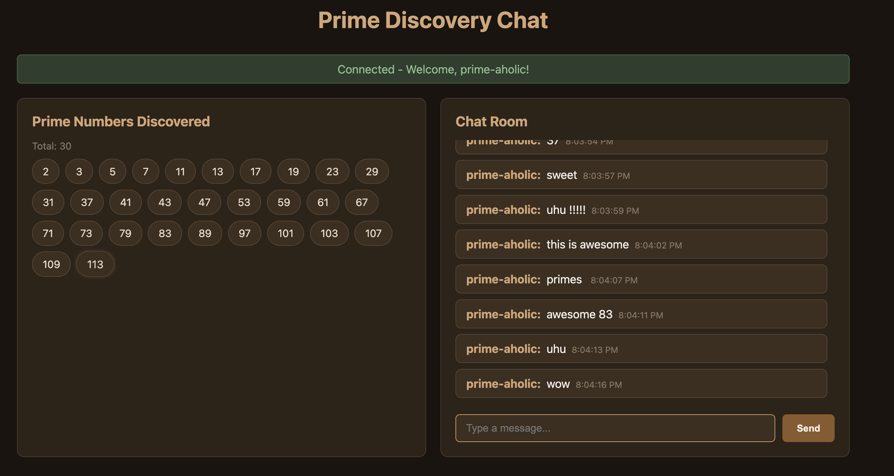

### Build

```bash
./mvnw clean install
```

### Run

```bash
./run.sh
```

Open http://localhost:8080

### Stop

```bash
./stop.sh
```

### Result



```
Prime Discovery Chat application with:
- WebSocket endpoint /ws/primes - broadcasts prime numbers as they are discovered
- WebSocket endpoint /ws/chat - real-time chat room
- REST endpoint /api/primes - returns all discovered primes
- Frontend built with React, TanStack Query, Bun, Vite
- Backend uses Java 25, Spring Boot 4.x with pure WebSocket (no STOMP)
- Prime discovery uses memoization with ConcurrentHashMap
```
