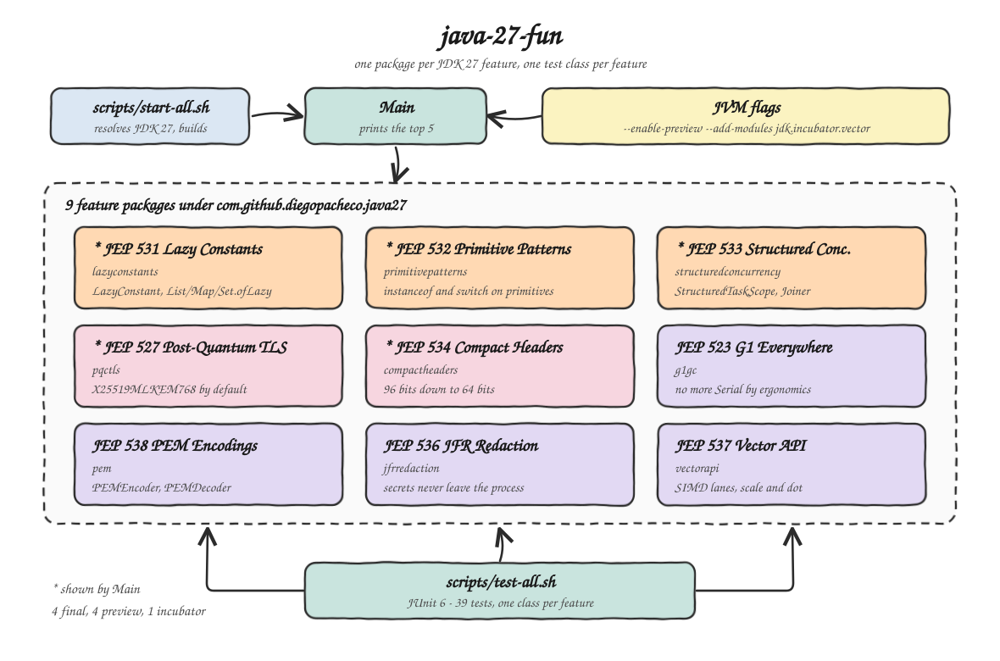

# java-27-fun

A hands-on POC of **every feature shipped in JDK 27** (GA 15 September 2026). Each of the nine JEPs
lives in its own package with its own test class, and `Main` prints the five most interesting ones.

Built and verified on Corretto `27.0.0-amzn` (`27+33-FR`).

## How it Works

`Main` is a plain console application. It imports the five headline feature packages and prints what
each one does at runtime, so the output is proof the feature really works on this JVM rather than a
description of it.

The other four JEPs are runtime and tooling changes with no code to call in `Main`, so they are
exercised only by their test classes: the tests read the live GC beans, the live VM flags and a JFR
recording taken in-process.

Preview features (JEPs 531, 532, 533, 538) need `--enable-preview` and the Vector API (JEP 537) needs
`--add-modules jdk.incubator.vector`. Both flags are set once in `pom.xml` for the compiler, for
Surefire and for the `exec` plugin, so no script has to remember them.

## Architecture



## Features

| JEP | Status | Package | What it shows |
|---|---|---|---|
| 531 | Preview | `lazyconstants` | `LazyConstant`, plus `List.ofLazy`, `Map.ofLazy` and the new `Set.ofLazy`: constants that initialize on first read, at most once, and still constant-fold. |
| 532 | Preview | `primitivepatterns` | `case int i`, `instanceof float f` and `Num(int age)` record patterns: pattern matching over primitives with an exactness test instead of a lossy cast. |
| 533 | Preview | `structuredconcurrency` | `StructuredTaskScope` with the JDK 27 third type parameter, so `join()` can throw a domain exception the caller chooses. |
| 527 | Final | `pqctls` | TLS 1.3 now puts the quantum-resistant `X25519MLKEM768` first by default, so existing code gets it without any change. |
| 534 | Final | `compactheaders` | Object headers are 64 bits instead of 96 by default, saving 4 bytes on every single object on the heap. |
| 523 | Final | `g1gc` | G1 is now selected in every environment, so small or containerized machines no longer silently fall back to Serial. |
| 538 | Preview | `pem` | `PEMEncoder` and `PEMDecoder` turn keys into RFC 7468 text and back, including password-encrypted private keys. |
| 536 | Final | `jfrredaction` | JFR replaces secrets in system properties with `[REDACTED]` before the recording ever leaves the process. |
| 537 | Incubator | `vectorapi` | `FloatVector.SPECIES_PREFERRED` maps array math onto the host CPU's SIMD lanes, with a scalar tail loop. |

## Stack

| Piece | Why |
|---|---|
| JDK 27 (Corretto) | The subject of the POC; every feature here needs a JDK 27 runtime. |
| Maven Wrapper | Builds with no Maven install and pins the preview flags in one place. |
| JUnit 6.1 | The only dependency; needed because every feature is proven by a test. |
| SDKMAN | Resolves and installs the JDK, already pinned by `.sdkmanrc`. |

## API

There is no network service. Each package exposes a small static API that its test class drives:

| Package | Entry points |
|---|---|
| `lazyconstants` | `banner()`, `square(int)`, `width(String)`, `isEnabled(Option)`, `initializations()` |
| `primitivepatterns` | `status(int)`, `narrowest(double)`, `ageOf(Json)`, `label(Object)` |
| `structuredconcurrency` | `load(user, item)`, `loadOrFail(user, item)`, `fastest(Duration, String...)` |
| `pqctls` | `defaultNamedGroups()`, `quantumResistantByDefault()`, `hybridGroupsEnabledByDefault()`, `optInHybridSchemes()`, `supportsMlKem(String)` |
| `compactheaders` | `enabled()`, `headerBits()`, `headerBytesSavedPerObject()` |
| `g1gc` | `names()`, `isG1()`, `collections()` |
| `pem` | `generateKeyPair()`, `encode(PublicKey)`, `decodePublicKey(String)`, `encrypt(PrivateKey, char[])`, `decrypt(String, char[])` |
| `jfrredaction` | `initialSystemProperties()`, `isRedacted(String)` |
| `vectorapi` | `lanes()`, `scale(float[], float)`, `dot(float[], float[])` |

## Key Data Structures and Design Decisions

**An `AtomicInteger` counter is the only way to observe laziness.** `LazyConstant` deliberately no
longer exposes `isInitialized()` in JDK 27, so `LazyConstants` counts invocations of its own
computing functions. That is what lets the tests assert *at most once per element*, which is the
actual contract, rather than just asserting the returned value.

**`narrowest(double)` orders its checks from narrowest to widest.** Primitive `instanceof` tests for
exact representability, not range, so `7.0` matches `byte`, `1.5` matches `float` and `0.1` matches
neither and stays a `double`. Reversing the order would make every check succeed at `float`.

**Structured concurrency is shown twice on purpose.** `load` uses the default
`ExecutionException`, while `loadOrFail` passes `OrderFailedException::new` to
`allSuccessfulOrThrow`. The second form is the JDK 27 change: the scope's new third type parameter
carries the exception type that `join()` throws.

**The JFR test needs its inputs on the command line.** `jdk.InitialSystemProperty` only records
properties the JVM was started with, so the redaction filter and both test properties are set in the
Surefire `argLine` rather than programmatically. The filter is `redact-key=+*confidential*`; the
leading `+` appends to the JDK's built-in filters instead of replacing them.

**Vector code always keeps a scalar tail.** `loopBound` stops at the last full vector, so arrays that
are not a multiple of the lane count are finished by a plain loop. The tests use length 37 precisely
to walk that path.

## How to run

```bash
./scripts/setup.sh
./scripts/start-all.sh
./scripts/test-all.sh
```

Or the plain Maven route:

```bash
./mvnw clean install
./mvnw exec:exec
```

### Result

```
Java 27+33-FR - top 5 features

JEP 531 - Lazy Constants (Third Preview)
----------------------------------------
initializations before use : 0
banner                     : Java 27 lazy constant
lazy list square(4)        : 16
lazy map width(constant)   : 8
lazy set VERBOSE enabled   : true
initializations after use  : 4

JEP 532 - Primitive Types in Patterns, instanceof and switch (Fifth Preview)
----------------------------------------------------------------------------
status(2)                  : error
status(42)                 : unknown status: 42
narrowest(7.0)             : byte 7
narrowest(100000.0)        : int 100000
narrowest(1.5)             : float 1.5
narrowest(0.1)             : double 0.1
ageOf(json)                : 30

JEP 533 - Structured Concurrency (Seventh Preview)
--------------------------------------------------
order                      : Order[user=user:diego, item=item:book]
fastest of 3 subtasks      : cache

JEP 527 - Post-Quantum Hybrid Key Exchange for TLS 1.3
------------------------------------------------------
default named groups       : [X25519MLKEM768, x25519, secp256r1, secp384r1, secp521r1, x448, ffdhe2048, ffdhe3072, ffdhe4096]
quantum resistant default  : true
hybrid on by default       : [X25519MLKEM768]
hybrid available opt-in    : [SecP256r1MLKEM768, SecP384r1MLKEM1024]
ML-KEM-768 available       : true

JEP 534 - Compact Object Headers by Default
-------------------------------------------
compact headers enabled    : true
object header bits         : 64
bytes saved per object     : 4
```

### Tests

```
Tests run: 5, Failures: 0, Errors: 0, Skipped: 0 -- in ...pem.PemCodecTest
Tests run: 5, Failures: 0, Errors: 0, Skipped: 0 -- in ...lazyconstants.LazyConstantsTest
Tests run: 5, Failures: 0, Errors: 0, Skipped: 0 -- in ...primitivepatterns.PrimitivePatternsTest
Tests run: 3, Failures: 0, Errors: 0, Skipped: 0 -- in ...g1gc.DefaultCollectorTest
Tests run: 4, Failures: 0, Errors: 0, Skipped: 0 -- in ...jfrredaction.JfrRedactionTest
Tests run: 4, Failures: 0, Errors: 0, Skipped: 0 -- in ...structuredconcurrency.StructuredConcurrencyTest
Tests run: 5, Failures: 0, Errors: 0, Skipped: 0 -- in ...pqctls.HybridKeyExchangeTest
Tests run: 5, Failures: 0, Errors: 0, Skipped: 0 -- in ...vectorapi.VectorMathTest
Tests run: 3, Failures: 0, Errors: 0, Skipped: 0 -- in ...compactheaders.CompactObjectHeadersTest

Tests run: 39, Failures: 0, Errors: 0, Skipped: 0
BUILD SUCCESS
```

## Scripts

All scripts live in `scripts/` and run from any directory of the repository.

| Script | What it does |
|---|---|
| `./scripts/setup.sh` | Installs JDK 27 through SDKMAN when missing and compiles everything |
| `./scripts/start-all.sh` | Runs the application and prints its output |
| `./scripts/status.sh` | Shows the application, the JDK and the build as UP or DOWN |
| `./scripts/test-all.sh` | Runs every test suite |
| `./scripts/stop-all.sh` | Stops the application |

This POC is a console application with no network service and no database, so there is no
`ports.env`, no `ui.sh` and no `sql-console.sh`.

```bash
./scripts/setup.sh
./scripts/start-all.sh
./scripts/status.sh
./scripts/test-all.sh
./scripts/stop-all.sh
```
