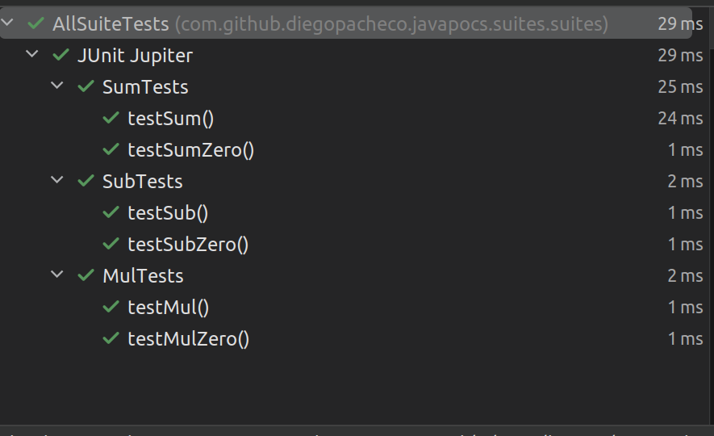

### Build 
```bash
./mvnw clean install 
```
### Suite Configuration
```Java
@RunWith(JUnitPlatform.class)
@SelectClasses({
        SumTests.class,
        SubTests.class
})
@SelectPackages("com.github.diegopacheco.javapocs.mul.tests")
public class AllSuiteTests {
}
```
Execution order:
1. SumTests (SelectClasses)
2. SubTests (SelectClasses)
3. MulTests (SelectPackages

### Test Results



### Surefire

By default maven surefire will run all suites

```
[INFO] --- surefire:3.1.2:test (default-test) @ junit-5-java-21-suites ---
[INFO] Using auto detected provider org.apache.maven.surefire.junit4.JUnit4Provider
[INFO] 
[INFO] -------------------------------------------------------
[INFO]  T E S T S
[INFO] -------------------------------------------------------
[INFO] Running com.github.diegopacheco.javapocs.suites.suites.AllSuiteTests
[INFO] Tests run: 6, Failures: 0, Errors: 0, Skipped: 0, Time elapsed: 0.275 s -- in com.github.diegopacheco.javapocs.suites.suites.AllSuiteTests
[INFO] Running com.github.diegopacheco.javapocs.suites.suites.JustSubSuiteTests
[INFO] Tests run: 2, Failures: 0, Errors: 0, Skipped: 0, Time elapsed: 0.001 s -- in com.github.diegopacheco.javapocs.suites.suites.JustSubSuiteTests
[INFO] 
[INFO] Results:
[INFO] 
[INFO] Tests run: 8, Failures: 0, Errors: 0, Skipped: 0
[INFO] 
[INFO] 
[INFO] --- jar:3.3.0:jar (default-jar) @ junit-5-java-21-suites ---
[INFO] Building jar: /mnt/e35d88d4-42b9-49ea-bf29-c4c3b018d429/diego/git/diegopacheco/java-pocs/pocs/junit-5-java-21-suites/target/junit-5-java-21-suites-1.0-SNAPSHOT.jar
[INFO] 
[INFO] --- install:3.1.1:install (default-install) @ junit-5-java-21-suites ---
[INFO] Installing /mnt/e35d88d4-42b9-49ea-bf29-c4c3b018d429/diego/git/diegopacheco/java-pocs/pocs/junit-5-java-21-suites/pom.xml to /home/diego/.m2/repository/com/github/diegopacheco/javapocs/junit-5-java-21-suites/1.0-SNAPSHOT/junit-5-java-21-suites-1.0-SNAPSHOT.pom
[INFO] Installing /mnt/e35d88d4-42b9-49ea-bf29-c4c3b018d429/diego/git/diegopacheco/java-pocs/pocs/junit-5-java-21-suites/target/junit-5-java-21-suites-1.0-SNAPSHOT.jar to /home/diego/.m2/repository/com/github/diegopacheco/javapocs/junit-5-java-21-suites/1.0-SNAPSHOT/junit-5-java-21-suites-1.0-SNAPSHOT.jar
[INFO] ------------------------------------------------------------------------
[INFO] BUILD SUCCESS
[INFO] ------------------------------------------------------------------------
[INFO] Total time:  3.083 s
[INFO] Finished at: 2024-05-31T00:28:22-07:00
[INFO] ------------------------------------------------------------------------

```