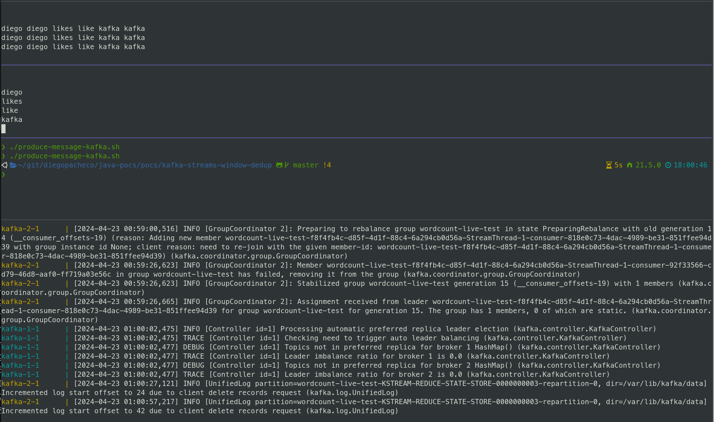

### Build 
```bash
./mvnw clean install 
```
### Version
Java: 21 <BR/>
Kafka: kafka_2.13-3.6.2 <BR/>
Zookeeper: zookeeper-3.4.14 <BR/>

### KAFKA POC Testing

1. Update KAFKA_HOME variable in [consumer-results.sh](consumer-results.sh) [consumer-inputs.sh](consumer-inputs.sh) and [produce-message-kafka.sh](produce-message-kafka.sh) with your KAFKA home path installation
2. If you are using Podman https://podman.io/ replace the line `docker-compose up --force-recreate` in [run-kafka-cluster.sh](run-kafka-cluster.sh) to `podman compose up --force-recreate`
3. After Kafka cluster gets ready, run  [run.sh](run.sh) [consumer-results.sh](consumer-results.sh)
4. At the end run [produce-message-kafka.sh](produce-message-kafka.sh) it should produce the same logs you can see in the picture below

Note:
- [consumer-inputs.sh](consumer-inputs.sh) listens to Kafka inputTopic topic
- [consumer-results.sh](consumer-results.sh) listens to Kafka outputTopic topic

### KafkaStream Code
```java
  KTable<Windowed<String>, String> deduplicated = source
            .flatMapValues(value -> Arrays.asList(pattern.split(value.toLowerCase())))
            .groupBy((key, word) -> word)
            .windowedBy(TimeWindows.of(Duration.ofSeconds(30)))
            .reduce((value1, value2) -> value1); // Deduplicate by keeping the first occurrence
```

### Result


### Delivery Semathics

* At least once: The same event can be delivered more than once.
* At most once: The event can be delivered only once.
* Exactly once: The event is delivered only once. (harder and more expensive)

### Things to keep in mind

* Make sure the code deliver the delivery semathics you need.
* Make sure the window is not too big to avoid memory issues (30 seems fine)
* Make sure the window is not too small to avoid loosing events (30 seems fine)
* Make sure the dedup key is a good one, in this case we are using the word itself(great one)

### Whats next?

* Make sure the window is aggregating events by timestamp(ordering)
* Configure different overalaps to avoid (loosing events in different windows)
* Make the program shutdown when the window it's done (maybe write the data in Redis)
* Observability, publish metrics on whats going on in the background