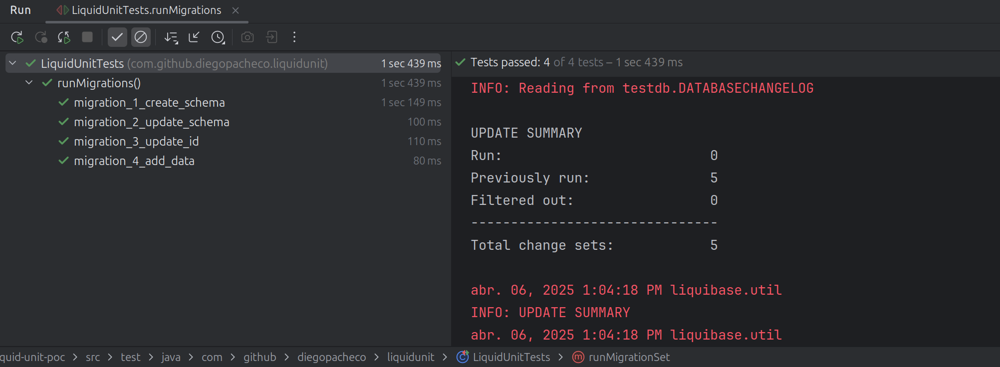
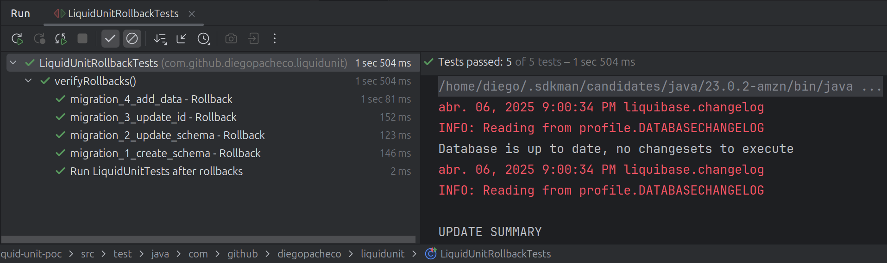

# Liquid Unit
Liquibase + Junit = Liquid Unit

```

  _     _             _     _ _   _       _ _
 | |   (_)           (_)   | | | | |     (_) |
 | |    _  __ _ _   _ _  __| | | | |_ __  _| |_
 | |   | |/ _` | | | | |/ _` | | | | '_ \| | __|
 | |___| | (_| | |_| | | (_| | |_| | | | | | |_
 |_____|_|\__, |\__,_|_|\__,_|\___/|_| |_|_|\__|
             | |
             |_|

LiquidUnit Usage:
  No args     - Run complete test suite: migrations, rollbacks, migrations
  --mt        - Run only migration tests
  --ro        - Run only rollback tests
  --? or --h  - Display this help message
```

### Rationale

The idea of this POC is to create a `blend` between `Liquibase` and `Junit`.
So migrations can be executed as tests (`test.sql`) and they can fail and `rollback.sql` script is executed.
So it's possible to automate schema changes and even migrations and be test-driven.

Basically you have 3 files:
* migration.sql -> Where you perform the migration
* test.sql -> Where you perform the tests, `expect : <number>` is used to assert the result of the query. 
* rollback.sql -> Where you perform the rollback.

### Why this POC is useful?

1. You can test migration scrips locally.
2. It can be used as bases for Integration testes with Migration Scripts.
3. It could be the basis for production automation of migration scripts.
4. It's fun and cool to learn stuff :-) Tests are being generated on the fly.

### Versions

```
Java      : 23
Liquibase : 4.29.0
Mysql     : 9.2.0
Junit     : 5.9.3
```

### Build 

```bash
./mvnw clean install 
```

### Start Mysql

```bash
./run-mysql-9x.sh
```

```
Creating and starting new MySQL 9.2 container...
cea6f8f3702c649f1b7aef5fca48a07c7e63014b0722a324ced8ea4e23f1b16e
Waiting for MySQL to be ready...
Still waiting... (1/30)
Still waiting... (2/30)
Still waiting... (3/30)
Still waiting... (4/30)
Still waiting... (5/30)
Still waiting... (6/30)
MySQL is up and running!
Connection details:
  Host: localhost
  Port: 3306
  User: root
  Password: pass
  Database: profile
````

### Result

Migrations and Tests


Each SQL is run as an assertion and verified. Example:
```
Executing tests from src/main/resources/migrations/migration_1_create_schema/test.sql
Found expectation (look-ahead): 1
✓ Assertion passed: SELECT COUNT(*) FROM information_schema.schemata WHERE schema_name = 'profile' -> Expected: 1, Actual: 1
Found expectation (look-ahead): 1
✓ Assertion passed: SELECT COUNT(*) FROM information_schema.tables WHERE table_schema = 'profile' AND table_name = 'user' -> Expected: 1, Actual: 1
Found expectation (look-ahead): 1
✓ Assertion passed: SELECT COUNT(*) FROM information_schema.tables WHERE table_schema = 'profile' AND table_name = 'user_links' -> Expected: 1, Actual: 1
Found expectation (look-ahead): 4
✓ Assertion passed: SELECT COUNT(*) FROM information_schema.columns WHERE table_schema = 'profile' AND table_name = 'user' AND column_name IN ('id', 'name', 'email', 'address') -> Expected: 4, Actual: 4
Found expectation (look-ahead): 5
✓ Assertion passed: SELECT COUNT(*) FROM information_schema.columns WHERE table_schema = 'profile' AND table_name = 'user_links' AND column_name IN ('id', 'user_id', 'x_link', 'facebook_link', 'youtube_link') -> Expected: 5, Actual: 5
Found expectation (look-ahead): 1
✓ Assertion passed: SELECT COUNT(*) FROM information_schema.key_column_usage WHERE table_schema = 'profile' AND table_name = 'user_links' AND column_name = 'user_id' AND referenced_table_name = 'user' -> Expected: 1, Actual: 1
```

Rollbacks


Sample output:
```
Applied migration: migration_4_add_data
Tables to verify dropped: []
Schemas to verify dropped: []
Tables to verify empty after DELETE: [profile.user_links, profile.user]
Executed rollback: src/main/resources/migrations/migration_4_add_data/rollback.sql
✓ Table verified empty after DELETE: profile.user_links
✓ Table verified empty after DELETE: profile.user
```

Schema After all migrations
```
mysql> desc user;
+---------+--------------+------+-----+---------+----------------+
| Field   | Type         | Null | Key | Default | Extra          |
+---------+--------------+------+-----+---------+----------------+
| id      | bigint       | NO   | PRI | NULL    | auto_increment |
| name    | varchar(255) | NO   |     | NULL    |                |
| email   | varchar(255) | NO   | UNI | NULL    |                |
| address | varchar(512) | YES  |     | NULL    |                |
| id_uuid | varchar(36)  | YES  |     | NULL    |                |
+---------+--------------+------+-----+---------+----------------+
5 rows in set (0.01 sec)

mysql> desc user_links;
+---------------+--------------+------+-----+---------+----------------+
| Field         | Type         | Null | Key | Default | Extra          |
+---------------+--------------+------+-----+---------+----------------+
| id            | bigint       | NO   | PRI | NULL    | auto_increment |
| user_id       | bigint       | NO   | MUL | NULL    |                |
| x_link        | varchar(255) | YES  |     | NULL    |                |
| facebook_link | varchar(255) | YES  |     | NULL    |                |
| youtube_link  | varchar(255) | YES  |     | NULL    |                |
| medium_link   | varchar(255) | YES  |     | NULL    |                |
| id_uuid       | varchar(36)  | YES  |     | NULL    |                |
+---------------+--------------+------+-----+---------+----------------+
7 rows in set (0.00 sec)
```

Data after all Migrations
```
mysql> select * from user;
+----+---------------+---------------------------+---------+--------------------------------------+
| id | name          | email                     | address | id_uuid                              |
+----+---------------+---------------------------+---------+--------------------------------------+
|  1 | John Doe      | john.doe@example.com      | NULL    | 0deac6c1-135a-11f0-907a-ead9ac162c53 |
|  2 | Jane Smith    | jane.smith@example.com    | NULL    | 0deaca03-135a-11f0-907a-ead9ac162c53 |
|  3 | David Johnson | david.johnson@example.com | NULL    | 0deacb0c-135a-11f0-907a-ead9ac162c53 |
|  4 | Emma Williams | emma.williams@example.com | NULL    | 0deacc1f-135a-11f0-907a-ead9ac162c53 |
|  5 | Michael Brown | michael.brown@example.com | NULL    | 0deaccb7-135a-11f0-907a-ead9ac162c53 |
|  6 | Olivia Jones  | olivia.jones@example.com  | NULL    | 0deacd11-135a-11f0-907a-ead9ac162c53 |
|  7 | William Davis | william.davis@example.com | NULL    | 0deacd63-135a-11f0-907a-ead9ac162c53 |
|  8 | Sophia Miller | sophia.miller@example.com | NULL    | 0deacdb6-135a-11f0-907a-ead9ac162c53 |
|  9 | James Wilson  | james.wilson@example.com  | NULL    | 0deace0f-135a-11f0-907a-ead9ac162c53 |
| 10 | Emily Taylor  | emily.taylor@example.com  | NULL    | 0deace62-135a-11f0-907a-ead9ac162c53 |
+----+---------------+---------------------------+---------+--------------------------------------+
10 rows in set (0.00 sec)

mysql> select * from user_links;
+----+---------+----------------------------+-----------------------------+----------------------------+----------------------------+--------------------------------------+
| id | user_id | x_link                     | facebook_link               | youtube_link               | medium_link                | id_uuid                              |
+----+---------+----------------------------+-----------------------------+----------------------------+----------------------------+--------------------------------------+
|  1 |       1 | https://twitter.com/user1  | https://facebook.com/user1  | https://youtube.com/user1  | https://medium.com/@user1  | 0deac6c1-135a-11f0-907a-ead9ac162c53 |
|  2 |       2 | https://twitter.com/user2  | https://facebook.com/user2  | https://youtube.com/user2  | https://medium.com/@user2  | 0deaca03-135a-11f0-907a-ead9ac162c53 |
|  3 |       3 | https://twitter.com/user3  | https://facebook.com/user3  | https://youtube.com/user3  | https://medium.com/@user3  | 0deacb0c-135a-11f0-907a-ead9ac162c53 |
|  4 |       4 | https://twitter.com/user4  | https://facebook.com/user4  | https://youtube.com/user4  | https://medium.com/@user4  | 0deacc1f-135a-11f0-907a-ead9ac162c53 |
|  5 |       5 | https://twitter.com/user5  | https://facebook.com/user5  | https://youtube.com/user5  | https://medium.com/@user5  | 0deaccb7-135a-11f0-907a-ead9ac162c53 |
|  6 |       6 | https://twitter.com/user6  | https://facebook.com/user6  | https://youtube.com/user6  | https://medium.com/@user6  | 0deacd11-135a-11f0-907a-ead9ac162c53 |
|  7 |       7 | https://twitter.com/user7  | https://facebook.com/user7  | https://youtube.com/user7  | https://medium.com/@user7  | 0deacd63-135a-11f0-907a-ead9ac162c53 |
|  8 |       8 | https://twitter.com/user8  | https://facebook.com/user8  | https://youtube.com/user8  | https://medium.com/@user8  | 0deacdb6-135a-11f0-907a-ead9ac162c53 |
|  9 |       9 | https://twitter.com/user9  | https://facebook.com/user9  | https://youtube.com/user9  | https://medium.com/@user9  | 0deace0f-135a-11f0-907a-ead9ac162c53 |
| 10 |      10 | https://twitter.com/user10 | https://facebook.com/user10 | https://youtube.com/user10 | https://medium.com/@user10 | 0deace62-135a-11f0-907a-ead9ac162c53 |
+----+---------+----------------------------+-----------------------------+----------------------------+----------------------------+--------------------------------------+
10 rows in set (0.00 sec)

mysql> SELECT u.name, ul.id_uuid, u.email FROM profile.user u  JOIN profile.user_links ul ON u.id = ul.user_id AND u.id_uuid = ul.id_uuid;
+---------------+--------------------------------------+---------------------------+
| name          | id_uuid                              | email                     |
+---------------+--------------------------------------+---------------------------+
| John Doe      | 0deac6c1-135a-11f0-907a-ead9ac162c53 | john.doe@example.com      |
| Jane Smith    | 0deaca03-135a-11f0-907a-ead9ac162c53 | jane.smith@example.com    |
| David Johnson | 0deacb0c-135a-11f0-907a-ead9ac162c53 | david.johnson@example.com |
| Emma Williams | 0deacc1f-135a-11f0-907a-ead9ac162c53 | emma.williams@example.com |
| Michael Brown | 0deaccb7-135a-11f0-907a-ead9ac162c53 | michael.brown@example.com |
| Olivia Jones  | 0deacd11-135a-11f0-907a-ead9ac162c53 | olivia.jones@example.com  |
| William Davis | 0deacd63-135a-11f0-907a-ead9ac162c53 | william.davis@example.com |
| Sophia Miller | 0deacdb6-135a-11f0-907a-ead9ac162c53 | sophia.miller@example.com |
| James Wilson  | 0deace0f-135a-11f0-907a-ead9ac162c53 | james.wilson@example.com  |
| Emily Taylor  | 0deace62-135a-11f0-907a-ead9ac162c53 | emily.taylor@example.com  |
+---------------+--------------------------------------+---------------------------+
10 rows in set (0.00 sec)

mysql>
```

### CLI run

```bash
./mvnw clean install package
java -jar target/liquid-unit-poc-1.0-SNAPSHOT.jar --mt
```

```
❯ java -jar target/liquid-unit-poc-1.0-SNAPSHOT.jar --mt

  _     _             _     _ _   _       _ _
 | |   (_)           (_)   | | | | |     (_) |
 | |    _  __ _ _   _ _  __| | | | |_ __  _| |_
 | |   | |/ _` | | | | |/ _` | | | | '_ \| | __|
 | |___| | (_| | |_| | | (_| | |_| | | | | | |_
 |_____|_|\__, |\__,_|_|\__,_|\___/|_| |_|_|\__|
             | |
             |_|

Database reset complete
abr. 06, 2025 9:48:32 PM liquibase.changelog
INFO: Creating database history table with name: profile.DATABASECHANGELOG
abr. 06, 2025 9:48:33 PM liquibase.changelog
INFO: Reading from profile.DATABASECHANGELOG
abr. 06, 2025 9:48:33 PM liquibase.lockservice
INFO: Successfully acquired change log lock
abr. 06, 2025 9:48:33 PM liquibase.command
INFO: Using deploymentId: 4001313427
abr. 06, 2025 9:48:33 PM liquibase.changelog
INFO: Reading from profile.DATABASECHANGELOG
Running Changeset: main/resources/migrations/migration_1_create_schema/migration.sql::diegopacheco:1::author
abr. 06, 2025 9:48:33 PM liquibase.executor
WARNING: Can't create database 'profile'; database exists
abr. 06, 2025 9:48:33 PM liquibase.changelog
INFO: Custom SQL executed
abr. 06, 2025 9:48:33 PM liquibase.changelog
INFO: ChangeSet main/resources/migrations/migration_1_create_schema/migration.sql::diegopacheco:1::author ran successfully in 24ms
Running Changeset: main/resources/migrations/migration_1_create_schema/migration.sql::diegopacheco:2::author
abr. 06, 2025 9:48:33 PM liquibase.changelog
INFO: Custom SQL executed
abr. 06, 2025 9:48:33 PM liquibase.changelog
INFO: ChangeSet main/resources/migrations/migration_1_create_schema/migration.sql::diegopacheco:2::author ran successfully in 35ms
Running Changeset: main/resources/migrations/migration_1_create_schema/migration.sql::diegopacheco:3::author
abr. 06, 2025 9:48:33 PM liquibase.changelog
INFO: Custom SQL executed
abr. 06, 2025 9:48:33 PM liquibase.changelog
INFO: ChangeSet main/resources/migrations/migration_1_create_schema/migration.sql::diegopacheco:3::author ran successfully in 38ms

UPDATE SUMMARY
Run:                          3
Previously run:               0
Filtered out:                 0
-------------------------------
Total change sets:            3

abr. 06, 2025 9:48:33 PM liquibase.util
INFO: UPDATE SUMMARY
abr. 06, 2025 9:48:33 PM liquibase.util
INFO: Run:                          3
abr. 06, 2025 9:48:33 PM liquibase.util
INFO: Previously run:               0
abr. 06, 2025 9:48:33 PM liquibase.util
INFO: Filtered out:                 0
abr. 06, 2025 9:48:33 PM liquibase.util
INFO: -------------------------------
abr. 06, 2025 9:48:33 PM liquibase.util
INFO: Total change sets:            3
abr. 06, 2025 9:48:33 PM liquibase.util
INFO: Update summary generated
abr. 06, 2025 9:48:33 PM liquibase.command
INFO: Update command completed successfully.
Liquibase: Update has been successful. Rows affected: 4
abr. 06, 2025 9:48:33 PM liquibase.lockservice
INFO: Successfully released change log lock
abr. 06, 2025 9:48:33 PM liquibase.command
INFO: Command execution complete
Executing tests from src/main/resources/migrations/migration_1_create_schema/test.sql
Found expectation (look-ahead): 1
✓ Assertion passed: SELECT COUNT(*) FROM information_schema.schemata WHERE schema_name = 'profile' -> Expected: 1, Actual: 1
Found expectation (look-ahead): 1
✓ Assertion passed: SELECT COUNT(*) FROM information_schema.tables WHERE table_schema = 'profile' AND table_name = 'user' -> Expected: 1, Actual: 1
Found expectation (look-ahead): 1
✓ Assertion passed: SELECT COUNT(*) FROM information_schema.tables WHERE table_schema = 'profile' AND table_name = 'user_links' -> Expected: 1, Actual: 1
Found expectation (look-ahead): 4
✓ Assertion passed: SELECT COUNT(*) FROM information_schema.columns WHERE table_schema = 'profile' AND table_name = 'user' AND column_name IN ('id', 'name', 'email', 'address') -> Expected: 4, Actual: 4
Found expectation (look-ahead): 5
✓ Assertion passed: SELECT COUNT(*) FROM information_schema.columns WHERE table_schema = 'profile' AND table_name = 'user_links' AND column_name IN ('id', 'user_id', 'x_link', 'facebook_link', 'youtube_link') -> Expected: 5, Actual: 5
Found expectation (look-ahead): 1
✓ Assertion passed: SELECT COUNT(*) FROM information_schema.key_column_usage WHERE table_schema = 'profile' AND table_name = 'user_links' AND column_name = 'user_id' AND referenced_table_name = 'user' -> Expected: 1, Actual: 1
abr. 06, 2025 9:48:33 PM liquibase.changelog
INFO: Reading from profile.DATABASECHANGELOG
abr. 06, 2025 9:48:33 PM liquibase.lockservice
INFO: Successfully acquired change log lock
abr. 06, 2025 9:48:33 PM liquibase.command
INFO: Using deploymentId: 4001313693
abr. 06, 2025 9:48:33 PM liquibase.changelog
INFO: Reading from profile.DATABASECHANGELOG
Running Changeset: main/resources/migrations/migration_2_update_schema/migration.sql::diegopacheco:4::author
abr. 06, 2025 9:48:33 PM liquibase.changelog
INFO: Custom SQL executed
abr. 06, 2025 9:48:33 PM liquibase.changelog
INFO: ChangeSet main/resources/migrations/migration_2_update_schema/migration.sql::diegopacheco:4::author ran successfully in 57ms

UPDATE SUMMARY
Run:                          1
Previously run:               0
Filtered out:                 0
-------------------------------
Total change sets:            1

abr. 06, 2025 9:48:33 PM liquibase.util
INFO: UPDATE SUMMARY
abr. 06, 2025 9:48:33 PM liquibase.util
INFO: Run:                          1
abr. 06, 2025 9:48:33 PM liquibase.util
INFO: Previously run:               0
abr. 06, 2025 9:48:33 PM liquibase.util
INFO: Filtered out:                 0
abr. 06, 2025 9:48:33 PM liquibase.util
INFO: -------------------------------
abr. 06, 2025 9:48:33 PM liquibase.util
INFO: Total change sets:            1
abr. 06, 2025 9:48:33 PM liquibase.util
INFO: Update summary generated
abr. 06, 2025 9:48:33 PM liquibase.command
INFO: Update command completed successfully.
Liquibase: Update has been successful. Rows affected: 1
abr. 06, 2025 9:48:33 PM liquibase.lockservice
INFO: Successfully released change log lock
abr. 06, 2025 9:48:33 PM liquibase.command
INFO: Command execution complete
Executing tests from src/main/resources/migrations/migration_2_update_schema/test.sql
Found expectation (look-ahead): 1
✓ Assertion passed: SELECT COUNT(*) FROM information_schema.columns WHERE table_schema = 'profile' AND table_name = 'user_links' AND column_name = 'medium_link' -> Expected: 1, Actual: 1
Found expectation (look-ahead): 0
✓ Assertion passed: SELECT COUNT(*) FROM profile.user_links WHERE medium_link IS NULL -> Expected: 0, Actual: 0
abr. 06, 2025 9:48:33 PM liquibase.changelog
INFO: Reading from profile.DATABASECHANGELOG
abr. 06, 2025 9:48:33 PM liquibase.lockservice
INFO: Successfully acquired change log lock
abr. 06, 2025 9:48:33 PM liquibase.command
INFO: Using deploymentId: 4001313841
abr. 06, 2025 9:48:33 PM liquibase.changelog
INFO: Reading from profile.DATABASECHANGELOG
Running Changeset: main/resources/migrations/migration_3_update_id/migration.sql::diegopacheco:5::author
abr. 06, 2025 9:48:33 PM liquibase.changelog
INFO: Custom SQL executed
abr. 06, 2025 9:48:33 PM liquibase.changelog
INFO: ChangeSet main/resources/migrations/migration_3_update_id/migration.sql::diegopacheco:5::author ran successfully in 54ms
Running Changeset: main/resources/migrations/migration_3_update_id/migration.sql::diegopacheco:6::author
abr. 06, 2025 9:48:33 PM liquibase.changelog
INFO: Custom SQL executed
abr. 06, 2025 9:48:33 PM liquibase.changelog
INFO: ChangeSet main/resources/migrations/migration_3_update_id/migration.sql::diegopacheco:6::author ran successfully in 5ms
Running Changeset: main/resources/migrations/migration_3_update_id/migration.sql::diegopacheco:7::author
abr. 06, 2025 9:48:33 PM liquibase.changelog
INFO: Custom SQL executed
abr. 06, 2025 9:48:33 PM liquibase.changelog
INFO: ChangeSet main/resources/migrations/migration_3_update_id/migration.sql::diegopacheco:7::author ran successfully in 53ms
Running Changeset: main/resources/migrations/migration_3_update_id/migration.sql::diegopacheco:8::author
abr. 06, 2025 9:48:33 PM liquibase.changelog
INFO: Custom SQL executed
abr. 06, 2025 9:48:33 PM liquibase.changelog
INFO: ChangeSet main/resources/migrations/migration_3_update_id/migration.sql::diegopacheco:8::author ran successfully in 5ms

UPDATE SUMMARY
Run:                          4
Previously run:               0
Filtered out:                 0
-------------------------------
Total change sets:            4

abr. 06, 2025 9:48:34 PM liquibase.util
INFO: UPDATE SUMMARY
abr. 06, 2025 9:48:34 PM liquibase.util
INFO: Run:                          4
abr. 06, 2025 9:48:34 PM liquibase.util
INFO: Previously run:               0
abr. 06, 2025 9:48:34 PM liquibase.util
INFO: Filtered out:                 0
abr. 06, 2025 9:48:34 PM liquibase.util
INFO: -------------------------------
abr. 06, 2025 9:48:34 PM liquibase.util
INFO: Total change sets:            4
abr. 06, 2025 9:48:34 PM liquibase.util
INFO: Update summary generated
abr. 06, 2025 9:48:34 PM liquibase.command
INFO: Update command completed successfully.
Liquibase: Update has been successful. Rows affected: 4
abr. 06, 2025 9:48:34 PM liquibase.lockservice
INFO: Successfully released change log lock
abr. 06, 2025 9:48:34 PM liquibase.command
INFO: Command execution complete
Executing tests from src/main/resources/migrations/migration_3_update_id/test.sql
Found expectation (look-ahead): 1
✓ Assertion passed: SELECT COUNT(*) FROM information_schema.columns WHERE table_schema = 'profile' AND table_name = 'user' AND column_name = 'id_uuid' -> Expected: 1, Actual: 1
Found expectation (look-ahead): 1
✓ Assertion passed: SELECT COUNT(*) FROM information_schema.columns WHERE table_schema = 'profile' AND table_name = 'user_links' AND column_name = 'id_uuid' -> Expected: 1, Actual: 1
Found expectation (look-ahead): 0
✓ Assertion passed: SELECT COUNT(*) FROM profile.user WHERE id_uuid IS NULL -> Expected: 0, Actual: 0
Found expectation (look-ahead): 0
✓ Assertion passed: SELECT COUNT(*) FROM profile.user_links WHERE id_uuid IS NULL -> Expected: 0, Actual: 0
abr. 06, 2025 9:48:34 PM liquibase.changelog
INFO: Reading from profile.DATABASECHANGELOG
abr. 06, 2025 9:48:34 PM liquibase.lockservice
INFO: Successfully acquired change log lock
abr. 06, 2025 9:48:34 PM liquibase.command
INFO: Using deploymentId: 4001314089
abr. 06, 2025 9:48:34 PM liquibase.changelog
INFO: Reading from profile.DATABASECHANGELOG
Running Changeset: main/resources/migrations/migration_4_add_data/migration.sql::diegopacheco:9::author
abr. 06, 2025 9:48:34 PM liquibase.changelog
INFO: Custom SQL executed
abr. 06, 2025 9:48:34 PM liquibase.changelog
INFO: ChangeSet main/resources/migrations/migration_4_add_data/migration.sql::diegopacheco:9::author ran successfully in 11ms
Running Changeset: main/resources/migrations/migration_4_add_data/migration.sql::diegopacheco:10::author
abr. 06, 2025 9:48:34 PM liquibase.changelog
INFO: Custom SQL executed
abr. 06, 2025 9:48:34 PM liquibase.changelog
INFO: ChangeSet main/resources/migrations/migration_4_add_data/migration.sql::diegopacheco:10::author ran successfully in 9ms

UPDATE SUMMARY
Run:                          2
Previously run:               0
Filtered out:                 0
-------------------------------
Total change sets:            2

abr. 06, 2025 9:48:34 PM liquibase.util
INFO: UPDATE SUMMARY
abr. 06, 2025 9:48:34 PM liquibase.util
INFO: Run:                          2
abr. 06, 2025 9:48:34 PM liquibase.util
INFO: Previously run:               0
abr. 06, 2025 9:48:34 PM liquibase.util
INFO: Filtered out:                 0
abr. 06, 2025 9:48:34 PM liquibase.util
INFO: -------------------------------
abr. 06, 2025 9:48:34 PM liquibase.util
INFO: Total change sets:            2
abr. 06, 2025 9:48:34 PM liquibase.util
INFO: Update summary generated
abr. 06, 2025 9:48:34 PM liquibase.command
INFO: Update command completed successfully.
Liquibase: Update has been successful. Rows affected: 22
abr. 06, 2025 9:48:34 PM liquibase.lockservice
INFO: Successfully released change log lock
abr. 06, 2025 9:48:34 PM liquibase.command
INFO: Command execution complete
Executing tests from src/main/resources/migrations/migration_4_add_data/test.sql
Found expectation (look-ahead): 10
✓ Assertion passed: SELECT COUNT(*) FROM profile.user -> Expected: 10, Actual: 10
Found expectation (look-ahead): 10
✓ Assertion passed: SELECT COUNT(*) FROM profile.user_links -> Expected: 10, Actual: 10
Found expectation (look-ahead): 0
✓ Assertion passed: SELECT COUNT(*) FROM profile.user WHERE id_uuid IS NULL -> Expected: 0, Actual: 0
Found expectation (look-ahead): 0
✓ Assertion passed: SELECT COUNT(*) FROM profile.user_links WHERE id_uuid IS NULL -> Expected: 0, Actual: 0
Found expectation (look-ahead): 10
✓ Assertion passed: SELECT COUNT(DISTINCT u.id) FROM profile.user u JOIN profile.user_links x ON u.id = x.user_id AND x.x_link IS NOT NULL JOIN profile.user_links fb ON u.id = fb.user_id AND fb.facebook_link IS NOT NULL JOIN profile.user_links yt ON u.id = yt.user_id AND yt.youtube_link IS NOT NULL JOIN profile.user_links md ON u.id = md.user_id AND md.medium_link IS NOT NULL -> Expected: 10, Actual: 10
Tests run: 4
Tests succeeded: 4
Tests failed: 0
✓ LiquidUnitTests completed successfully!
```

### TODO

1. Add more Patterns
2. Add more tests
3. Improve limitations (accept Strings equals, multiple stmts, multiline comments)

### Refactoring Notes

#### V1 (took 4h to get it done)

* 2 classes: 
  * `LiquidUnitTests` - Class that runs the migration and tests
  * `LiquidUnitRollbackTests` - Class that runs the rollback and tests
* Code was duplicated from src/main/java to src/test/java
* Lots of duplications
* Lots of methods throwing exceptions
* DB Config/Reading was duplicated

Summary:
```
LiquidUnitTests : 253 LoC
LiquidUnitRollbackTests : 365 LoC
```

Original Code: https://github.com/diegopacheco/java-pocs/tree/before-liquidunit-refactoring/pocs/liquid-unit-poc/src/main/java/com/github/diegopacheco/liquidunit

V1: Method using Copilot/Sonnet 3.7 LLM in a `Vibe Code` it could not be 100% vibe code because AI got stuck several times and could not troubleshoot problems and would get stuck forever on same point so consider 80% vibe code.

#### V2 (took 3h to get it done)

* No more code duplication
* Tests are the source of truth at : LiquidUnitRollbackTests and LiquidUnitTests Tests now extend this both classes and do nothing.
* Remove throws Exception
* DB Config/Reading is abstracted and centralized by the DAO
* Better separation of concerns
* Using Java Records :-)
* Created the following concerns:
  * DAO: `DatabaseDAO` - Class that handles all the database operations
  * Liquibase: `LiquibaseService` - Class that handles all the liquibase operations
  * Parser: `SQLTestsParser` - Class that handles all the SQL parsing operations for SQL test Assertions
  * Parser:  `SQLRollbackParser` - Class that handles all the SQL parsing operations for SQL Rollback Test Generations
  * Execution.Engine: `LiquidUnitTests` - Class that handles the execution of the migrations and tests
  * Execution.Engine: `LiquidUnitRollbackTests` - Class that handles the execution of the rollbacks and generated tests
* Test the Code that generate and run tests: 
  * 11 Unit Tests for the `SQLTestsParser` code
  * 11 Unit Tests for the `SQLRollbackParser` code
  * 9 Integration Tests for `DatabaseMigrationDAO` code
  * 4 Unit Tests (with mocks sorry) for the `LiquibaseService` code
* Total 45 tests

Summary:
```
LiquidUnitTests : 88 LoC (65% less code) 
LiquidUnitRollbackTests : 159 LoC (56% less code)
```
<BR/>
Note on Order: 
Usually `@Order` is a bad thing, I would not do this if was not a POC
because make the tests more fragile, here it would be better split this project in more projects
them it would be easier to do somethings and have parallelism and isolation.

V2: Method here was NO AI LLM for the Refactoring, only use AI to help with tests of the tests. That part was smooth and pretty good.

### Summary on AI LLM

Took me 4h to get it working and 3h to fix it to make it decent. So LLM is not linear improvement it's useful but far from perfect and good to prototype and get something working but still need spend almost same ammount of code to Refactor and make it decent.