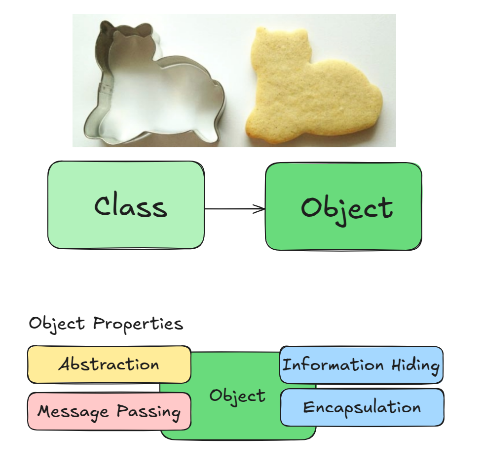

### Rationale

Extreme influences from:
* Proper Roots OOP
* Domain Driven Design (DDD)
* Elegant Objects (EO)

### What IF?

People are coding in C(imperative programming) and they don't know it.
What IF when we code in Java, Typescript, Kotlin or Scala, we are not coding in OOP? What is proper OOP?

### Proper OOP

OOP we `MUST` have DATA and Functions together. We should not SEPARATE them. Otherwise you have an `Anemic Model` (Anti-Pattern): https://martinfowler.com/bliki/AnemicDomainModel.html

Creating a class does not guarantee proper abstractions. People have allergy to abstractions because most of people dont get OOP properly and them create a bunch of bad abstrations, therefore its better to not create abstractions at all and just duplicado code in several cases.
I'm all in favor of good abstractions if they are well-made.

### Familiarity

There are "Standards" we are very used to them, like for instance:
* Getters/Setters
* Constants
* Enums
* POJOs
* Delegation
* Inheritance
* DRY (Don't Repeat Yourself)
* MVC (Model View Controller)

But do we question if this "Standards" are good or bad? Maybe some are anti-patterns. 
When we do something over and over we belive that's the norm because is familiar to us. But we should question everything, even the most "standard" things.

There is no shame here, we all do things we not suppose to do, we all have bad habits. But we should be aware of them and try to improve. Awareness is always a good thing, if we dont understand the problem we are trying to solve, we will never be able to solve in better ways with better solutions.

### Have you ever stop to think that...

You make decisions everyday, you decide what classes do you create, they names, they resposabilities, how they "talk" to each other, have you ever tought how can you make sure your abstractions are good? Or if you are just adding more complexity?

### Anti-Patterns (Code Examples)

1. Constant
2. Enums
3. POJOs
4. Delegation

### Related POCs/Repos

* https://github.com/diegopacheco/Elegant.Objects
* https://github.com/diegopacheco/Elegant.Objects.vol.2
* https://github.com/diegopacheco/java-pocs/tree/master/pocs/if-killer-proper-oop
* https://github.com/diegopacheco/java-pocs/tree/master/pocs/if-alternatives-fun
