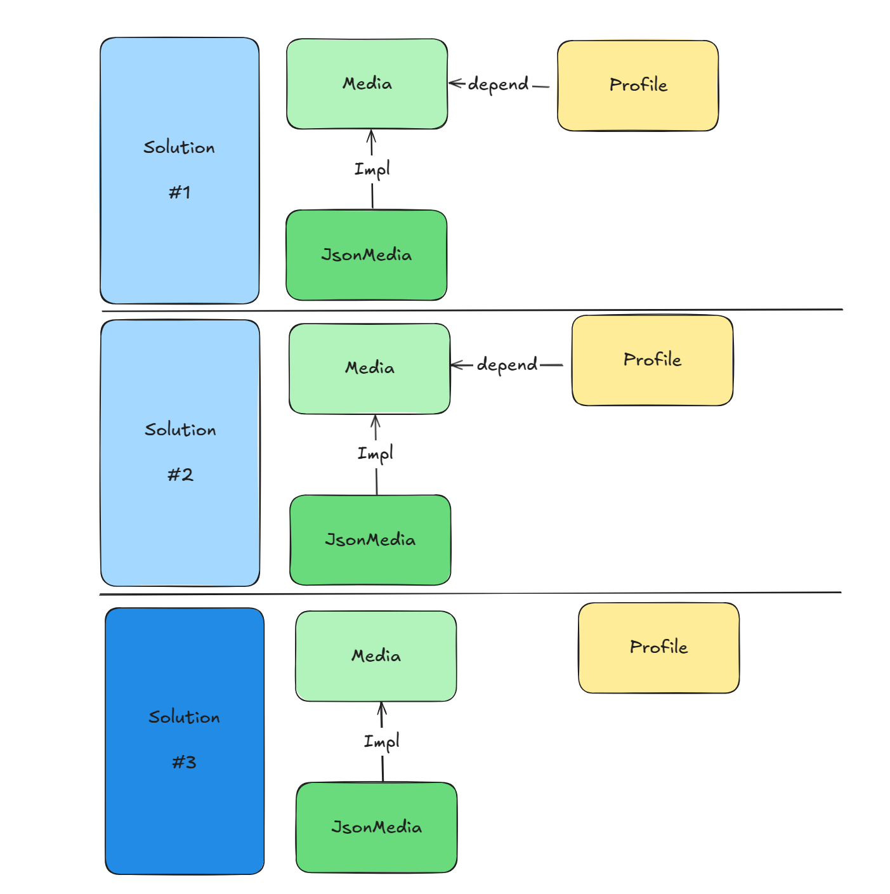

### Rationale

This is implementations that try to provide a better OOP Design.
Consider as complement for: https://github.com/diegopacheco/java-pocs/tree/master/pocs/oop-anti-patterns

Result is always the same:
```
{ 
  "name":"John",
  "address":"123 main st, Main City MS",
  "phone":"555-1111-111",
  "xProfile":"@johndoe",
  "email":"Doe",
  "facebookProfile":"johndoe"
}
```
However, we have different Design(implementations).

### Solutions

For this POC I have 3 different solutions.



### Solutions - One

Here we have a `Elegant Objects` approach. Where I'm also by design using void and make it be a sophisticated bind/attach mechanism.
Profile only knows media interface and also there is immutability here.

### Solutions - Two

Similar to the first one, but here I change media, to be based on the `return` and here there is no parameters so it's like a Builder with a Decorator. 

### Solutions - Three

Here I simplify things a great deal. I still use Media interfaces, but we could remove it completely if we want.
We remove the coupling with media on the Profile object, and we couple with Standard java collection(Map)
This ways is much more generic. This is not that different than getters, it's maybe a bulk get, but is for sure more generic and transparent in this use case. 

### Build

```bash
./mvnw clean install 
```

### Related POCs/Repos

* https://github.com/diegopacheco/Elegant.Objects
* https://github.com/diegopacheco/Elegant.Objects.vol.2
* https://github.com/diegopacheco/java-pocs/tree/master/pocs/if-killer-proper-oop
* https://github.com/diegopacheco/java-pocs/tree/master/pocs/if-alternatives-fun
* https://github.com/diegopacheco/java-pocs/tree/master/pocs/oop-anti-patterns