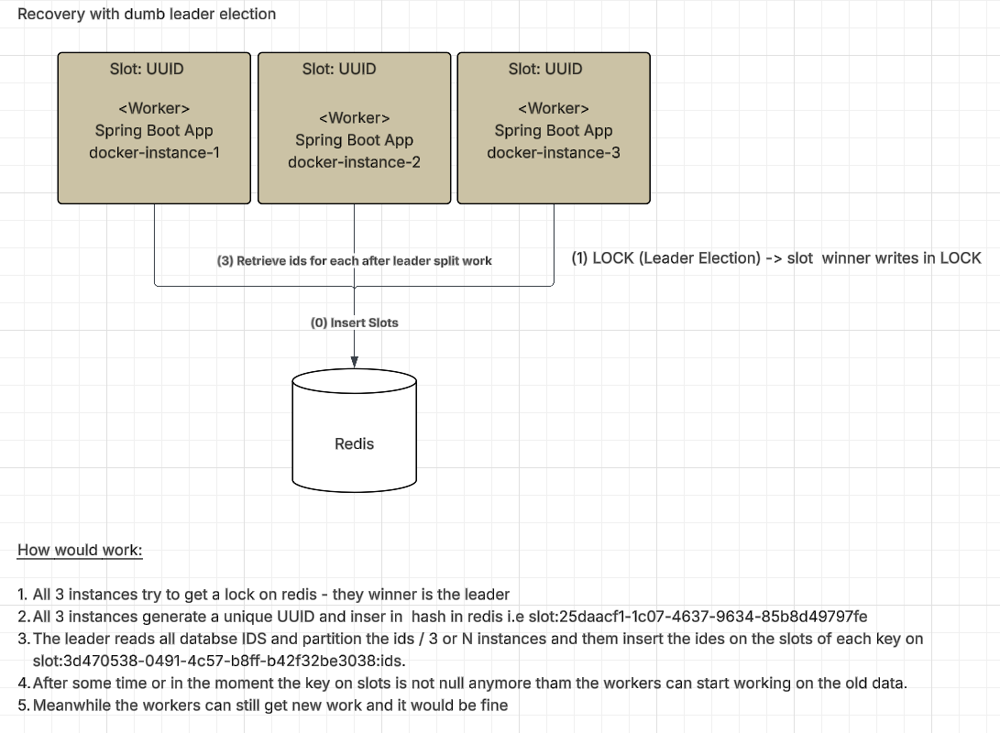

## Rationale

The idea here is to just have fun with a dumb leader election with redis and 3 instances of spring boot application.
Proper leader election is a complex topic, but this example is just to show how it can be done in a simple way.



It works like this, the 3 instances will create a slot, which is unique random UUID (called slot).
The slot will be store in redis with the pattern `slot:<UUID>`. After that because this is POC each node will insert 10 ramdom
UUID on the db which is a key `db` in redis which is a hash. This UUID is just a symbol for some work that needs to be done.
Such work can be loaded into queue/executor that will process the work. The idea of the leader election here is because we 
dont want all 3 instance doing the same work, we need a coordination in this case the leader, which will do:
 * Split the work in across all slots, right now just 3 but the algo is generic.
 * Store the split result in a key in redis being with the pattern `slot:<UUID>:ids`

Once the leader is done(other instances are waiting for 15 seconds) they will try to fetch they own
ids by querying the key `slot:<UUID>:ids` where `<UUID>` is the slot that they created.

This solution is for fun, it has issues like:
* IF Redis is down, the leader election will not work.
* I did not test this algo with chaos and I don't think is bulletproof Only which a lot of testing to know.
* After the lock, the issue is that the other nodes are waiting to be time based, it would be better to wait for the LOCK key to be done
or another clear signal that the leader is done.
* Everytime a new machine/instance bootup the same code will run, them split will happen again if `db` is not cleaned.
* IF machines/instances fail before this process finish lock still be alive for up to 60 seconds, which is the time to live of the lock.
* Only once the lock is gone a new leader election could happen, but this scenario can create some bugs just use your imagination. 

Even being a dumb poc there are some interesting techniques going here like:
* Make same spring boot app run in 3 different instance in docker-compose (changing port with SERVER_PORT)
* Detect if application is running in a container or not
* Advanced usage of redis like hashes and locks.
* Slots logic.

How proper leader election would look like?
* Zookeeper can be used for leader election, but it is a complex solution.
* Apache Curator is a library that can be used to simplify Zookeeper usage.
* Paxos is a algorithms for leader election, but they are complex and not easy to implement.
* Raft is another algorithm for leader election, more simple than paxos.

### Build

```bash
./mvnw clean install
```

### Result

```bash
./build.sh
./start.sh
```

```bash
❯ ./start.sh
[+] Running 4/4
 ✔ Container recovery-leader-election-process-redis-1           Created                                                                                             0.0s 
 ✔ Container recovery-leader-election-process-instance_app_1-1  Recreated                                                                                           0.1s 
 ✔ Container recovery-leader-election-process-instance_app_2-1  Recreated                                                                                           0.1s 
 ✔ Container recovery-leader-election-process-instance_app_3-1  Recreated                                                                                           0.1s 
Attaching to instance_app_1-1, instance_app_2-1, instance_app_3-1, redis-1
redis-1           | 1:C 02 Aug 2025 08:22:39.005 # WARNING Memory overcommit must be enabled! Without it, a background save or replication may fail under low memory condition. Being disabled, it can also cause failures without low memory condition, see https://github.com/jemalloc/jemalloc/issues/1328. To fix this issue add 'vm.overcommit_memory = 1' to /etc/sysctl.conf and then reboot or run the command 'sysctl vm.overcommit_memory=1' for this to take effect.
redis-1           | 1:C 02 Aug 2025 08:22:39.006 * oO0OoO0OoO0Oo Redis is starting oO0OoO0OoO0Oo
redis-1           | 1:C 02 Aug 2025 08:22:39.006 * Redis version=7.2.10, bits=64, commit=00000000, modified=0, pid=1, just started
redis-1           | 1:C 02 Aug 2025 08:22:39.006 # Warning: no config file specified, using the default config. In order to specify a config file use redis-server /path/to/redis.conf
redis-1           | 1:M 02 Aug 2025 08:22:39.006 * monotonic clock: POSIX clock_gettime
redis-1           | 1:M 02 Aug 2025 08:22:39.007 * Running mode=standalone, port=6379.
redis-1           | 1:M 02 Aug 2025 08:22:39.007 * Server initialized
redis-1           | 1:M 02 Aug 2025 08:22:39.008 * Loading RDB produced by version 7.2.10
redis-1           | 1:M 02 Aug 2025 08:22:39.008 * RDB age 208 seconds
redis-1           | 1:M 02 Aug 2025 08:22:39.008 * RDB memory usage when created 1.11 Mb
redis-1           | 1:M 02 Aug 2025 08:22:39.008 * Done loading RDB, keys loaded: 0, keys expired: 0.
redis-1           | 1:M 02 Aug 2025 08:22:39.008 * DB loaded from disk: 0.000 seconds
redis-1           | 1:M 02 Aug 2025 08:22:39.008 * Ready to accept connections tcp
instance_app_2-1  | 
instance_app_2-1  |   .   ____          _            __ _ _
instance_app_2-1  |  /\\ / ___'_ __ _ _(_)_ __  __ _ \ \ \ \
instance_app_2-1  | ( ( )\___ | '_ | '_| | '_ \/ _` | \ \ \ \
instance_app_2-1  |  \\/  ___)| |_)| | | | | || (_| |  ) ) ) )
instance_app_2-1  |   '  |____| .__|_| |_|_| |_\__, | / / / /
instance_app_2-1  |  =========|_|==============|___/=/_/_/_/
instance_app_2-1  | 
instance_app_2-1  |  :: Spring Boot ::                (v3.5.4)
instance_app_2-1  | 
instance_app_3-1  | 
instance_app_3-1  |   .   ____          _            __ _ _
instance_app_3-1  |  /\\ / ___'_ __ _ _(_)_ __  __ _ \ \ \ \
instance_app_3-1  | ( ( )\___ | '_ | '_| | '_ \/ _` | \ \ \ \
instance_app_3-1  |  \\/  ___)| |_)| | | | | || (_| |  ) ) ) )
instance_app_3-1  |   '  |____| .__|_| |_|_| |_\__, | / / / /
instance_app_3-1  |  =========|_|==============|___/=/_/_/_/
instance_app_3-1  | 
instance_app_3-1  |  :: Spring Boot ::                (v3.5.4)
instance_app_3-1  | 
instance_app_1-1  | 
instance_app_1-1  |   .   ____          _            __ _ _
instance_app_1-1  |  /\\ / ___'_ __ _ _(_)_ __  __ _ \ \ \ \
instance_app_1-1  | ( ( )\___ | '_ | '_| | '_ \/ _` | \ \ \ \
instance_app_1-1  |  \\/  ___)| |_)| | | | | || (_| |  ) ) ) )
instance_app_1-1  |   '  |____| .__|_| |_|_| |_\__, | / / / /
instance_app_1-1  |  =========|_|==============|___/=/_/_/_/
instance_app_1-1  | 
instance_app_1-1  |  :: Spring Boot ::                (v3.5.4)
instance_app_1-1  | 
instance_app_2-1  | 2025-08-02T08:22:40.697Z  INFO 7 --- [           main] c.g.d.sandboxspring.Application          : Starting Application v1.0-SNAPSHOT using Java 23.0.2 with PID 7 (/app/app.war started by root in /app)
instance_app_2-1  | 2025-08-02T08:22:40.702Z  INFO 7 --- [           main] c.g.d.sandboxspring.Application          : No active profile set, falling back to 1 default profile: "default"
instance_app_3-1  | 2025-08-02T08:22:40.749Z  INFO 7 --- [           main] c.g.d.sandboxspring.Application          : Starting Application v1.0-SNAPSHOT using Java 23.0.2 with PID 7 (/app/app.war started by root in /app)
instance_app_3-1  | 2025-08-02T08:22:40.753Z  INFO 7 --- [           main] c.g.d.sandboxspring.Application          : No active profile set, falling back to 1 default profile: "default"
instance_app_1-1  | 2025-08-02T08:22:40.796Z  INFO 7 --- [           main] c.g.d.sandboxspring.Application          : Starting Application v1.0-SNAPSHOT using Java 23.0.2 with PID 7 (/app/app.war started by root in /app)
instance_app_1-1  | 2025-08-02T08:22:40.807Z  INFO 7 --- [           main] c.g.d.sandboxspring.Application          : No active profile set, falling back to 1 default profile: "default"
instance_app_2-1  | >> Starting Leader Election from this Slot: 14c9c9b1-d7ea-4a21-b6e4-de73ce693671 port: 8082
instance_app_3-1  | >> Starting Leader Election from this Slot: de61043d-4a6d-4314-a283-7bd5f054ea0b port: 8083
instance_app_1-1  | >> Starting Leader Election from this Slot: 2cb1ef3d-1e39-4889-924c-d84de3f7ef73 port: 8081
instance_app_2-1  | >> Register my slot in redis DONE
instance_app_2-1  | >>> Generating 10 ids for db
instance_app_3-1  | >> Register my slot in redis DONE
instance_app_3-1  | >>> Generating 10 ids for db
instance_app_2-1  | Generated: 10 ids for work.
instance_app_2-1  | ==> Lock acquired by slot: 14c9c9b1-d7ea-4a21-b6e4-de73ce693671 I'm the leader
instance_app_2-1  | ==>  Starting split work...
instance_app_1-1  | >> Register my slot in redis DONE
instance_app_1-1  | >>> Generating 10 ids for db
instance_app_1-1  | Generated: 10 ids for work.
instance_app_3-1  | Generated: 10 ids for work.
instance_app_1-1  | << Lock NOT acquired. Another slot is leader.
instance_app_1-1  | << Waiting for leader to finish work...
instance_app_3-1  | << Lock NOT acquired. Another slot is leader.
instance_app_3-1  | << Waiting for leader to finish work...
instance_app_2-1  | ==>  Work split DONE
instance_app_2-1  | ==>  Leader Work DONE
instance_app_2-1  | 2025-08-02T08:22:44.061Z  INFO 7 --- [           main] o.s.b.a.e.web.EndpointLinksResolver      : Exposing 1 endpoint beneath base path '/actuator'
instance_app_2-1  | 2025-08-02T08:22:44.339Z  INFO 7 --- [           main] o.s.b.web.embedded.netty.NettyWebServer  : Netty started on port 8082 (http)
instance_app_2-1  | 2025-08-02T08:22:44.355Z  INFO 7 --- [           main] c.g.d.sandboxspring.Application          : Started Application in 4.324 seconds (process running for 5.124)
instance_app_2-1  | Spring Boot 3.5.x working! 
instance_app_1-1  | << Getting my IDs from slot: 2cb1ef3d-1e39-4889-924c-d84de3f7ef73
instance_app_3-1  | << Getting my IDs from slot: de61043d-4a6d-4314-a283-7bd5f054ea0b
instance_app_1-1  | << My IDs: 0afa7fd1-1827-489b-90b2-54af11c0fb6b,92aeca60-7b21-4cf5-96ed-0c7694374f40,8d9f0f6b-0077-4e11-ba5d-c8113361b6a2,f327482a-1b3e-47bd-b3a7-3469c0b6ad23,272d4e56-93cc-4dcc-97c6-373f4bd08a28
instance_app_3-1  | << My IDs: 0677545d-cf2f-4b5b-8a9c-46885100117e,ea959cf8-675e-4756-8380-04057fb48321,0cec52bb-f819-4bd0-944c-915e3e59e370,0b7766df-5f70-4372-888f-f66728defab3
instance_app_3-1  | 2025-08-02T08:22:59.003Z  INFO 7 --- [           main] o.s.b.a.e.web.EndpointLinksResolver      : Exposing 1 endpoint beneath base path '/actuator'
instance_app_1-1  | 2025-08-02T08:22:59.045Z  INFO 7 --- [           main] o.s.b.a.e.web.EndpointLinksResolver      : Exposing 1 endpoint beneath base path '/actuator'
instance_app_3-1  | 2025-08-02T08:22:59.347Z  INFO 7 --- [           main] o.s.b.web.embedded.netty.NettyWebServer  : Netty started on port 8083 (http)
instance_app_3-1  | 2025-08-02T08:22:59.367Z  INFO 7 --- [           main] c.g.d.sandboxspring.Application          : Started Application in 19.344 seconds (process running for 20.152)
instance_app_3-1  | Spring Boot 3.5.x working! 
instance_app_1-1  | 2025-08-02T08:22:59.379Z  INFO 7 --- [           main] o.s.b.web.embedded.netty.NettyWebServer  : Netty started on port 8081 (http)
instance_app_1-1  | 2025-08-02T08:22:59.398Z  INFO 7 --- [           main] c.g.d.sandboxspring.Application          : Started Application in 19.329 seconds (process running for 20.189)
instance_app_1-1  | Spring Boot 3.5.x working! 
```

### Redis

```bash
./redis-cli-docker.sh
```

```bash
127.0.0.1:6379> keys *
1) "slot:de61043d-4a6d-4314-a283-7bd5f054ea0b:ids"
2) "slot:2cb1ef3d-1e39-4889-924c-d84de3f7ef73:ids"
3) "slot:2cb1ef3d-1e39-4889-924c-d84de3f7ef73"
4) "slot:14c9c9b1-d7ea-4a21-b6e4-de73ce693671:ids"
5) "slot:14c9c9b1-d7ea-4a21-b6e4-de73ce693671"
6) "db"
7) "slot:de61043d-4a6d-4314-a283-7bd5f054ea0b"
127.0.0.1:6379> 
```

### Endpoints

* /generate -> Generates 10 ids on the key `db`
* /db -> Return the whole list of ids that need to be recovered and split on key `db`
* /ids -> After Leader election and split, here will be ids of the given service
* /clean -> Cleans the `db`,`slots` and `LOCK` key