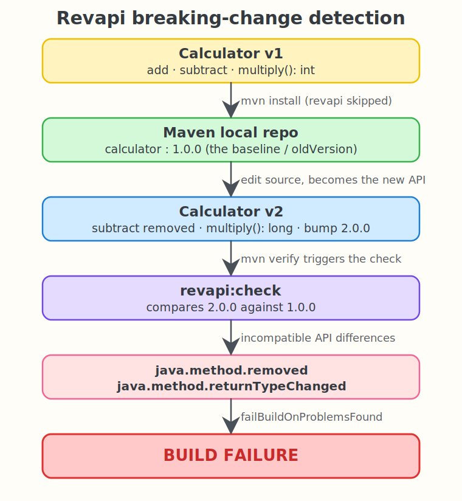

# Revapi + Maven + Java 25 POC

A minimal proof of concept that uses [Revapi](https://revapi.org/revapi-site/main/getting-started.html)
to detect a **source/binary breaking change** in a Java 25 library at build time and fail the Maven build.

Revapi builds the API model of two versions of an artifact, diffs them, classifies every
difference (source, binary, semantic), and fails the build when an incompatible change is found.

## What this POC does

It keeps two versions of a tiny `Calculator` API. The build of version `2.0.0` is compared
against the already published baseline `1.0.0`, and Revapi blocks the build because the change
breaks callers.



## The breaking change

| Method | 1.0.0 (baseline) | 2.0.0 (current) | Revapi verdict |
| --- | --- | --- | --- |
| `add(int, int)` | `int` | `int` | unchanged |
| `subtract(int, int)` | present | **removed** | `java.method.removed` |
| `multiply(int, int)` | returns `int` | returns **`long`** | `java.method.returnTypeChanged` |

Both differences are binary incompatible: existing compiled callers of `subtract` and
`multiply` would break, so Revapi fails the build.

## Layout

```
pom.xml                                   Java 25 build + revapi-maven-plugin wiring
src/main/java/com/example/Calculator.java the active source (baseline by default)
versions/Calculator.v1.java               compatible API (1.0.0)
versions/Calculator.v2.java               breaking API   (2.0.0)
test.sh                                   runs the whole flow and prints the result
```

## How Revapi is wired (`pom.xml`)

```xml
<plugin>
  <groupId>org.revapi</groupId>
  <artifactId>revapi-maven-plugin</artifactId>
  <version>0.15.1</version>
  <dependencies>
    <dependency>
      <groupId>org.revapi</groupId>
      <artifactId>revapi-java</artifactId>
      <version>0.28.4</version>
    </dependency>
  </dependencies>
  <configuration>
    <oldVersion>1.0.0</oldVersion>
  </configuration>
  <executions>
    <execution>
      <id>api-check</id>
      <phase>verify</phase>
      <goals><goal>check</goal></goals>
    </execution>
  </executions>
</plugin>
```

`oldVersion` is the artifact Revapi resolves from the local Maven repository and treats as the
baseline. The new side is the artifact produced by the current build.

## Run it

```bash
./test.sh
```

The script:

1. Builds `Calculator` v1, installs it as `calculator:1.0.0` (Revapi skipped) so it becomes the baseline.
2. Swaps in the breaking v2 source and bumps the project to `2.0.0`.
3. Runs `mvn verify`, which triggers `revapi:check` comparing `2.0.0` against `1.0.0`.
4. Restores the working tree to the clean baseline on exit.

A different version number is required: Revapi resolves the new artifact from the build only
when its coordinates differ from the baseline. With identical versions it would compare `1.0.0`
against itself and report no change.

## Expected output

```
==> Step 1: build and install the compatible baseline 1.0.0 (revapi skipped)
==> Step 2: introduce a breaking change in the source and bump to 2.0.0
==> Step 3: run 'mvn verify' so revapi compares 2.0.0 against 1.0.0

----- revapi detected API differences -----
java.method.returnTypeChanged: method long com.example.Calculator::multiply(int, int): The return type changed from 'int' to  'long'. https://revapi.org/revapi-java/differences.html#java.method.returnTypeChanged
java.method.removed: method int com.example.Calculator::subtract(int, int): Method was removed. https://revapi.org/revapi-java/differences.html#java.method.removed
-------------------------------------------

RESULT: PASS - revapi caught the breaking change and failed the build.
```

`PASS` means the POC worked: Revapi did its job and the breaking build was rejected.

## Versions

| Tool | Version |
| --- | --- |
| Java | 25 (`maven.compiler.release` 25) |
| Maven | 3.9.x |
| revapi-maven-plugin | 0.15.1 |
| revapi-java | 0.28.4 |
| maven-compiler-plugin | 3.14.0 |

## References

- Revapi getting started: https://revapi.org/revapi-site/main/getting-started.html
- Java difference codes: https://revapi.org/revapi-java/differences.html
