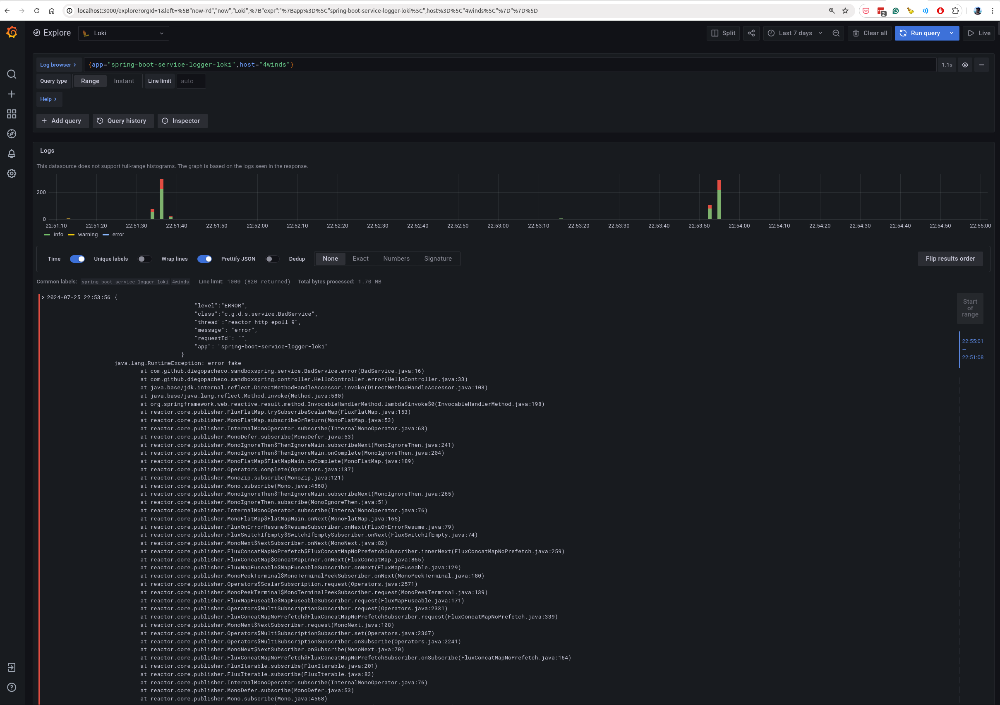

### Build
```bash
./mvnw clean install
```
### Run Loki
````bash
./run-loki.sh
````
### Run Spring Boot app
```bash
./run.sh
```
````
❯ ./run.sh
[INFO] Scanning for projects...
[INFO] 
[INFO] ----< com.github.diegopacheco.javapocs:spring-boot-3x-logback-loki >----
[INFO] Building spring-boot-3x-logback-loki 1.0-SNAPSHOT
[INFO]   from pom.xml
[INFO] --------------------------------[ war ]---------------------------------
[INFO] 
[INFO] >>> spring-boot:3.3.2:run (default-cli) > test-compile @ spring-boot-3x-logback-loki >>>
[INFO] 
[INFO] --- resources:3.3.1:resources (default-resources) @ spring-boot-3x-logback-loki ---
[INFO] Copying 1 resource from src/main/resources to target/classes
[INFO] Copying 1 resource from src/main/resources to target/classes
[INFO] 
[INFO] --- compiler:3.13.0:compile (default-compile) @ spring-boot-3x-logback-loki ---
[INFO] Recompiling the module because of added or removed source files.
[INFO] Compiling 3 source files with javac [debug parameters release 21] to target/classes
[INFO] 
[INFO] --- resources:3.3.1:testResources (default-testResources) @ spring-boot-3x-logback-loki ---
[INFO] Copying 0 resource from src/test/resources to target/test-classes
[INFO] 
[INFO] --- compiler:3.13.0:testCompile (default-testCompile) @ spring-boot-3x-logback-loki ---
[INFO] Recompiling the module because of changed dependency.
[INFO] 
[INFO] <<< spring-boot:3.3.2:run (default-cli) < test-compile @ spring-boot-3x-logback-loki <<<
[INFO] 
[INFO] 
[INFO] --- spring-boot:3.3.2:run (default-cli) @ spring-boot-3x-logback-loki ---
[INFO] Attaching agents: []

  .   ____          _            __ _ _
 /\\ / ___'_ __ _ _(_)_ __  __ _ \ \ \ \
( ( )\___ | '_ | '_| | '_ \/ _` | \ \ \ \
 \\/  ___)| |_)| | | | | || (_| |  ) ) ) )
  '  |____| .__|_| |_|_| |_\__, | / / / /
 =========|_|==============|___/=/_/_/_/

 :: Spring Boot ::                (v3.3.2)

2024-07-25 22:53:16 INFO  c.g.d.sandboxspring.Application - Starting Application using Java 21 with PID 1597435 (/mnt/e35d88d4-42b9-49ea-bf29-c4c3b018d429/diego/git/diegopacheco/java-pocs/pocs/spring-boot-3x-logback-loki/target/classes started by diego in /mnt/e35d88d4-42b9-49ea-bf29-c4c3b018d429/diego/git/diegopacheco/java-pocs/pocs/spring-boot-3x-logback-loki)
2024-07-25 22:53:16 INFO  c.g.d.sandboxspring.Application - No active profile set, falling back to 1 default profile: "default"
2024-07-25 22:53:17 INFO  o.s.b.a.e.web.EndpointLinksResolver - Exposing 14 endpoints beneath base path '/actuator'
2024-07-25 22:53:17 INFO  o.s.b.w.e.netty.NettyWebServer - Netty started on port 8080 (http)
2024-07-25 22:53:17 INFO  c.g.d.sandboxspring.Application - Started Application in 2.105 seconds (process running for 2.363)
Spring Boot 3.3.x working! 
````

### Generate traffic
```bash
./generate-traffic.sh
```
```
❯ ./generate-traffic.sh
okerrorokerrorokerrorokerrorokerrorokerrorokerrorokerrorokerrorokerrorokerrorokerrorokerrorokerrorokerrorokerrorokerrorokerrorokerrorokerrorokerrorokerrorokerrorokerrorokerrorokerrorokerrorokerrorokerrorokerrorokerrorokerrorokerrorokerrorokerrorokerrorokerrorokerrorokerrorokerrorokerrorokerrorokerrorokerrorokerrorokerrorokerrorokerrorokerrorokerrorokerrorokerrorokerrorokerrorokerrorokerrorokerrorokerrorokerrorokerrorokerrorokerrorokerrorokerrorokerrorokerrorokerrorokerrorokerrorokerrorokerrorokerrorokerrorokerrorokerrorokerrorokerrorokerrorokerrorokerrorokerrorokerrorokerrorokerrorokerrorokerrorokerrorokerrorokerrorokerrorokerrorokerrorokerrorokerrorokerrorokerrorokerrorokerrorokerrorokerror%  
```
### Check Loki
```
http://localhost:3000/explore
```

