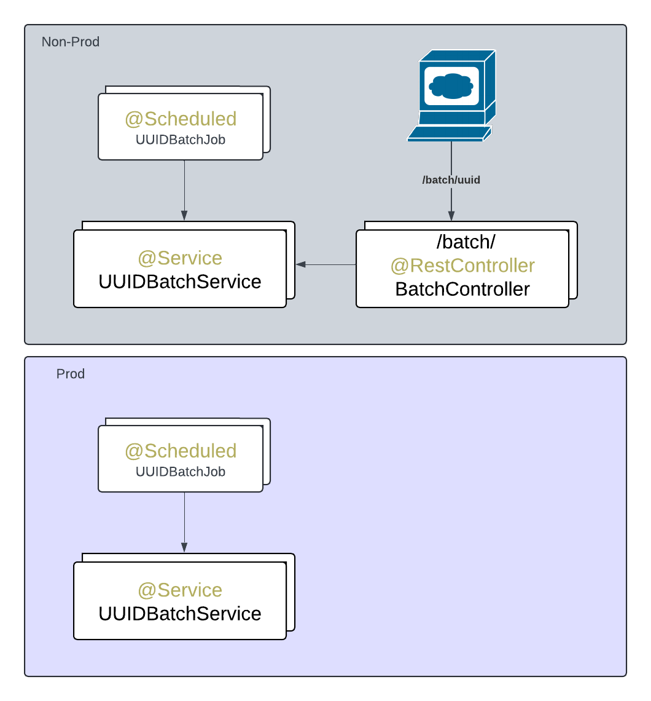

### Rationale

This is a way to test batch jobs but also have them @Scheduled with a cron to run.
The issue is you dont want wait the crom to kick in to test it. A endpoint that can call the job directely is great
so it allow integration tests and exploratory testing. However we dont want that endpoint in prod(because is a testing interface)
so there is some magic to disable the endpoint when running in prod.

Is possible to pass parameters to the batch job via the geenric rest controller `BatchController`. Some extra infra might still needed in order to mock or setup other dependencies but this by it self make it way more testable.

<center>
    
</center>

### Build
```bash
./mvnw clean install
```
### Result
```
./run-non-prod.sh
```
```
❯ ./run-non-prod.sh

  .   ____          _            __ _ _
 /\\ / ___'_ __ _ _(_)_ __  __ _ \ \ \ \
( ( )\___ | '_ | '_| | '_ \/ _` | \ \ \ \
 \\/  ___)| |_)| | | | | || (_| |  ) ) ) )
  '  |____| .__|_| |_|_| |_\__, | / / / /
 =========|_|==============|___/=/_/_/_/

 :: Spring Boot ::                (v3.3.1)

2024-07-12T01:51:35.960-07:00  INFO 2699429 --- [           main] c.g.d.sandboxspring.Application          : Starting Application v1.0-SNAPSHOT using Java 21 with PID 2699429 (/mnt/e35d88d4-42b9-49ea-bf29-c4c3b018d429/diego/git/diegopacheco/java-pocs/pocs/spring-boot-job-testing-endpoint/target/spring-boot-job-testing-endpoint-1.0-SNAPSHOT.war started by diego in /mnt/e35d88d4-42b9-49ea-bf29-c4c3b018d429/diego/git/diegopacheco/java-pocs/pocs/spring-boot-job-testing-endpoint)
2024-07-12T01:51:35.963-07:00  INFO 2699429 --- [           main] c.g.d.sandboxspring.Application          : The following 1 profile is active: "dev"
2024-07-12T01:51:37.607-07:00  INFO 2699429 --- [           main] o.s.b.a.e.web.EndpointLinksResolver      : Exposing 1 endpoint beneath base path '/actuator'
2024-07-12T01:51:38.064-07:00  INFO 2699429 --- [           main] o.s.b.web.embedded.netty.NettyWebServer  : Netty started on port 8080 (http)
2024-07-12T01:51:38.081-07:00  INFO 2699429 --- [           main] c.g.d.sandboxspring.Application          : Started Application in 2.657 seconds (process running for 3.162)
Spring Boot 3.3.x working! 
2024-07-12T01:51:43.342-07:00  INFO 2699429 --- [or-http-epoll-2] c.g.d.s.batch.UUIDBatchService           : UUIDBatchService running. Generating UUIDs...
a8eeebf0-a469-4b0d-9d78-b9e7e36d977e
595312ca-c261-4651-a22d-581c5ae3efe3
5183e7e3-6de4-4d9b-a0d2-2d31e553d74b
6c494980-8afa-4b64-b90f-073ee84ff48d
29bec7ec-a85d-409f-a839-da7d8bc124ba
b95b8064-5c27-40bd-a677-159cadcb0e79
565c2795-7454-4536-9bbc-60e8b5ea76c0
afbbffde-2131-4db4-b1a6-ff199205ddf0
f07c965e-fbd5-4041-ad32-d7d8f7945db0
a7a47a14-fe54-4a6b-a6fd-bc8a766a0f00
```
goto
```
http://localhost:8080/batch/uuid
```
```
// 20240712014253
// http://localhost:8080/batch/uuid

true
```

try run prod...
```
./run-prod.sh
```
```
❯ ./run-prod.sh

  .   ____          _            __ _ _
 /\\ / ___'_ __ _ _(_)_ __  __ _ \ \ \ \
( ( )\___ | '_ | '_| | '_ \/ _` | \ \ \ \
 \\/  ___)| |_)| | | | | || (_| |  ) ) ) )
  '  |____| .__|_| |_|_| |_\__, | / / / /
 =========|_|==============|___/=/_/_/_/

 :: Spring Boot ::                (v3.3.1)

2024-07-12T01:52:43.835-07:00  INFO 2699838 --- [           main] c.g.d.sandboxspring.Application          : Starting Application v1.0-SNAPSHOT using Java 21 with PID 2699838 (/mnt/e35d88d4-42b9-49ea-bf29-c4c3b018d429/diego/git/diegopacheco/java-pocs/pocs/spring-boot-job-testing-endpoint/target/spring-boot-job-testing-endpoint-1.0-SNAPSHOT.war started by diego in /mnt/e35d88d4-42b9-49ea-bf29-c4c3b018d429/diego/git/diegopacheco/java-pocs/pocs/spring-boot-job-testing-endpoint)
2024-07-12T01:52:43.841-07:00  INFO 2699838 --- [           main] c.g.d.sandboxspring.Application          : The following 1 profile is active: "prod"
2024-07-12T01:52:45.661-07:00  INFO 2699838 --- [           main] o.s.b.a.e.web.EndpointLinksResolver      : Exposing 1 endpoint beneath base path '/actuator'
2024-07-12T01:52:46.195-07:00  INFO 2699838 --- [           main] o.s.b.web.embedded.netty.NettyWebServer  : Netty started on port 8080 (http)
2024-07-12T01:52:46.210-07:00  INFO 2699838 --- [           main] c.g.d.sandboxspring.Application          : Started Application in 2.926 seconds (process running for 3.433)
Spring Boot 3.3.x working! 
```
```
http://localhost:8080/batch/uuid
```
````
Whitelabel Error Page
This application has no configured error view, so you are seeing this as a fallback.

Fri Jul 12 01:53:18 PDT 2024
[6f64d203-1] There was an unexpected error (type=Not Found, status=404).
````

### Runing batch jobs on integration testing
```
BatchControllerIT
```
```
/home/diego/.sdkman/candidates/java/21-amzn/bin/java -ea -XX:+EnableDynamicAgentLoading -Djdk.instrument.traceUsage=true) -Didea.test.cyclic.buffer.size=1048576 -javaagent:/home/diego/.local/share/JetBrains/Toolbox/apps/intellij-idea-community-edition/lib/idea_rt.jar=43991:/home/diego/.local/share/JetBrains/Toolbox/apps/intellij-idea-community-edition/bin -Dfile.encoding=UTF-8 -Dsun.stdout.encoding=UTF-8 -Dsun.stderr.encoding=UTF-8 -classpath /home/diego/.m2/repository/org/junit/platform/junit-platform-launcher/1.10.2/junit-platform-launcher-1.10.2.jar:/home/diego/.local/share/JetBrains/Toolbox/apps/intellij-idea-community-edition/lib/idea_rt.jar:/home/diego/.local/share/JetBrains/Toolbox/apps/intellij-idea-community-edition/plugins/junit/lib/junit5-rt.jar:/home/diego/.local/share/JetBrains/Toolbox/apps/intellij-idea-community-edition/plugins/junit/lib/junit-rt.jar:/home/diego/git/diegopacheco/java-pocs/pocs/spring-boot-job-testing-endpoint/target/test-classes:/home/diego/git/diegopacheco/java-pocs/pocs/spring-boot-job-testing-endpoint/target/classes:/home/diego/.m2/repository/org/springframework/boot/spring-boot-starter-webflux/3.3.1/spring-boot-starter-webflux-3.3.1.jar:/home/diego/.m2/repository/org/springframework/boot/spring-boot-starter/3.3.1/spring-boot-starter-3.3.1.jar:/home/diego/.m2/repository/org/springframework/boot/spring-boot/3.3.1/spring-boot-3.3.1.jar:/home/diego/.m2/repository/org/springframework/spring-context/6.1.10/spring-context-6.1.10.jar:/home/diego/.m2/repository/org/springframework/spring-aop/6.1.10/spring-aop-6.1.10.jar:/home/diego/.m2/repository/org/springframework/spring-expression/6.1.10/spring-expression-6.1.10.jar:/home/diego/.m2/repository/org/springframework/boot/spring-boot-autoconfigure/3.3.1/spring-boot-autoconfigure-3.3.1.jar:/home/diego/.m2/repository/org/springframework/boot/spring-boot-starter-logging/3.3.1/spring-boot-starter-logging-3.3.1.jar:/home/diego/.m2/repository/ch/qos/logback/logback-classic/1.5.6/logback-classic-1.5.6.jar:/home/diego/.m2/repository/ch/qos/logback/logback-core/1.5.6/logback-core-1.5.6.jar:/home/diego/.m2/repository/org/apache/logging/log4j/log4j-to-slf4j/2.23.1/log4j-to-slf4j-2.23.1.jar:/home/diego/.m2/repository/org/apache/logging/log4j/log4j-api/2.23.1/log4j-api-2.23.1.jar:/home/diego/.m2/repository/org/slf4j/jul-to-slf4j/2.0.13/jul-to-slf4j-2.0.13.jar:/home/diego/.m2/repository/jakarta/annotation/jakarta.annotation-api/2.1.1/jakarta.annotation-api-2.1.1.jar:/home/diego/.m2/repository/org/yaml/snakeyaml/2.2/snakeyaml-2.2.jar:/home/diego/.m2/repository/org/springframework/boot/spring-boot-starter-json/3.3.1/spring-boot-starter-json-3.3.1.jar:/home/diego/.m2/repository/com/fasterxml/jackson/core/jackson-databind/2.17.1/jackson-databind-2.17.1.jar:/home/diego/.m2/repository/com/fasterxml/jackson/core/jackson-annotations/2.17.1/jackson-annotations-2.17.1.jar:/home/diego/.m2/repository/com/fasterxml/jackson/core/jackson-core/2.17.1/jackson-core-2.17.1.jar:/home/diego/.m2/repository/com/fasterxml/jackson/datatype/jackson-datatype-jdk8/2.17.1/jackson-datatype-jdk8-2.17.1.jar:/home/diego/.m2/repository/com/fasterxml/jackson/datatype/jackson-datatype-jsr310/2.17.1/jackson-datatype-jsr310-2.17.1.jar:/home/diego/.m2/repository/com/fasterxml/jackson/module/jackson-module-parameter-names/2.17.1/jackson-module-parameter-names-2.17.1.jar:/home/diego/.m2/repository/org/springframework/boot/spring-boot-starter-reactor-netty/3.3.1/spring-boot-starter-reactor-netty-3.3.1.jar:/home/diego/.m2/repository/io/projectreactor/netty/reactor-netty-http/1.1.20/reactor-netty-http-1.1.20.jar:/home/diego/.m2/repository/io/netty/netty-codec-http/4.1.111.Final/netty-codec-http-4.1.111.Final.jar:/home/diego/.m2/repository/io/netty/netty-common/4.1.111.Final/netty-common-4.1.111.Final.jar:/home/diego/.m2/repository/io/netty/netty-buffer/4.1.111.Final/netty-buffer-4.1.111.Final.jar:/home/diego/.m2/repository/io/netty/netty-transport/4.1.111.Final/netty-transport-4.1.111.Final.jar:/home/diego/.m2/repository/io/netty/netty-codec/4.1.111.Final/netty-codec-4.1.111.Final.jar:/home/diego/.m2/repository/io/netty/netty-handler/4.1.111.Final/netty-handler-4.1.111.Final.jar:/home/diego/.m2/repository/io/netty/netty-codec-http2/4.1.111.Final/netty-codec-http2-4.1.111.Final.jar:/home/diego/.m2/repository/io/netty/netty-resolver-dns/4.1.111.Final/netty-resolver-dns-4.1.111.Final.jar:/home/diego/.m2/repository/io/netty/netty-resolver/4.1.111.Final/netty-resolver-4.1.111.Final.jar:/home/diego/.m2/repository/io/netty/netty-codec-dns/4.1.111.Final/netty-codec-dns-4.1.111.Final.jar:/home/diego/.m2/repository/io/netty/netty-resolver-dns-native-macos/4.1.111.Final/netty-resolver-dns-native-macos-4.1.111.Final-osx-x86_64.jar:/home/diego/.m2/repository/io/netty/netty-resolver-dns-classes-macos/4.1.111.Final/netty-resolver-dns-classes-macos-4.1.111.Final.jar:/home/diego/.m2/repository/io/netty/netty-transport-native-epoll/4.1.111.Final/netty-transport-native-epoll-4.1.111.Final-linux-x86_64.jar:/home/diego/.m2/repository/io/netty/netty-transport-native-unix-common/4.1.111.Final/netty-transport-native-unix-common-4.1.111.Final.jar:/home/diego/.m2/repository/io/netty/netty-transport-classes-epoll/4.1.111.Final/netty-transport-classes-epoll-4.1.111.Final.jar:/home/diego/.m2/repository/io/projectreactor/netty/reactor-netty-core/1.1.20/reactor-netty-core-1.1.20.jar:/home/diego/.m2/repository/io/netty/netty-handler-proxy/4.1.111.Final/netty-handler-proxy-4.1.111.Final.jar:/home/diego/.m2/repository/io/netty/netty-codec-socks/4.1.111.Final/netty-codec-socks-4.1.111.Final.jar:/home/diego/.m2/repository/org/springframework/spring-web/6.1.10/spring-web-6.1.10.jar:/home/diego/.m2/repository/org/springframework/spring-beans/6.1.10/spring-beans-6.1.10.jar:/home/diego/.m2/repository/org/springframework/spring-webflux/6.1.10/spring-webflux-6.1.10.jar:/home/diego/.m2/repository/io/projectreactor/reactor-core/3.6.7/reactor-core-3.6.7.jar:/home/diego/.m2/repository/org/reactivestreams/reactive-streams/1.0.4/reactive-streams-1.0.4.jar:/home/diego/.m2/repository/org/springframework/boot/spring-boot-starter-actuator/3.3.1/spring-boot-starter-actuator-3.3.1.jar:/home/diego/.m2/repository/org/springframework/boot/spring-boot-actuator-autoconfigure/3.3.1/spring-boot-actuator-autoconfigure-3.3.1.jar:/home/diego/.m2/repository/org/springframework/boot/spring-boot-actuator/3.3.1/spring-boot-actuator-3.3.1.jar:/home/diego/.m2/repository/io/micrometer/micrometer-observation/1.13.1/micrometer-observation-1.13.1.jar:/home/diego/.m2/repository/io/micrometer/micrometer-commons/1.13.1/micrometer-commons-1.13.1.jar:/home/diego/.m2/repository/io/micrometer/micrometer-jakarta9/1.13.1/micrometer-jakarta9-1.13.1.jar:/home/diego/.m2/repository/io/micrometer/micrometer-core/1.13.1/micrometer-core-1.13.1.jar:/home/diego/.m2/repository/org/hdrhistogram/HdrHistogram/2.2.2/HdrHistogram-2.2.2.jar:/home/diego/.m2/repository/org/latencyutils/LatencyUtils/2.0.3/LatencyUtils-2.0.3.jar:/home/diego/.m2/repository/org/springframework/boot/spring-boot-starter-test/3.3.1/spring-boot-starter-test-3.3.1.jar:/home/diego/.m2/repository/org/springframework/boot/spring-boot-test/3.3.1/spring-boot-test-3.3.1.jar:/home/diego/.m2/repository/org/springframework/boot/spring-boot-test-autoconfigure/3.3.1/spring-boot-test-autoconfigure-3.3.1.jar:/home/diego/.m2/repository/com/jayway/jsonpath/json-path/2.9.0/json-path-2.9.0.jar:/home/diego/.m2/repository/org/slf4j/slf4j-api/2.0.13/slf4j-api-2.0.13.jar:/home/diego/.m2/repository/jakarta/xml/bind/jakarta.xml.bind-api/4.0.2/jakarta.xml.bind-api-4.0.2.jar:/home/diego/.m2/repository/jakarta/activation/jakarta.activation-api/2.1.3/jakarta.activation-api-2.1.3.jar:/home/diego/.m2/repository/net/minidev/json-smart/2.5.1/json-smart-2.5.1.jar:/home/diego/.m2/repository/net/minidev/accessors-smart/2.5.1/accessors-smart-2.5.1.jar:/home/diego/.m2/repository/org/ow2/asm/asm/9.6/asm-9.6.jar:/home/diego/.m2/repository/org/assertj/assertj-core/3.25.3/assertj-core-3.25.3.jar:/home/diego/.m2/repository/net/bytebuddy/byte-buddy/1.14.17/byte-buddy-1.14.17.jar:/home/diego/.m2/repository/org/awaitility/awaitility/4.2.1/awaitility-4.2.1.jar:/home/diego/.m2/repository/org/hamcrest/hamcrest/2.2/hamcrest-2.2.jar:/home/diego/.m2/repository/org/junit/jupiter/junit-jupiter/5.10.2/junit-jupiter-5.10.2.jar:/home/diego/.m2/repository/org/junit/jupiter/junit-jupiter-api/5.10.2/junit-jupiter-api-5.10.2.jar:/home/diego/.m2/repository/org/opentest4j/opentest4j/1.3.0/opentest4j-1.3.0.jar:/home/diego/.m2/repository/org/junit/platform/junit-platform-commons/1.10.2/junit-platform-commons-1.10.2.jar:/home/diego/.m2/repository/org/apiguardian/apiguardian-api/1.1.2/apiguardian-api-1.1.2.jar:/home/diego/.m2/repository/org/junit/jupiter/junit-jupiter-params/5.10.2/junit-jupiter-params-5.10.2.jar:/home/diego/.m2/repository/org/junit/jupiter/junit-jupiter-engine/5.10.2/junit-jupiter-engine-5.10.2.jar:/home/diego/.m2/repository/org/junit/platform/junit-platform-engine/1.10.2/junit-platform-engine-1.10.2.jar:/home/diego/.m2/repository/org/mockito/mockito-core/5.11.0/mockito-core-5.11.0.jar:/home/diego/.m2/repository/net/bytebuddy/byte-buddy-agent/1.14.17/byte-buddy-agent-1.14.17.jar:/home/diego/.m2/repository/org/objenesis/objenesis/3.3/objenesis-3.3.jar:/home/diego/.m2/repository/org/mockito/mockito-junit-jupiter/5.11.0/mockito-junit-jupiter-5.11.0.jar:/home/diego/.m2/repository/org/skyscreamer/jsonassert/1.5.1/jsonassert-1.5.1.jar:/home/diego/.m2/repository/com/vaadin/external/google/android-json/0.0.20131108.vaadin1/android-json-0.0.20131108.vaadin1.jar:/home/diego/.m2/repository/org/springframework/spring-core/6.1.10/spring-core-6.1.10.jar:/home/diego/.m2/repository/org/springframework/spring-jcl/6.1.10/spring-jcl-6.1.10.jar:/home/diego/.m2/repository/org/springframework/spring-test/6.1.10/spring-test-6.1.10.jar:/home/diego/.m2/repository/org/xmlunit/xmlunit-core/2.9.1/xmlunit-core-2.9.1.jar com.intellij.rt.junit.JUnitStarter -ideVersion5 -junit5 com.github.diegopacheco.sandboxspring.controller.BatchControllerIT
00:39:11.170 [main] INFO org.springframework.test.context.support.AnnotationConfigContextLoaderUtils -- Could not detect default configuration classes for test class [com.github.diegopacheco.sandboxspring.controller.BatchControllerIT]: BatchControllerIT does not declare any static, non-private, non-final, nested classes annotated with @Configuration.
00:39:11.360 [main] INFO org.springframework.boot.test.context.SpringBootTestContextBootstrapper -- Found @SpringBootConfiguration com.github.diegopacheco.sandboxspring.Application for test class com.github.diegopacheco.sandboxspring.controller.BatchControllerIT

  .   ____          _            __ _ _
 /\\ / ___'_ __ _ _(_)_ __  __ _ \ \ \ \
( ( )\___ | '_ | '_| | '_ \/ _` | \ \ \ \
 \\/  ___)| |_)| | | | | || (_| |  ) ) ) )
  '  |____| .__|_| |_|_| |_\__, | / / / /
 =========|_|==============|___/=/_/_/_/

 :: Spring Boot ::                (v3.3.1)

2024-07-13T00:39:11.838-07:00  INFO 2874489 --- [           main] c.g.d.s.controller.BatchControllerIT     : Starting BatchControllerIT using Java 21 with PID 2874489 (started by diego in /mnt/e35d88d4-42b9-49ea-bf29-c4c3b018d429/diego/git/diegopacheco/java-pocs/pocs/spring-boot-job-testing-endpoint)
2024-07-13T00:39:11.841-07:00  INFO 2874489 --- [           main] c.g.d.s.controller.BatchControllerIT     : No active profile set, falling back to 1 default profile: "default"
2024-07-13T00:39:12.941-07:00  INFO 2874489 --- [           main] c.g.d.s.controller.BatchControllerIT     : Started BatchControllerIT in 1.484 seconds (process running for 2.711)
Spring Boot 3.3.x working! 
OpenJDK 64-Bit Server VM warning: Sharing is only supported for boot loader classes because bootstrap classpath has been appended
2024-07-13T00:39:13.650-07:00  INFO 2874489 --- [     parallel-1] c.g.d.s.controller.BatchController       : Setting amount to: 3
2024-07-13T00:39:13.650-07:00  INFO 2874489 --- [     parallel-1] c.g.d.s.batch.UUIDBatchService           : UUIDBatchService running. Generating UUIDs...
2024-07-13T00:39:13.651-07:00  INFO 2874489 --- [     parallel-1] c.g.d.s.batch.UUIDBatchService           : Running in non-prod mode. Amount: 3
efb2d932-b61c-49df-af7f-f86d192c791e
fa2e5499-ad3a-4aa8-abab-2aa9b35039ef
5a8503a1-5618-4b1e-9a9d-1cf1917ccebc

Process finished with exit code 0
```

### Options for State Injection

Goals

* Centralize as much as possible (FeatureFlag Class)
* Mix Test and Production code as little as possible
* Avoid code duplication as much as possible
* Pass parameters for what need to change
* Return data to allow assertions

Options

* Option #1 - Feature Flags / Test Flags
  * Per attribute/variable
  * Per class
  * Might sound messy but is the best options because could all be abstracted by the FF class.
* Option #2 - Rest Controller parameters
  * Might require to pass down the line to service/repository
* Option #3 - External State Injection System / Service (Mock/Proxy)
  * One way or another
  * Ideally centralized and less places and times as possible
* Option #4 - Database
  * kind of clear for code perspective but has serious isolation issues.
  * Database might sound like a good idea because is separated from the code but is not.
* Option #5 - Different Routing
  * Different Service/Repository
  * The issue is that could duplicate code and be harder to mantain but a bit cleanner.

## Notes on Induction

* Inducing spesific states is a good way to test the system.
* As much as could feel wrong because is in the middle of the code is actually a good practice.
* Because it allow integration tests and exploratory testing(QA) is easier.
* The key is to have a way to turn it off in production.
* The key is to have a way to pass parameters to the system.
* The key is to have a way to return data to allow assertions.
* This way is just like any other RPC endpoint testing.