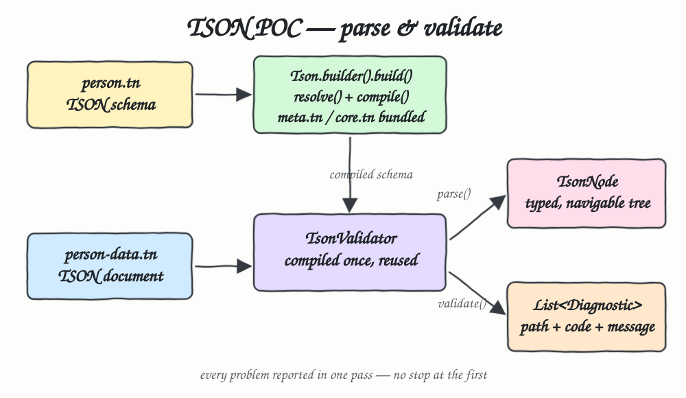

# tson-java-java25

POC of [tson-java](https://github.com/litterat/ltr8-io-tson-java) — a Java 25 implementation of
[TSON](https://tson.io) (Typed Schema Object Notation), a Unicode-first superset of JSON with a
hash-pinned schema layer. A `TsonValidator` class parses and validates TSON documents against a
schema, driven from `Main` and covered by JUnit 6 tests.

## Architecture



## Stack

| Piece | Why |
|---|---|
| Java 25 | tson-java requires it (records, sealed interfaces, module system) |
| tson `0.1.0-SNAPSHOT` | the front door: `Tson.builder()`, `resolve`, `treeRegistry` |
| tson-compiler | parser, schema compiler, `TsonReadContext`, `Diagnostic` |
| tson-schema / tson-tree / tson-bind / tson-annotation / tson-regex | transitive modules of `tson`; no external runtime deps |
| Maven | the POC template already uses the wrapper; the library ships Gradle-only, so `setup.sh` bridges it |
| JUnit 6.0.3 | test framework, imported via `org.junit:junit-bom` |
| log4j2 | inherited from the POC template, unused by the validator |

The library is **not on Maven Central**. `setup.sh` clones it, builds the jars with its own Gradle
wrapper, and installs the 7 artifacts into `~/.m2` under `io.ltr8`.

## Contracts / API

`TsonValidator` — one instance per schema, resolved and compiled once in the constructor.

| Method | Contract |
|---|---|
| `TsonValidator(String schemaText)` | resolves + compiles the schema; throws if the schema does not resolve |
| `TsonNode parse(String type, String data)` | reads the document into a typed tree; fail-fast, throws on the first problem |
| `List<Diagnostic> validate(String type, String data)` | collecting mode; an empty list means valid |
| `boolean isValid(String type, String data)` | `validate(...).isEmpty()` |

`Diagnostic` is `(path, code, message, expected, actual, dataPosition, schemaPosition)` where `path`
is an RFC 6901 JSON Pointer into the *data* (`/address/city`) and `code` is a closed enum
(`FIELD_REQUIRED`, `TYPE_MISMATCH`, `ATOM_CONSTRAINT_VIOLATION`, `WRONG_ARITY`, …).

The schema and documents used by the POC live as text blocks in `Main` (`SCHEMA`, `VALID`, `INVALID`)
and are reused by the tests, so the tests and the runnable program cannot drift apart.

## Key data structures and design decisions

- **`TsonNode` tree, not a bound POJO.** `tson` offers two read modes: `treeRegistry()` (immutable
  `TsonNode` — `RecordNode` / `MapNode` / `ArrayNode` / `TupleNode` / `AtomNode` / `NullNode` /
  `AbsentNode` / `MissingNode`) and `bindRegistry()` (real Java objects). The POC uses the tree: the
  TSON schema stays the single source of truth and no Java class has to mirror it.
- **Structure-preserving.** TSON distinguishes record from map and array from tuple, so the node type
  carries information JSON's object/array pair loses.
- **Missing instead of null.** Navigating off the tree returns `MissingNode`, so
  `person.at("/address/city")` never throws and `get("email").asString()` on an absent optional is
  just an empty `Optional`.
- **Read mode is the context, not a flag.** `TsonReadContext.throwing(...)` fails fast (used by
  `parse`) and `TsonReadContext.collecting(...)` accumulates (used by `validate`), so one compiled
  reader serves both without a boolean parameter.
- **Compile once.** `Tson.builder().build()` bootstraps meta-kernel/meta.tn/core.tn on every call, so
  the validator holds the `TsonCompiledSchema` and the tests share one instance via `@BeforeAll`.

## How to run

```bash
./setup.sh          # clone + build tson-java, install the io.ltr8 jars into ~/.m2
./mvnw clean test   # JUnit 6 tests
./run.sh            # Main
```

`./run.sh`:

```
name:   Ada Lovelace
age:    30
city:   London
skills: 3
email:  <absent>
valid:   true
invalid: false
  [ATOM_CONSTRAINT_VIOLATION] /age -> 'thirty' is not a valid integer -- only integer and based-integer forms are accepted (§5.6)
  [ATOM_CONSTRAINT_VIOLATION] /role -> 'wizard' is not a member of this enum -- expected one of [admin, member, guest]
  [FIELD_REQUIRED] /name -> missing required field 'name' for 'person'
```

`./mvnw clean test`:

```
[INFO] Running TsonValidatorTest
[INFO] Tests run: 10, Failures: 0, Errors: 0, Skipped: 0, Time elapsed: 0.159 s -- in TsonValidatorTest
[INFO]
[INFO] Results:
[INFO]
[INFO] Tests run: 10, Failures: 0, Errors: 0, Skipped: 0
[INFO] BUILD SUCCESS
```

## How it works?

`Tson.builder().build()` boots a registry with the bundled standard library (meta-kernel, `meta.tn`,
`core.tn`), which is what gives a schema its vocabulary — `text`, `int32`, `uuid`, `!enum`. The
constructor then calls `resolve(schemaText)` to parse the schema, resolve every type reference and
link it, and `treeRegistry().compile(...)` to turn each declared type into a reusable reader. That
compiled schema is the validator's only state.

`parse(type, data)` looks the reader up by type name and reads the document through a *throwing*
context, so a bad value raises instead of returning something wrong. `validate(type, data)` runs the
same reader through a *collecting* context, which records each problem as a `Diagnostic` and keeps
going — the invalid document above comes back with all three problems in one pass rather than
stopping at `/age`. An empty list means the document conforms.
