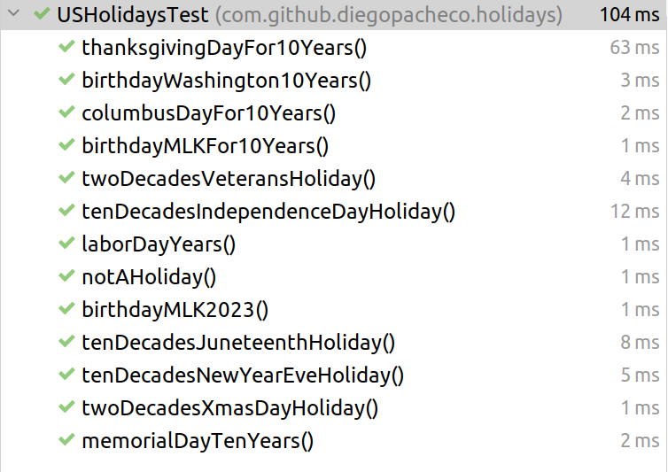

### Build 
```bash
./mvnw clean install 
```
### Law definition
According to US federal law. (a)The following are legal public holidays:
```json
[x] New Year’s Day, January 1.
[x] Birthday of Martin Luther King, Jr., the third Monday in January.
[x] Washington’s Birthday, the third Monday in February.
[x] Memorial Day, the last Monday in May.
[x] Juneteenth National Independence Day, June 19.
[x] Independence Day, July 4.
[x] Labor Day, the first Monday in September.
[x] Columbus Day, the second Monday in October.
[x] Veterans Day, November 11.
[x] Thanksgiving Day, the fourth Thursday in November.
[x] Christmas Day, December 25.
```
more: https://www.law.cornell.edu/uscode/text/5/6103

## Tests are passing 100%


## Rationale

I always love JodaTime(https://www.joda.org/joda-time/) was the only way
to work with date, time and timezone in java. <BR/> 
Now there were a JSR 310 Java Time (https://jcp.org/aboutJava/communityprocess/pfd/jsr310/JSR-310-guide.html)
introduced in Java 8 which make dates sane again. 

## Should this code be a service or a library?

The main benefit of a service, you do much less migrations, things are more transparent. 
For this case, so far, is the perfect library, since there is ZERO Dependencies, by definition is a Lean Library.
While using the service approach, we could benefit from testing, adding more complex dates processing on the fly.

However, I would stick with libraries for this case, the math is 
hard in service or lib that does not change if is a lib or service, 
you need to test well and them the library will be fine. 
Pay attention there is not hardcoded holidays, everything is done via math, which is provided by US federal law.

Doing what is right is always more diffult, takes more time, and require thinking, not always is obvious, lots of times will look like a Service make sense but actually the library will make more sense, othertimes a library will make more sense but actually you sohuld build a service, so think about the tradeoffs and challedge the assumptions.

## Design

****Basically we are using polymorphism at is best. There is a Holiday interface and them all the classes on the checkers package implement Holiday. USHolidays is just just one aggregator, which you might know by the pattern name Facade and a form of Composite because it also implements Holiday.